# Extra Labs 1: DC-1 ON Vulnhub

## Description

DC-1 là một máy ảo (Virtual Machine) dạng thử thách "boot2root" trên VulnHub, được tạo ra bởi tác giả DCAU và phát hành vào ngày 28/02/2019.

Mục tiêu của thử thách là giúp người chơi rèn luyện kỹ năng kiểm thử xâm nhập (penetration testing). Mức độ bảo mật của bài này được đánh giá ở mức cơ bản (Beginner).

Mục tiêu cuối cùng là tìm và đọc được tổng cộng 5 "flag", trong đó flag cuối cùng nằm ở thư mục của người dùng root.

Thông số kỹ thuật: Máy ảo được xây dựng trên hệ điều hành Debian 32-bit, sử dụng định dạng file OVA (chạy trên VirtualBox), và được cấu hình mạng tự động cấp IP qua DHCP (mặc định là Bridged Networking).

## Các bước khai thác

Sử dụng lệnh netdiscover để tìm địa chỉ IP của máy mục tiêu trong mạng nội bộ:

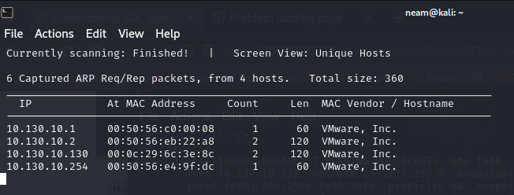

Quét thấy địa chỉ IP 10.130.10.130 có khả năng là máy DC-1, em tiếp tục sử dụng nmap để điều tra thêm:

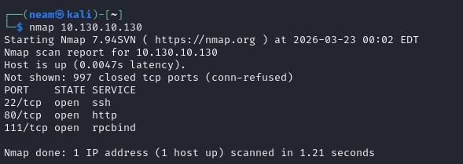

Sử dụng lệnh nmap -sV để quét các cổng (port) đang mở. Kết quả sẽ cho thấy máy mục tiêu đang mở 3 cổng: 22 (SSH), 80 (HTTP), và 111 (RPC).

Truy cập vào cổng 80 qua trình duyệt web, chúng ta sẽ phát hiện máy chủ đang chạy hệ quản trị nội dung Drupal CMS.

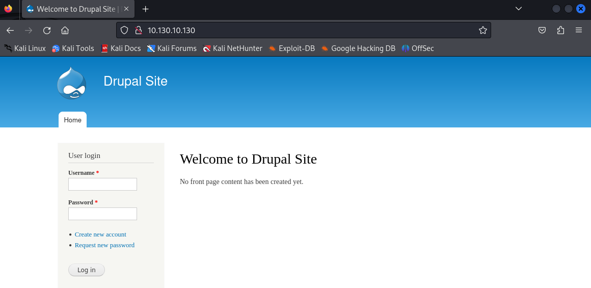

Chúng ta tiến hành điều tra sâu vào dịch vụ đang chạy trên cổng 80 là Drupal, xác định phiên bản của Drupal CMS sử dụng công cụ Droopescan:

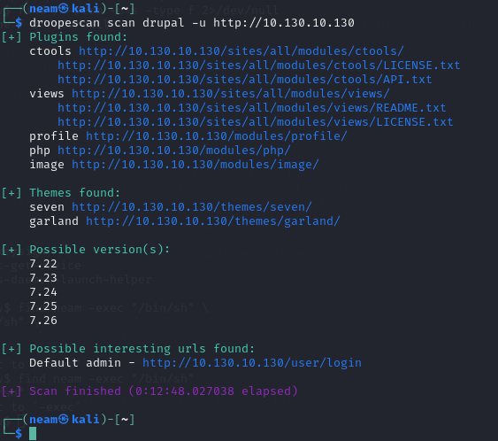

Vậy có thể khoanh vùng rằng phiên bản của drupal là 7.2x, em tiếp tục tìm các lỗ hổng của drupal tương ứng với phiên bản này, sử dụng searchsploit drupal:

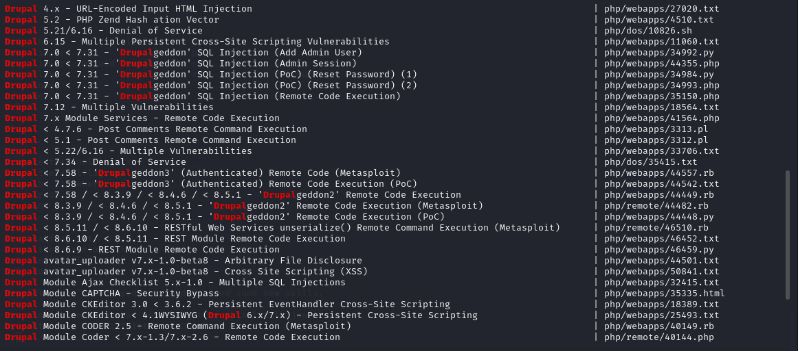

Tiến hành kiểm tra lỗ hổng và sử dụng công cụ Metasploit với mã khai thác Drupalgeddon2 để tấn công mục tiêu, từ đó lấy được một reverse shell (quyền truy cập vào máy chủ).

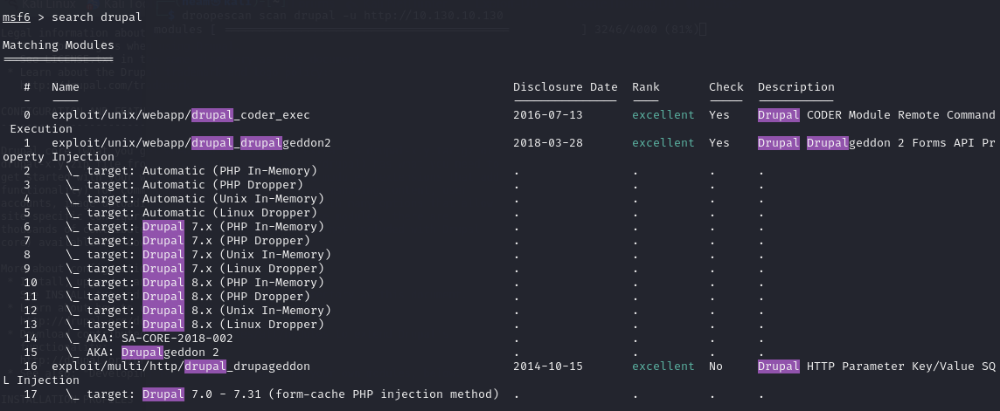

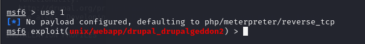

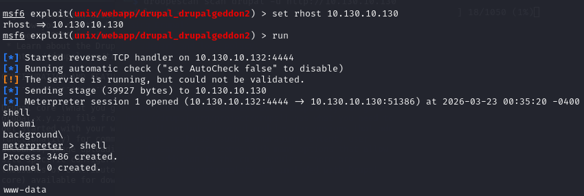

Phần sử dụng MSF khá đơn giản, chỉ việc set rhost rồi run là có thể lấy được reverse shell.

Khi đã có reverse shell, sử dụng Python để tạo một TTY shell ổn định:

```bash
python -c 'import pty; pty.spawn("/bin/bash")'
```

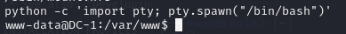

Kiểm tra các file trong thư mục, em phát hiện flag đầu tiên là flag1.txt:

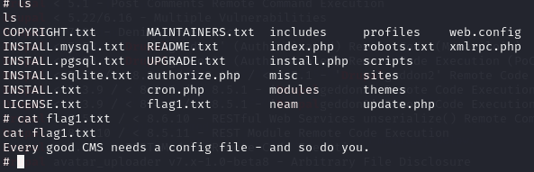

Sau đó em kiểm tra các file khác thì thấy flag2 trong file setting.php:

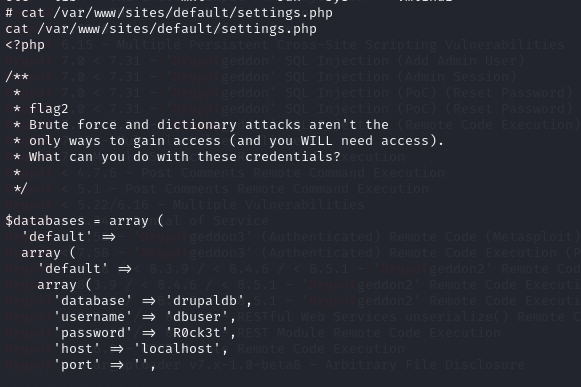

Và quay lại /home em phát hiện ra thư mục flag4, nên em cũng bắt được ngay flag4 với nội dung:

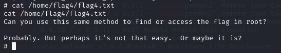

Tiến hành tìm kiếm các tệp tin có quyền SUID bằng lệnh find / -perm -u=s -type f 2>/dev/null và phát hiện ra lệnh find được thiết lập bit SUID.

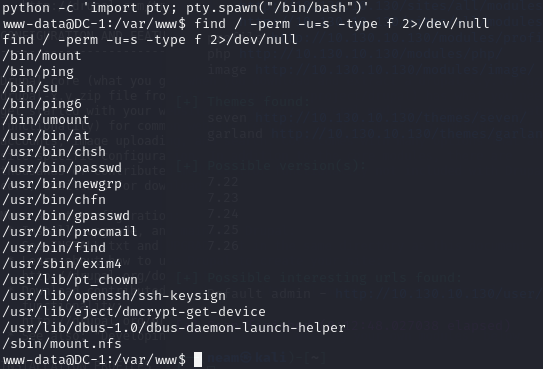

Bởi vì lệnh find có SUID, nó có thể được thực thi với quyền của người dùng root.

Bằng cách tạo một tệp tạm thời (ví dụ: touch raj) và sử dụng nó với lệnh find: find neam -exec "/bin/sh" \; , người tấn công có thể tạo ra một root shell.

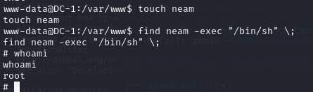

Và di chuyển vào thư mục /root, chúng ta có thể tìm thấy và đọc file thefinalflag.txt

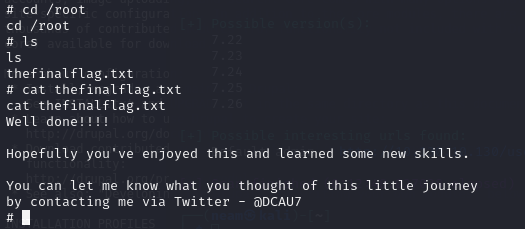

