# Extra Labs 2: DC-2 on vulhub

## Description

Thông tin chung: DC-2 được phát hành vào ngày 22/03/2019 và được thiết kế đặc biệt cho người mới bắt đầu (Beginners).
## Mục tiêu: Tương tự như DC-1, mục tiêu cuối cùng của bạn là thu thập tổng cộng 5 "flag", với flag cuối cùng (quan trọng nhất) nằm trong thư mục của người dùng root.

Hệ thống: Máy ảo sử dụng hệ điều hành Debian 32-bit (chạy trên nền tảng VirtualBox), và mạng được cấu hình nhận IP tự động qua DHCP.

Lưu ý cực kỳ quan trọng: Không giống DC-1, với DC-2, bạn bắt buộc phải cấu hình tệp /etc/hosts trên máy tính tấn công (ví dụ Kali Linux) để trỏ IP của mục tiêu tới tên miền dc-2 (ví dụ: 192.168.122.185 dc-2). Nếu bỏ qua bước này, hệ thống quản trị nội dung (CMS) của trang web mục tiêu sẽ không hoạt động bình thường.

Sử dụng lệnh netdiscover để tìm địa chỉ IP của máy mục tiêu trong mạng nội bộ:

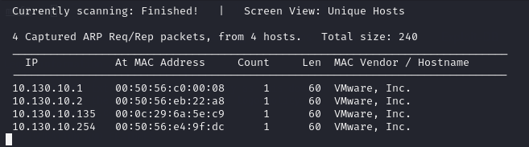

Sử dụng nmap để quét các cổng đang mở. Kết quả quét sẽ cho thấy máy mục tiêu đang mở 2 cổng: 80 (HTTP) và 7744 (SSH)

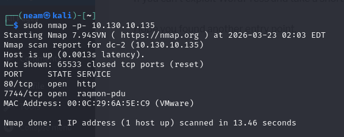

Vì phần giải thích có yêu cầu phải cấu hình tệp host, nên chúng ta cũng sẽ thêm luôn địa chỉ IP này vào file host:

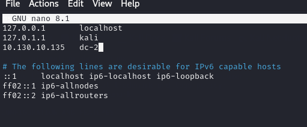

Ta thấy rằng máy dc-2 đang mở cổng 80 (http), chúng ta thử truy cập vào trang web xem có tìm được manh mối nào không:

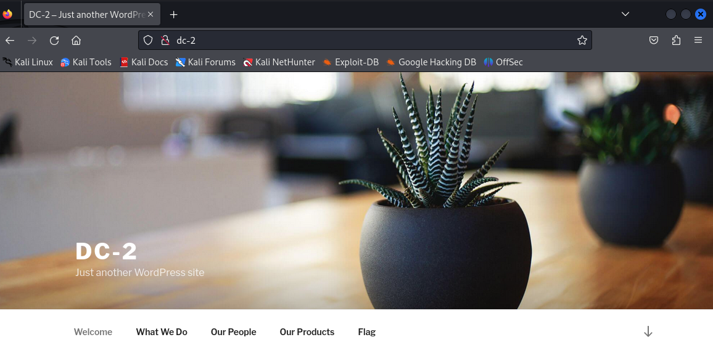

Tại đây em thấy đang chạy wordpress, và có luôn flag được hiển thị, ấn vào xem thì được gợi ý sử dụng cewl để thu thập các từ khóa trên trang web:

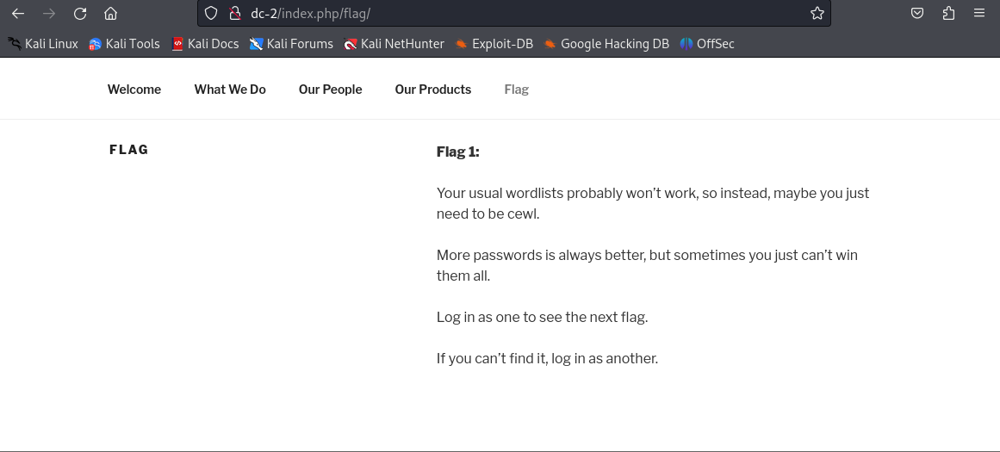

Nhận diện trang web đang sử dụng nền tảng WordPress. Sử dụng công cụ wpscan kết hợp với từ điển vừa tạo để dò quét tên người dùng và tấn công Brute-force mật khẩu.

```bash
cewl http://dc-2 | tail -n +2 > password.txt
```

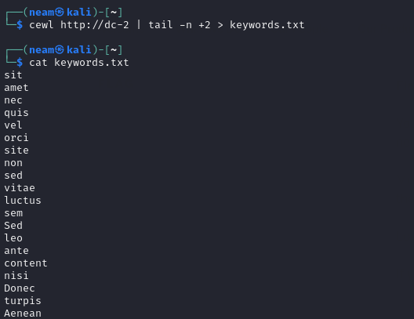

Tiếp tục em sử dụng wpscan username tìm thấy 3 tài khoản:

```bash
wpscan --url http://dc-2 --enumerate u
```

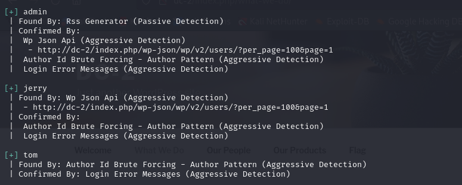

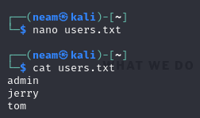

Lại tiếp tục sử dụng wpscan để brute-force:

```bash
wpscan --url http://dc-2 -U users.txt -P keywords.txt
```

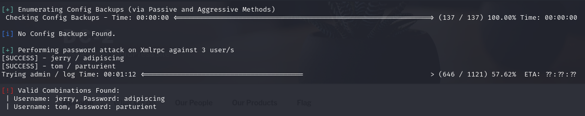

Ta nhận được 2 tài khoản là jerry/adipiscing và tom/parturient.

Đăng nhập vào trang quản trị WordPress  với 2 tên đăng nhập trên. Đặc biệt ở tài khoản jerry em tìm thấy flag2:

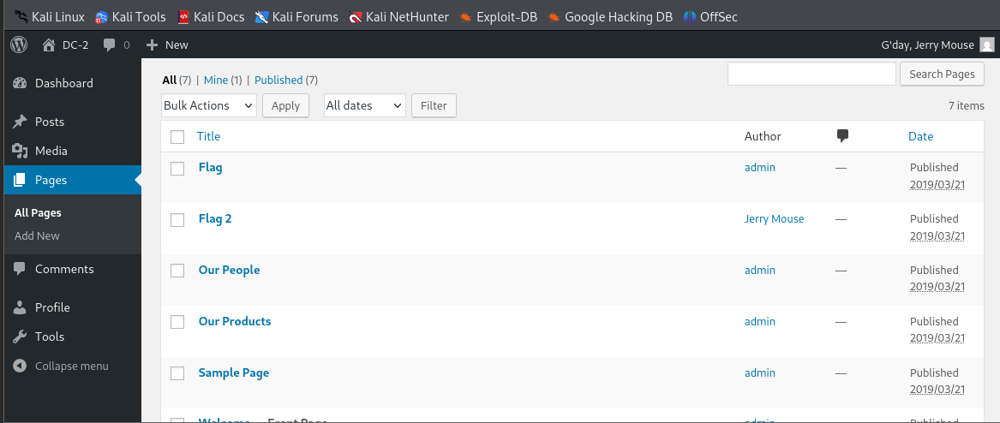

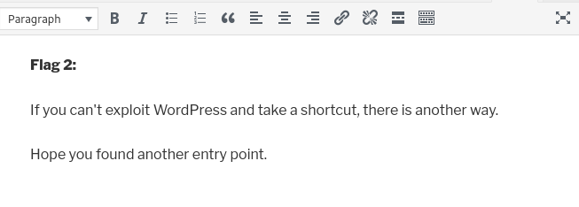

Flag2 gợi ý rằng nếu không thể khai thác thêm về WP thì tiếp cận bằng cách khác.

Vì trước đó quét ra cổng 7744 đang mở và chạy ssh, em thử kết nối luôn với 2 tài khoản trên:

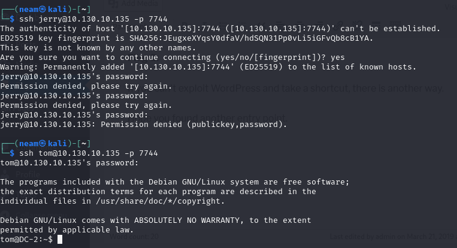

Em đăng nhập qua ssh với user tom, nhưng sau khi đăng nhập em phát hiện bị giam trong một môi trường shell hạn chế quyền gọi là rbash (Restricted Shell)

Kiểm tra thư mục xem có thông tin gì hữu ích, em thấy có file flag3.txt, nhưng không thể dùng cat hay nano, em thử dùng vi và thành công đọc file

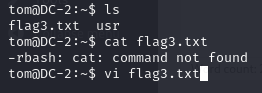

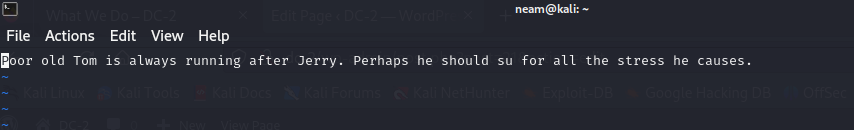

Sử dụng kỹ thuật "Escape rbash" bằng trình soạn thảo vi.

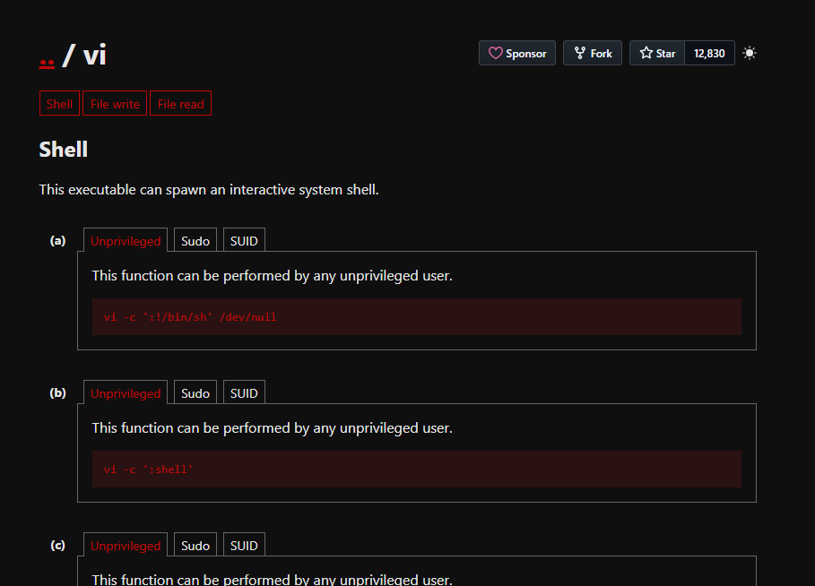

Cụ thể: Mở vi, gõ lệnh :set shell=/bin/bash tiếp theo là :shell để thoát ra:

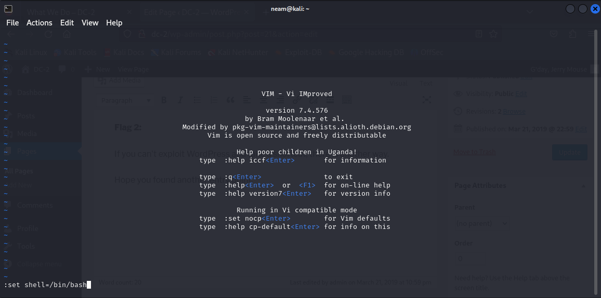

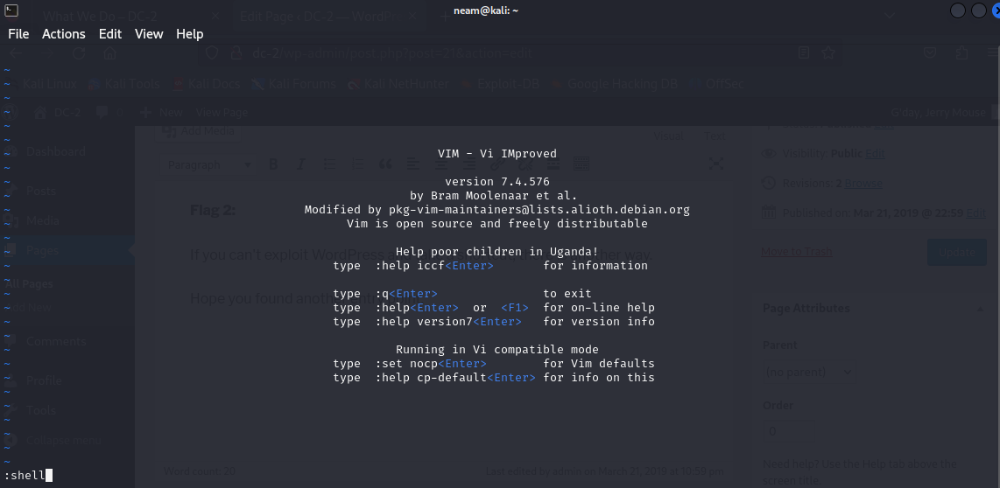

Sau đó xuất lại các biến môi trường PATH và SHELL để có thể sử dụng các lệnh bình thường:

```bash
export PATH=/bin:/usr/bin:$PATH
```

```bash
export SHELL=/bin/bash:$SHELL
```

```bash
cat flag3.txt
```

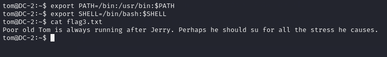

Từ gợi ý của flag3, chúng ta sẽ chuyển sang user jerry để khai thác tiếp:

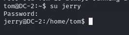

Trở về thư mục của user jerry, ta tìm được flag4:

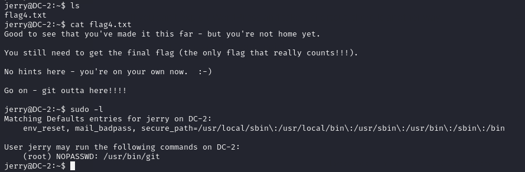

Phát hiện ra lệnh git có thể thực thi với quyền sudo.

Chạy lệnh sudo git branch --help config và ngay tại dấu nhắc lệnh, gõ !/bin/sh để khởi tạo một root shell

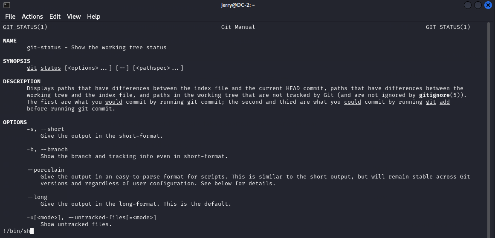

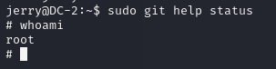

Và cuối cùng chúng ta đã có được quyền root và lấy được cờ cuối cùng:

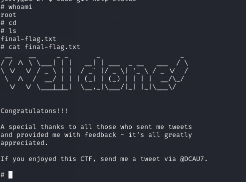

